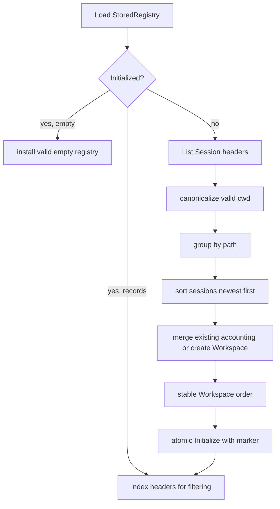
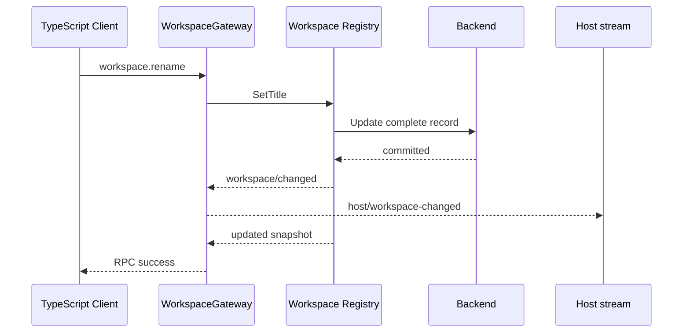

# 20 Workspace Registry、SQLite 与 API Gateway

状态：Accepted

本文拥有 Workspace Registry、Workspace entity、历史 Session Header bootstrap、storage-only Backend、SQLite/sqlc adapter、七个 `workspace.*` method、四类 Host frame，以及 `session.create({workspaceId})` 的集成语义。通用 RPC 与 frame union 由[03 协议与 API 兼容设计](./03-protocol-and-api-compatibility.md)和[07 API Proxy 模块设计与实现](./07-api-proxy-module.md)拥有；Session Header/Event 与 Persistence 分别由[10](./10-session-core-and-lifecycle.md)和[19](./19-session-persistence-and-sqlite.md)拥有；当前实施状态与证据只见[08 实施进度](./08-implementation-progress.md)。

## 1. 固定源与职责映射

固定源基线：`47f943859bef60e4160492346772ded9b24f765a`。

| 源 owner / symbol | Go owner | 保留职责 |
| --- | --- | --- |
| `packages/workspace/workspace/src/index.ts` 的 `WorkspaceRegistry` | `workspace.DurableRegistry` | durable order、archive set、path identity、bootstrap、Session accounting |
| `packages/workspace/workspace/src/entity.ts` 的 `WorkspaceEntity` | `workspace.entity` | title、attach/detach、Session 手动顺序、status |
| `packages/workspace/workspace/src/paths.ts` | `workspace.canonicalDirectory` | existing-directory realpath canon |
| 源 `storageDomain` Workspace spec | `workspace.Backend` 与 `workspace/persistence/sqlite` | owner-defined storage port、原子记录/全局状态写入 |
| `packages/host/apiproxy/src/api/workspace.ts` 与 schema | `apiproxy.WorkspaceAPI`、method-owned decoders | 七个 `workspace.*` wire contract |
| `packages/host/apiproxy/src/api-proxy.ts` Workspace handlers | `apiproxy.WorkspaceGateway` | 领域调用、业务错误和 Host frame 映射 |
| 源 `WebApiClient.workspace` | 仅作为 contract oracle | HTTP payload/result 与 Host stream 兼容验证 |

Go 不复制 Storage Domain 的通用 KV runtime、Typert、浏览器 Workspace manager 或 UI tree。源职责被映射为领域 interface、明确 SQLite adapter 和 API anti-corruption boundary；wire 名称与行为不因实现方式变化。

## 2. 领域模型与不变量

一个 Workspace record 包含：

- stable `ID`；
- existing directory 的 canonical `Path`；
- display `Title`；
- durable candidate `SessionIDs` 手动顺序；
- `CreatedAt` 与最近真实 mutation 的 `UpdatedAt`。

Registry global state 包含：

- `Initialized`：合法空 Registry 与待 bootstrap 状态的区分；
- `WorkspaceIDs`：authoritative display order；
- `ArchivedSessionIDs`：跨 Workspace 的全局 archive set。

必须保持以下不变量：

1. Workspace ID 唯一且非空；
2. canonical path 只能属于一个 Workspace；
3. 一个 Session ID 最多由一个 Workspace account；
4. initialized Registry 的 order 必须无重复、无 missing、无 orphan；
5. archive 不移除 accounting slot；
6. Workspace 删除不删除目录、文件或 Session log；
7. `Snapshot.SessionIDs` 只暴露 Header canonical cwd 仍等于 Workspace path 的 candidate。

Workspace 是分组与显示状态 owner，不是 Session、文件系统或项目内容的 owner。

## 3. Registry 与 Entity 分工

`DurableRegistry` 拥有 identity map、全局 order/archive、Header index、写入串行化和领域事件。`entity` 只保留 Registry 指针与 stable ID，每次读取都取得最新 committed record，避免长生命周期 handle 持有陈旧副本。

| 操作 | 规则 |
| --- | --- |
| `Create(path)` | canonicalize existing directory；同路径返回既有 handle；新记录以前插加入 order |
| `SetTitle(title)` | 只改 display title；是否 trim/非空/全局唯一由 API consumer policy 决定 |
| `AttachSession(id)` | 验证已知 Header 与 canonical cwd；新 accounting 前插；重复 attach 幂等 |
| `InsertSessionBefore(id, before?)` | source/anchor 必须已 account；无 anchor 追加到末尾 |
| `DetachSession(id)` | 只移除 accounting；未知或已移除为 no-op |
| `Status()` | 当前目录可用则 `ok`，任意 stat failure 或非目录为 `missing-dir`；不改 record |
| `Delete(id)` | 删除注册和 global order slot；保留所有外部资源 |
| `InsertBefore(id, before?)` | DOM insertBefore 语义；返回完整 committed order |
| `ArchiveSession(id)` | Session 必须 live 或持久化可知；重复 archive 不写入 |

Title uniqueness 不是 Workspace domain invariant：不同 canonical path 在创建时允许同 basename。浏览器 rename contract 需要唯一 display name，所以该检查由 `WorkspaceGateway` 在 create/rename/delete 共享 mutation chain 内完成。

## 4. SessionHeaders anti-corruption port

Workspace 只需要 immutable Session Header，因此由 Consumer 定义：

```text
SessionHeaders.Get(id)  -> Header / not found
SessionHeaders.List()   -> detached Header list
```

默认 composition adapter 按以下顺序取得事实：

```text
Get(id)
  -> live Session LiveStore
  -> Session Persistence Inspect

List()
  -> persisted Header list
  -> merge live Session Header by stable ID
```

Workspace 不导入 Session SQLite、`SessionLogStore` 状态或 live Agent。该 adapter 位于 composition root，是 Workspace 消费 Session 事实的 anti-corruption boundary。

## 5. 首次历史 bootstrap

`Initialized=false` 时，Registry 从 Header-only 历史建立 Workspace：



排序与合并规则保留固定源：

- 同一目录的 Session 按 `createdAt` 降序，tie 按 ID；
- Workspace 按该目录最新 Session 时间降序；
- 无历史 group 时使用 record `createdAt`；
- 时间相同优先沿用 durable prior order，最后按 Workspace ID；
- 无法 realpath、无 cwd 或已经由其他 Workspace account 的 Header 不产生重复 membership；
- filtered candidate 仍保留在 durable record，直到一次真实 entity mutation 负责 pruning。

Bootstrap 只运行一次。`Initialized=true` 且 Registry 为空是稳定状态，不得因重启重复扫描并重新创建已被用户删除的 Workspace。

## 6. Backend 与 SQLite/sqlc

`workspace.Backend` 是 Registry 消费方拥有的 storage-only port：

```text
Load / Initialize
Create(record, order)
Update(record)
Delete(id, order)
SetOrder(order)
SetArchivedSessionIDs(ids)
Close
```

Registry 在调用前完成 canonical path、ID、membership、顺序、archive、timestamp 和事件决策。Backend 只保证请求的记录与 global state 原子写入，不添加业务分支。`Backend` 是 Workspace owner 的 Go interface，不是 Plugin Service：`@deepseek-ai/dsh-workspace` Factory 负责构造当前 SQLite adapter 和 `DurableRegistry`，Runtime 只看到 `workspaceRegistry` capability。

SQLite owner 目录为：

```text
workspace/persistence/sqlite/
├── sql/schema.sql
├── sql/query.sql
├── sqlc.yaml
└── internal/dbsql/
```

Schema 分为 singleton `workspace_state` 与 keyed `workspaces`。数组以 JSON text 保存，但 JSON 编解码只属于 adapter；返回前映射为 `StoredRegistry`/`StoredWorkspace`。`application_id`、`user_version`、foreign/unversioned database 拒绝、单连接、busy timeout、journal mode 和 `synchronous=FULL` 与 Session SQLite 使用同等级技术边界，但两者不是同一数据库模型。

```text
workspaces.sqlite      -> Workspace registration/order/archive
sessions.sqlite        -> Session Header/Event facts/revision/repair
```

Workspace adapter 不读 `sessions.sqlite`，Session adapter 也不读 Workspace state；跨领域关系只经 `SessionHeaders`。

## 7. 七个 `workspace.*` method

| Method | 下游 capability | 业务结果与失败 |
| --- | --- | --- |
| `workspace.list` | Registry | ordered `items` + complete `archivedSessionIds` reconnect baseline |
| `workspace.create` | Registry | existing directory adoption；path collision 返回 `created:false`；失败为 `workspace-invalid-path` |
| `workspace.rename` | Workspace | trim、non-blank schema、same-title no-op、跨 Workspace name conflict |
| `workspace.delete` | Registry | registration-only delete；unknown 为 `workspace-not-found` |
| `workspace.insertBefore` | Registry | 返回完整 Workspace order；unknown source/anchor 为 `workspace-not-found` |
| `workspace.insertSessionBefore` | Workspace | 返回完整 Workspace view；unaccounted source/anchor 为 `workspace-move-invalid` |
| `workspace.archiveSession` | Registry | 返回完整 archive set；unknown Session 为 `session-not-found` |

Decoder 必须区分缺失、`null`、空 ID 和 optional anchor；`workspace.rename` 的 blank 检查保持源 root-level refine shape。业务拒绝是 HTTP 200 内的 RPC failure，存储或内部故障继续返回技术错误。

## 8. Host frame 与 reconnect

Workspace mutation 成功后发布 owner-defined post-commit event，由 Gateway 投影为：

| Domain publication | Host frame | Payload |
| --- | --- | --- |
| Workspace upsert | `host/workspace-changed` | complete `WorkspaceView` |
| registration delete | `host/workspace-removed` | `workspaceId` |
| display order replacement | `host/workspace-order-changed` | complete `workspaceIds` |
| archive replacement | `host/archived-sessions-changed` | complete `archivedSessionIds` |



Host stream 不发送初始 Workspace baseline。Connection 建立或重建后，客户端通过 `workspace.list` 取得权威 snapshot，再应用 higher-arrival Host changes；frame 不是持久化日志。

## 9. `session.create({workspaceId})`

Session Gateway 消费最小 `workspace.Registry` capability：

1. 只给 `workspaceId`：读取 Workspace path，作为新 Session immutable Header `cwd`；
2. 只给 `cwd`：保持原 Session create 路径；
3. 两者都缺失：使用 Host working directory；
4. 两者同时出现：`bad-request`；
5. Workspace 不存在：`workspace-not-found`；
6. Session 创建成功后调用 `AttachSession`；失败返回 `workspace-attach-failed`。

Attach 发生在 Session/Agent 创建提交之后。若 attach 因存储或校验失败，Go 保留已经创建的 live Session，与固定源的失败边界一致；Gateway 不能跨两个领域伪造分布式 rollback。

## 10. 并发、失败与生命周期

TS Registry 用 Promise chain 将 mutation 排成事件循环 slot；Go Registry 用写锁覆盖“读取最新 record → 决策 → Backend commit → 替换 cache”，避免并发 mutation lost update。会在锁外发生的 Header I/O 完成后，attach 必须重新取得最新 record 并再次判断 membership。

API create/rename/delete 还共享独立 mutex，因为 rename 的 name uniqueness 属于 API-level policy，必须与可能增加/删除候选标题的相邻调用串行。Registry 自己的 order、archive 和 entity mutation无需第二套 API 状态机。

领域 publication 始终在 Backend commit 后发生；observer failure 只上报，不能回滚。Backend failure 时内存状态和 Host frame都不前进。Workspace 插件的 Scope owns Registry observers 和内部 SQLite adapter 的 close；SQLite 自身没有 Factory、Manifest 或 Service key。默认 CLI 以 `--data-dir` 同时定位 `sessions.sqlite` 与独立的 `workspaces.sqlite`；`--workspace-db` 只覆盖 Workspace database 的具体路径，不改变 Session storage。

## 11. 依赖方向与验证所有权

```text
Connection Host
  -> API Proxy WorkspaceGateway
  -> workspace.Registry / Workspace
  -> workspace.Backend
  -> workspace/persistence/sqlite

workspace.Registry
  -> workspace-owned SessionHeaders
  -> assembly adapter
  -> Session LiveStore / Session Persistence
```

- `workspace` 不依赖 API Proxy、Echo/WebSocket、Session persistence implementation、sqlc 或 SQLite driver；
- SQLite adapter 只依赖 Workspace-owned storage types；
- API Proxy owns wire DTO/error/frame mapping，不把 `WorkspaceView` 传入领域；
- composition root owns concrete adapter selection and cross-domain Header mapping。

验证应分层：领域测试覆盖 bootstrap、canonical identity、accounting、ordering、archive、并发与 post-commit；adapter 测试覆盖 schema/transaction/reopen/corruption；decoder/frame tests 覆盖 wire shape；固定源 `WebApiClient` contract 覆盖真实 HTTP/WebSocket 交互。真实 Web UI 是独立环境验收，不能用 schema 或 source-client contract 替代。

## 12. 后续能力进入规则

- Unarchive 只有固定 API/Client contract 进入时增加，不能由 archive 方法隐式承担；
- Filesystem watcher、project file index 与 Shell cwd 以 Workspace ID 作为上游选择时，仍通过各自 consumer-owned port 读取 path；不得把实现塞入 Registry；
- Workspace search、Settings title policy 或 recent-selection 属于独立 projection/client capability；
- 若未来迁移到通用 Storage Domain，必须保持 `workspace.Backend` 的业务无关性和现有事务语义，不把 KV runtime 类型泄漏到领域；
- Web UI、浏览器 Workspace manager、directory picker、SDK、Typert generator 和 `!!js` 继续不进入 Go 运行时。
