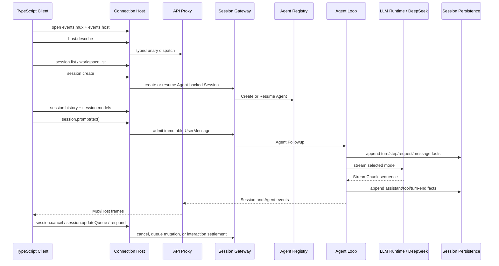

# 21 Web Agent 主会话闭环与能力边界

状态：Draft

本文拥有当前交付目标的纵向能力闭包：让固定 TypeScript Client 通过 Go Host 创建或打开文本会话，驱动真实 Agent Loop，并持续观察到终态。本文不重复各模块的 wire、领域或持久化契约；这些契约分别由对应模块文档拥有，实施状态与验证证据只记录在[08 实施进度](./08-implementation-progress.md)。

## 1. 目标客户端

兼容对象是固定基线 `47f943859bef60e4160492346772ded9b24f765a` 中的 Host-facing TypeScript Client contract，尤其是 `packages/client/connection` 的 `WebApiClient` 和 `packages/client/runtime` 的 Session/Workspace object layer。

当前不复制或托管以下浏览器实现：

- `apps/web`、React 组件、CSS、前端静态资源和 `/plugins/<id>/client.js`；
- `window.__DSH_BOOT__`、Client Module System 和完整 `bundle/web-app` plugin roster；
- Settings、Credentials、Agent Preset、Goal、Subagent、Plugin Inventory、Dynamic Cordis 等管理或扩展页面。

因此，“Web 主流程兼容”不等于“未经裁剪的源 `web` profile 所有页面均可用”。完整源 profile 的 Welcome Notice 会读取 `ui-onboarding` Settings namespace；该依赖不属于本轮主会话闭包，不能通过在 API Proxy 中硬编码成功值规避。使用完整源 profile 的产品级验收只有在显式扩大范围后才成立。

## 2. 可观察闭环

主流程必须从浏览器请求一直到 durable Session 终态，而不是分别证明若干同名类型存在：



闭环成功的最终观察必须同时包含：

1. `session.prompt` 返回 `{accepted: true}`；
2. Mux 收到同一 Session 的 committed events，最终包含 `turn/end`；
3. Host 收到 `running:true` 到 `running:false` 的状态转换；
4. `session.history` 能再次读取该轮已提交事实；
5. 重启后 SQLite-backed Session 仍可 list、history 和 resume。

## 3. 纳入能力矩阵

| ID | 用户结果 | 必需 Host surface | 主要所有者 |
| --- | --- | --- | --- |
| WAF-01 | 建立一个可用 connection generation | `events.mux`、`events.host`、`host.describe` | Connection Host、API Proxy |
| WAF-02 | 读取 Session/Workspace 基线 | `session.list`、`workspace.list` | Session Gateway、Workspace Gateway |
| WAF-03 | 创建 Agent-backed 文本 Session | `session.create`，支持 `workspaceId` 或 `cwd` | Session Gateway、Agent Registry |
| WAF-04 | 打开会话并读取历史 | `session.history` | Session Gateway、Session Persistence |
| WAF-05 | 查看并选择可路由模型 | `session.models`、`session.selectModel` | Session Gateway、LLM Runtime、Default Model |
| WAF-06 | 提交文本并驱动完整轮次 | `session.prompt` | Session Gateway、Inbox、Agent Loop |
| WAF-07 | 实时渲染模型、Tool 和终态 | `session/event`、`session/subscribed`、`host/session-status`、`host/agent-error` | Session Frame Hub |
| WAF-08 | 处理 turn 内后续输入 | `session/queue`、`session.updateQueue` | Inbox、Session Gateway |
| WAF-09 | 取消运行中轮次 | `session.cancel` | Agent、Agent Loop、Session Gateway |
| WAF-10 | 回答 Approval/Question | `approval/*`、`question/*`、`POST /api/respond` | Interaction Gateway、Approval、UserQuestions |
| WAF-11 | 修改会话标题 | `session.rename`、`title` projection | Session Title、Session Gateway |
| WAF-12 | 保留并恢复会话事实 | SQLite Session Persistence、cold list/history/resume | Session Persistence |

七个既有 `workspace.*` method 和对应 Host frame 继续保留，因为 Workspace 已是 `session.create({workspaceId})` 的真实上游；拖拽排序、归档、删除等手势不是主聊天验收的必要步骤。`llm.providers` 与 `llm.models` 继续作为已实现的 Host catalog，但主会话只依赖 per-Session 的 `session.models` 与 `session.selectModel`。

## 4. 明确不纳入本轮

以下方法或能力不是文本主会话闭环的依赖，不因完整 WebUI 中存在调用点而进入实现：

- `session.search`、`session.fork`、`session.attachment`；
- `host.pickDirectory`、`host.listDirectory`、`host.createDirectory`、`host.openPath`；
- `settings.*`、`credentials.*`、`agentPreset.*` 的完整 Provider 与 mutation；
- `skill.list`、`subagent.*`、`goal.*`、Jobs、Message Feedback；
- Typert Host Gateway、`commands/*`、`pluginInventory/*`、`dynamicCordisRunner/*`；
- Shell、Filesystem、PTY、LSP、Sandbox、Attachment、Spill 等非当前文本闭环 Tool Provider；
- Web 静态资源、boot manifest、Client plugin bundle 与 React UI。

已存在的协议分支不自动成为当前 release gate，也不能作为继续扩展同一领域的理由。后续若纳入其中一项，必须给出主流程或明确用户场景中的真实 Consumer，并更新[01 复制范围与兼容基线](./01-porting-scope-and-baseline.md)。

## 5. 所有权与依赖方向

主流程不引入一个“Web Service”统管所有业务：

```text
TypeScript Client
  -> Connection Host          transport, trust, cancellation
  -> API Proxy method adapter payload/result mapping only
  -> capability owner         Session / Workspace / Interaction
  -> Agent Registry           Agent identity and lifecycle
  -> Agent Loop               turn and step state machine
  -> LLM / Tools              provider-neutral execution

SQLite adapters -> consumer-owned persistence ports
composition root -> concrete services and adapters
```

- Connection Host 不推导 Session、模型或 Tool 状态。
- API Proxy 不持有业务事实，不用 `nil Provider + fixed success` 冒充能力。
- Session Gateway 可以编排 Session、Agent、LLM directory、Title 和 Workspace，但不导入 Echo、SQLite driver 或 DeepSeek HTTP 类型。
- Agent Loop 只消费 Agent、Session、System Prompt、Tools 和 LLM capability，不依赖 Web、API Proxy 或 persistence adapter。
- Session/Workspace persistence adapter 只保存业务 owner 已经决定的事实。
- 默认 composition 只装配当前闭包所需的实现；新增页面 API 不得直接扩大 Agent Loop。

## 6. 验收层级

主流程按以下顺序验收，较低层级不能代替较高层级：

1. **Go component**：Agent Loop、Session Gateway、Frame Hub、SQLite persistence 各自通过聚焦测试。
2. **固定源 contract**：固定 `WebApiClient` 通过真实 HTTP/WebSocket 调用 Go Gateway，完成 create、history、models、prompt、queue、cancel、respond。
3. **默认 composition**：`DefaultSpecs` 装配 Connection、Session、Agent Loop、LLM、DeepSeek 和 SQLite；固定 `WebApiClient` 经一条真实请求得到 `turn/end`。
4. **Provider smoke**：显式提供真实 DeepSeek credential 后完成一次独立 smoke；离线 fake DeepSeek HTTP 只证明装配和协议，不声称真实环境可用。
5. **restart**：进程级或等价 composition 重建后，SQLite 中的会话仍可恢复。

当前工作只补缺失层级，不重复已经由更强证据覆盖的 schema 或单元断言。

## 7. 进入下一能力的门槛

只有满足以下任一条件，才从主会话闭包扩展能力：

- 当前闭环在固定源 Client 上被该缺失能力实际阻断；
- 用户明确把新的 UI 场景加入目标；
- 当前实现的领域不变量要求该能力，否则会产生错误事实或不可恢复状态。

页面上存在一个按钮、源仓库存在一个 package、或返回 404 本身都不是进入条件。进入后仍先确定业务 owner 和 consumer-owned port，再接 API method；不得从 `apiproxy` handler 反向发明领域对象。
