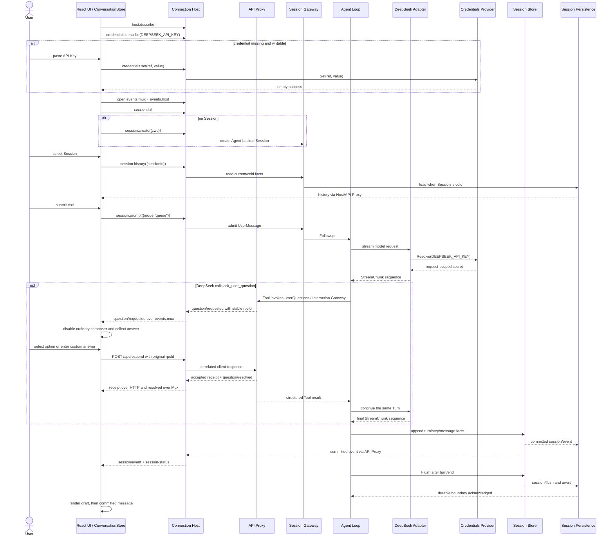

# 21 Web Agent 主会话闭环与能力边界

状态：Accepted

本文拥有浏览器到 Go Agent Loop 的主会话闭包。默认服务提供仓库自有的主会话 UI；它复用固定 DeepSeek Harness Host 协议，但不复制原版 `apps/web` 的组件源码、Connection 实现或 Client plugin runtime。实施状态与验证证据只记录在[08 实施进度](./08-implementation-progress.md)。

## 1. 用户目标

启动 `cmd/goren` 后，用户直接打开 `http://127.0.0.1:3080`，可以：

1. 创建新对话；
2. 从左侧选择已有对话；
3. 读取该对话的持久历史；
4. 发送文本并观察 Agent 的流式回复；
5. 切换会话后再次恢复刚才的历史；
6. 在浏览器中设置、替换或删除 DeepSeek API Key；
7. Agent 需要补充信息时回答结构化 Question，并让同一 Turn 继续到最终输出。

DeepSeek credential 使用引用 `DEEPSEEK_API_KEY`。启动环境值优先且只读；没有环境值时由 owner-only local Store 提供，Web 可通过 write-only Host API 管理。仓库根 `.env` 仍只是本地开发输入，若使用则由 shell 显式加载，不进入二进制、typed config、Session、日志或提交。完整规则由[22 Credentials 与 API Key 管理](./22-credentials-and-api-key-management.md)拥有。

## 2. UI 与源 Web 产品的关系

纳入的是根级 `web` 包及其内嵌静态资源。浏览器源码使用 React、TypeScript、Vite 与 Tailwind CSS，由本仓库独立实现；信息布局参考 Harness 的紧凑三栏工作台，但只连接以下既有 Host surface：

- `host.describe`；
- `credentials.describe`、`credentials.set`、`credentials.unset`；
- `session.list`、`session.create`、`session.history`、`session.prompt`；
- `/api/events.mux` 与 `/api/events.host`；
- Mux `question/requested`、`question/resolved` 与 HTTP `/api/respond`。

以下原版浏览器能力不复制：

- `window.__DSH_BOOT__`、`/plugins/<id>/client.js` 与 Client Module System；
- 原版 React 组件系统、Cordis browser context 和完整 `bundle/web-app` roster；
- Workspace 树编辑、完整 Settings/多 Provider Credentials、Agent Preset、Goal、Subagent 和 Plugin Inventory 页面；
- directory picker、附件、搜索、fork、Shell/PTY 面板；
- Approval 交互控件。服务端协议仍保留，但当前极简 UI 不消费 Approval frame。

因此，“默认 Web 主会话可用”不表示“原版 DeepSeek Harness Web 产品完整兼容”。

## 3. 所有权与依赖方向

```text
web browser state
  -> Connection Host HTTP/WebSocket
  -> API Proxy typed methods/frames
  -> Session Gateway / Credentials Gateway
  -> Agent Registry / Agent Loop / Credentials Provider
  -> LLM Runtime / DeepSeek

Session facts -> Session Persistence -> SQLite Backend
composition root -> web.Handler + Connection + capabilities
```

- `web` 只拥有浏览器展示状态、Host 调用、Question 输入投影和断线重连，不决定 Session、UserQuestions 或 Agent 业务规则。
- `web` 只保留尚未提交的 password input draft；已存秘密不会从 Host 返回，也不进入浏览器 snapshot。
- `internal/connection` 仍拥有 Echo route、trust fence、HTTP/WS 生命周期；它只消费 `http.Handler`，不知道 UI 页面结构。
- `internal/assembly` 用 `@gorenx/dsh-web` Factory 把 `web.Site` 接到默认 Connection composition。
- API Proxy、Session、Agent Loop、LLM 和 persistence 均不导入 `web`。
- SQLite adapter 只保存 Session 已提交的事实；UI 切换会话时通过 `session.history` 重新读取，不访问数据库。

## 4. 主流程



`assistant/chunk` 只构成浏览器中的临时 draft；`assistant/message` 和 `turn/end` 到达后删除 draft，以 committed history 为准。只有 `source.kind=user` 的 `user/message` 才显示为 “You”；System Prompt 插入的 runtime-context 和 Tool facts 继续参与 Session/模型上下文，但不进入普通对话投影。选择另一个 Session 时，浏览器不复用当前 DOM 推断历史，而是重新调用 `session.history`。

## 5. 浏览器状态对象

浏览器实现保持两个有状态对象，不翻译源 TypeScript 的插件函数组合：

- `HarnessAPI`：拥有 unary RPC envelope、两条 downlink WebSocket、server-request `rpcId`、`/api/respond`、重连和关闭；
- `ConversationStore`：拥有 Session list、selected Session、history event、stream draft、pending Question、value-free credential metadata 和可观察状态；React 组件负责 DOM 投影。

`ConversationStore` 不创建第二套业务模型。Session 标题优先读取 `projections.values.title`；首个 prompt 到正式 projection 到达前，只保留一个浏览器本地显示标题，不写回服务端。

## 6. 失败、断线与安全边界

- unary HTTP/业务失败显示为可消失错误提示，不伪造成功或修改历史；
- 任一 downlink 断开后独立重连；socket 断开只结束订阅，不取消正在运行的 Agent turn；
- pending Question 不进入 SQLite；Mux 重连会以同一 `rpcId` 重放，浏览器回答成功或收到 `question/resolved` 后幂等移除；
- Question 等待期间普通 composer 禁用，避免把回答误提交为下一条 queued prompt；
- 页面刷新后以 `session.list` 和 `session.history` 重建，不依赖 local storage；
- UI 通过 `textContent` 渲染模型输出，不把模型文本作为 HTML 执行；
- credential response 只包含 `configured/source/writable`；浏览器不会回读已存 secret，环境来源也不能被 Web 覆盖；
- `/api` 仍由 Connection Host 优先匹配，未知 API 不落入 SPA fallback；
- 默认 listener 仅绑定 loopback；非 loopback 部署仍需单独设计 TLS、认证和授权。

## 7. 验收层级

1. **Go component**：`web.Site` 的静态资源、SPA fallback、API 排除和 Connection handler delegation 通过 Go test。
2. **Host contract**：固定源 `WebApiClient` 经默认 `DefaultSpecs`、DeepSeek Adapter 和离线 HTTP oracle完成 `turn/end`。
3. **UI contract**：`web-ui-main-flow.ts` 在 JSDOM 中加载真实内嵌页面，完成发送、回复、新建会话、切回、历史恢复、Question 回答到 Agent continuation，并确认 plugin runtime-context 不显示为用户消息；API Key dialog 当前以 TypeScript build 与 Host Credentials contract 分层验证。
4. **Provider environment**：显式加载 `.env` 后，同一 UI contract 调用真实 `https://api.deepseek.com` 并完成主流程。
5. **Visual browser**：只验证真实浏览器的布局、键盘和视觉行为；不能替代前四层，目前也不扩大业务能力范围。

较低层级不能替代较高层级；JSDOM 的 UI contract 不等同真实浏览器视觉验收，离线 DeepSeek oracle 也不等同真实 Provider。

## 8. 扩展门槛

只有用户把新的 UI 场景加入目标，或当前主会话被已纳入能力真实阻断，才增加浏览器能力。进入时先确认对应业务 owner 和 Host contract；不得在 `web` 中直接读 SQLite、调用 DeepSeek、写 local credential 文件或补造 API 成功值。API Key 只能通过 `credentials.*` Host contract 提交给 Credentials Provider。
