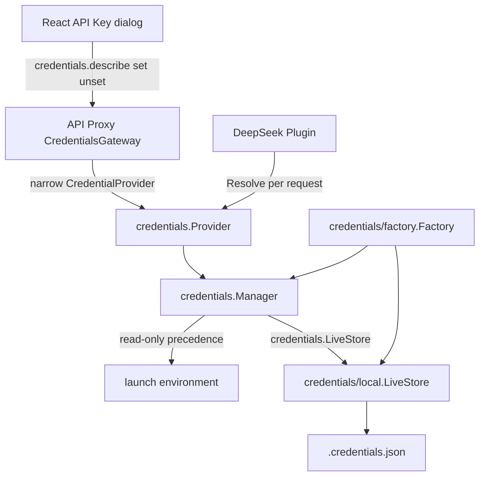
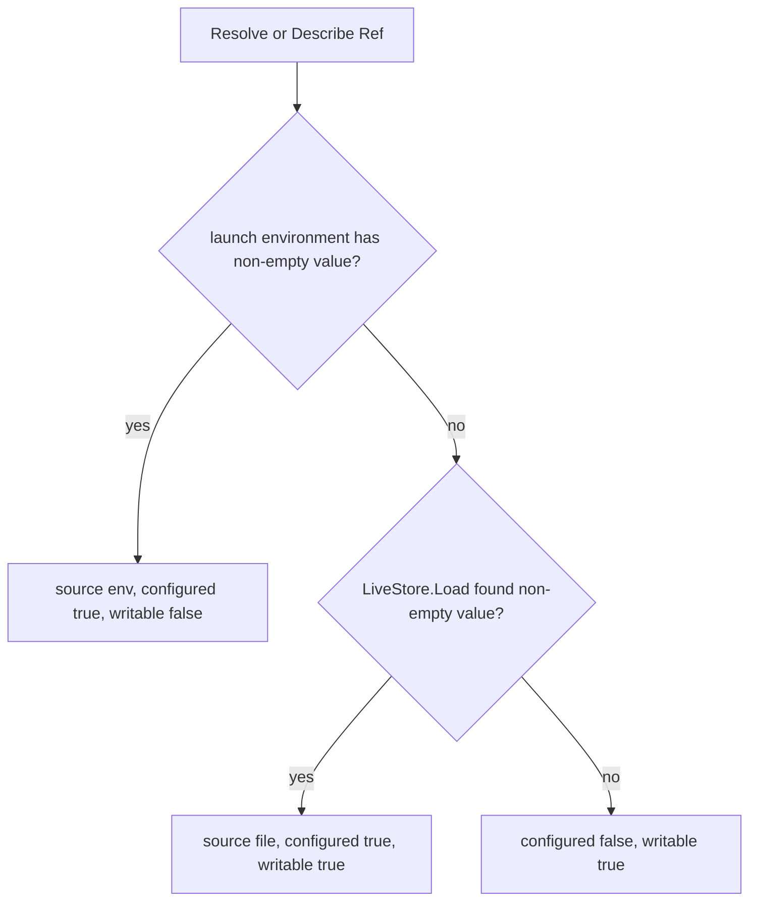
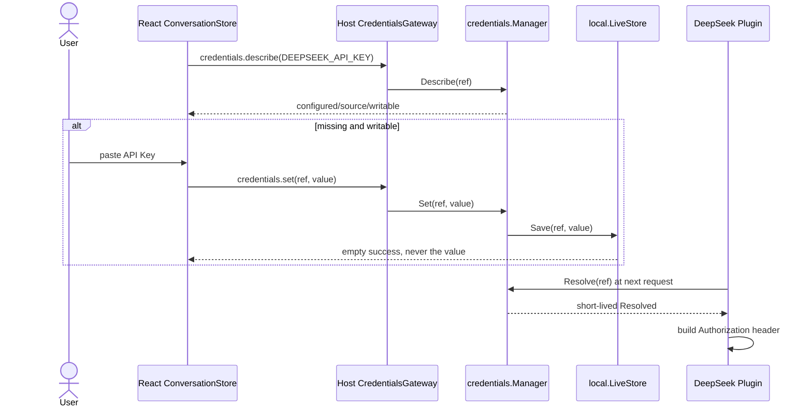

# 22 Credentials 与 API Key 管理

状态：Accepted

本文拥有 Credentials capability、默认 local LiveStore、DeepSeek credential resolution、Host `credentials.*` API 与 Web API Key 设置闭环。Settings 的 redacted namespace 描述仍由[07 API Proxy 模块设计与实现](./07-api-proxy-module.md)拥有；DeepSeek 请求由[13 Harness LLM Runtime 与 DeepSeek Provider 模块设计](./13-harness-llm-runtime-and-deepseek-provider.md)拥有；浏览器主流程由[21 Web Agent 主会话闭环与能力边界](./21-web-agent-main-flow.md)拥有。实施状态和验证证据只见[08 实施进度](./08-implementation-progress.md)。

## 1. 源职责与纳入范围

固定源基线的主要证据是：

- `packages/credentials/credentials/src/index.ts`：`CredentialProvider`、`CredentialInfo`、`ResolvedCredential` 与更新语义；
- `packages/credentials/credentials-local/src/index.ts`：环境层、local 文件层、只读遮蔽与 owner-only 写入；
- `packages/host/apiproxy/src/api/credentials.ts`、`credentials.schema.ts`：write-only Host API；
- `packages/host/apiproxy/src/api-proxy.ts`：API 到 `CredentialProvider` 的调用；
- `packages/client/connection/src/client/web-api-client.ts`：现有 TypeScript Client 的 `credentials.describe/set/unset` 调用面；
- `packages/client/ui-settings-models/src/client/ProviderEditor.tsx`：浏览器只提交新 Key，不读取已存明文。

Goren 纳入以下可观察行为：

- `CredentialRef` 对应合法 POSIX 环境变量名；
- `resolve`、`describe`、`set`、`unset` Provider 能力；
- 启动环境优先于托管文件，环境来源只读；
- `credentials.describe` 只返回 `configured/source/writable`；
- secret 只通过 `credentials.set` 从浏览器单向进入 Host；
- DeepSeek 在每个新请求开始时解析 `apiKeyEnv` 引用；
- Web 可完成首次设置、替换和删除 `DEEPSEEK_API_KEY`。

源 local Provider 的 YAML comment preservation、`.env` fallback、watcher、`credentials/updated`、跨进程 advisory lock 和复杂文件关系防护没有进入当前主会话闭包。Goren 默认 local LiveStore 使用 JSON；这是部署格式选择，不是协议偏离。

## 2. Credentials 与 Settings 的区别

Settings 是非敏感 typed configuration：它描述 namespace、schema、redacted value、revision，以及变更是 live 还是需要 restart。例如 DeepSeek Settings 可以保存 `apiKeyEnv: "DEEPSEEK_API_KEY"`，但不能保存 API Key 明文。

Credentials 是秘密解析与写入能力：它用 `Ref` 指向秘密，向运行时返回短生命周期 `Resolved`，向 UI 只返回无值的 `Info`。因此取消 `!!js` 后的 typed config 也不能代替 Credentials；typed config 决定“引用哪个 Key”，Credentials 决定“该引用当前从哪里得到秘密值”。

当前完整 Settings Provider、namespace persistence 和 mutation API 仍为 Deferred。Credentials 已独立进入主流程，不依赖先完成 Settings。

## 3. 所有权与依赖方向



职责分层如下：

- `credentials.Provider` 是向上游提供的完整能力接口；
- `credentials.Manager` 是有状态规则对象，拥有 precedence、writability 和 mutation semantics；
- `credentials.LiveStore` 是 Manager 消费的 storage-only port，不读取环境、不决定优先级；
- `credentials/local.LiveStore` 是一个具体存储实现，不是 Plugin，也不提供 Service；
- `credentials/factory.Factory` 是领域内 composition root，选择 local LiveStore 并构造直接提供 `credentials.Provider` 的 Manager Plugin；
- `apiproxy.CredentialProvider` 是 API Proxy 消费方拥有的窄接口，故意没有 `Resolve`，因此 Host API Gateway 无法读取 secret；
- DeepSeek Plugin 消费完整 `credentials.Provider`，但 Adapter 的公共 contract 仍只接收 request-scoped resolver。

这也解释了为什么 Factory 位于独立的 `credentials/factory` 组合根，而不在 `credentials/local`：`LiveStore` 是可替换的持久化端口，`Provider` 是包含业务规则的运行时能力，local adapter 不应决定完整 Plugin 组合。

## 4. 解析与写入语义



`Set` 拒绝空值；清除必须调用 `Unset`。环境层命中时，`Set` 和 `Unset` 都返回业务拒绝，不能把被遮蔽的文件写入伪装成生效。local 文件命中时，替换对下一次 DeepSeek 请求可见；已经启动的 stream 保持其初始 request generation。

默认优先级只有：

```text
launch environment > local LiveStore
```

仓库 `.env` 不由 Credentials 包解析。需要使用 `.env` 时仍由启动 shell 显式加载，使其成为 launch environment；Goren 不建立第二套 dotenv 配置语义。

## 5. Host API 与秘密单向流动

| Method | 请求 | 成功值 | 是否携带秘密 |
| --- | --- | --- | --- |
| `credentials.describe` | `{refs: string[]}`，最多 64 个 | `{credentials: Record<string, CredentialView>}` | 否 |
| `credentials.set` | `{ref, value}` | `{}` | 仅请求方向 |
| `credentials.unset` | `{ref}` | `{}` | 否 |

引用必须匹配 `^[A-Za-z_][A-Za-z0-9_]*$`。payload decode 失败是 `bad-request`；Provider 拒绝写入映射为 `credential-rejected`；技术 I/O 失败仍是技术错误。任何 response、RPC error details、Web snapshot 或 Session event 都不能携带秘密值。

`CredentialsGateway` 只依赖没有 `Resolve` 的窄接口。这个结构限制比“调用方自觉不读”更强：API Proxy 代码没有获得读取凭据明文的能力。

## 6. local LiveStore 与安全边界

默认文档位于 Session SQLite 同目录的 `.credentials.json`。local LiveStore：

- 要求绝对路径；
- 每次操作重新读取并验证整个文档；
- 在进程内串行化 read-modify-write；
- 使用同目录 owner-only 临时文件、`Sync` 和 rename 原子替换；
- 创建 `0700` 目录与 `0600` 文档；
- 拒绝权限过宽、非法 JSON、非法引用和空值。

Goren 选择 JSON，是因为当前唯一 writer 是本仓库 Web/Host，不需要源 YAML Provider 的注释保留，标准库即可严格编码。此选择避免引入 YAML 依赖和隐式 scalar 语义。若未来需要人工编辑、注释保留或兼容源 `.credentials.yaml`，应新增另一个 `LiveStore` 实现或显式迁移工具，不能让 `Manager` 分支判断文件格式。

当前 mutex 只保证同一 `local.LiveStore` 实例内的并发操作。没有跨进程 writer lock，也没有 watcher 或 `credentials/updated` 推送。LiveStore 每次读取最新文件，因此可以观察外部原子替换；但多进程并发写入不是当前承诺。

## 7. Web 与 DeepSeek 主流程



Web 启动时读取 credential metadata。缺失且可写时打开 API Key dialog；环境来源时显示只读状态；文件来源时允许替换或删除。浏览器不回读、缓存或展示已存值，password input 只保存当前未提交 draft。

## 8. 生命周期、失败与扩展规则

- Plugin apply 只有在 LiveStore 和 Manager 创建成功后才提供 Service；失败由 Runtime composition 回滚；
- DeepSeek Plugin 和 API Proxy Plugin 都通过 `ServiceOf[credentials.Provider]()` 声明依赖，避免运行期碰到未装配能力才打补丁；
- 启动信息只打印凭据文件路径和环境变量名，不打印 configured value；
- 新 LiveStore 实现只实现 `credentials.LiveStore`，不得复制 Manager 的 precedence 或 Host API；
- 新 Credentials Provider 若具有不同业务语义，应实现 `credentials.Provider` 并由 Factory 显式选择，不能把多个 provider 塞进 local LiveStore；
- `credentials/updated`、watcher、跨进程锁和完整 Settings UI 只有真实 Consumer 进入时才扩展，并分别补充生命周期与故障测试。
