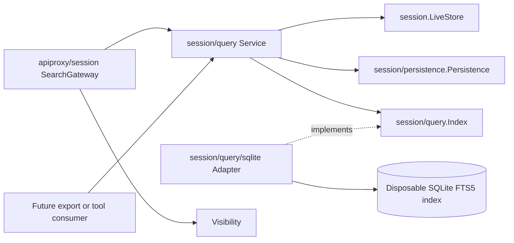
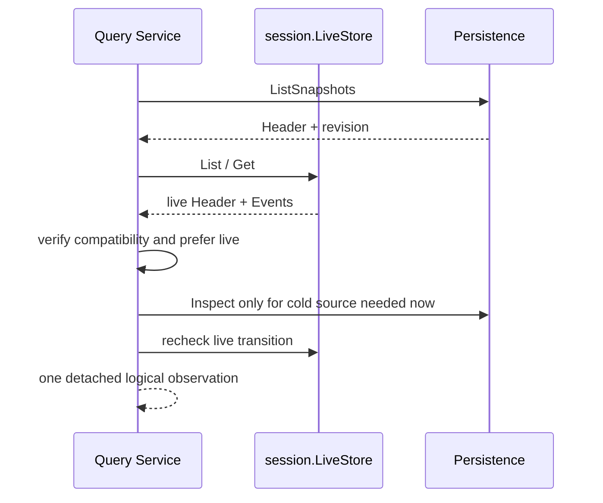
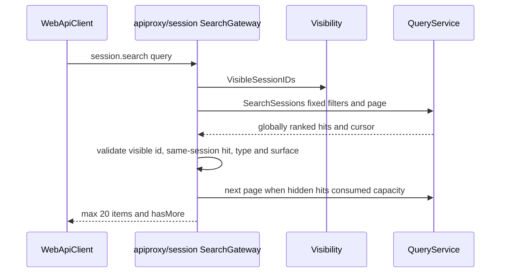

# 23 Session Query 与 Search 设计

状态：Accepted

本文拥有 live-preferred Session corpus、精确读取/过滤/关系追踪、语义文档提取、可重建 SQLite FTS5 index、cursor generation 与 `session.search` 的 Query 侧语义。浏览器 method 的可见性和 wire 映射由[16 Session API Gateway 与实时 Frame 投影](./16-session-api-gateway-and-live-frames.md)拥有；durable facts、revision 与 recovery 由[19 Session Persistence 与 SQLite 事实存储设计](./19-session-persistence-and-sqlite.md)拥有；Header/Event/surface invariant 由[10 Session Core 与生命周期](../session/docs/design.zh-CN.md)拥有；实施证据只见[08 实施进度](./08-implementation-progress.md)。

## 1. 固定源与职责映射

固定源基线：`47f943859bef60e4160492346772ded9b24f765a`。

| TypeScript owner | Go owner | 保留职责 |
| --- | --- | --- |
| `packages/session-query/session-query/src/index.ts` | `session/query.Service`、`QueryService` | exact reads、filter、title、surface、event window 与 trace |
| `corpus.ts` / `sources.ts` | `Service.ListSessions`、`loadLogical`、`observeCorpus` | live-preferred source selection、Header compatibility 与 cold observation |
| `documents.ts` / `extraction.ts` | `documents.go` | first-party semantic Event text 与 surface classification |
| `tracing.ts` | `exact.go` | Session lineage、surface replacement 与 source-event relationships |
| `session-query-sqlite/src/index.ts` | `session/query.Service` + `session/query/sqlite.Adapter` | observation/reconciliation policy 与 storage-only derived index 分离 |
| `query.ts` / `schema.ts` | `session/query/sqlite` | FTS5 schema、ranking、literal query、snippet、generation 与 row mapping |
| `host/apiproxy/src/api-proxy.ts` 的 `sessions.search` | `apiproxy/session.SearchGateway` | Host 可见性、固定 message scope、Provider page consumption 与 wire projection |

Go 保留源项目的职责划分，但不翻译 TypeScript abstract class、函数组合或 AbortSignal 写法。`Service` 是有状态领域对象；exact query、corpus reconciliation 和 cursor policy 是它的方法。SQLite 只实现 `Index` port，不成为第二个 Session Persistence，也不拥有浏览器权限。

## 2. 边界与依赖方向

依赖规则：

- `session/query` 依赖 Session core 和 Persistence 的稳定 capability，不依赖 API Proxy、Echo、WebSocket、SQLite driver 或 sqlc 类型；
- `session/query/sqlite` 依赖 Query-owned `Index` contract，生成类型止于 `internal/dbsql`；
- API Proxy 只消费 `QueryService`，不能查询 FTS table 或解释 index generation；
- Persistence SQLite 保存 canonical Header/Event facts；Query SQLite 保存可删除、可重建的文档与排名元数据，两者不双写同一责任；
- Query Service 不创建、resume、fork 或修改 Session，也不发布 Session lifecycle event。

## 3. Query Service 能力矩阵

`QueryService` 是上游消费的稳定能力，功能按问题而不是存储方式分组：

| 能力组 | 方法 | 语义 |
| --- | --- | --- |
| Corpus | `ListSessions`、`ReadSession`、`FilterSessions` | 列出 live/persisted availability；读取完整 replay-valid log；按 ID/CWD/created-at/parent/availability 过滤 |
| Title | `ReadTitle`、`ReadTitleSnapshot`、`ReadTitleSnapshots` | 从同一 Header/Event observation fold title；batch 保持首次出现顺序并隔离单 Session 失败 |
| Event | `ListEvents`、`FilterEvents`、`ReadEvent` | 分类 raw event surface；按 seq/time/type/surface/literal text 过滤；读取受限的连续上下文窗口 |
| Surface | `ReadSurface` | 返回当前 model-visible Event 序列及 raw-log capture boundary |
| Relationship | `TraceSession`、`TraceEvent` | 追踪 parent/child lineage、replacement chain、replaced nodes、source 与 derived event edge |
| Full text | `SearchSessions`、`SearchEvents` | 基于同一 live-preferred corpus 搜索并按最佳 event 或 event relevance 排名，返回 opaque cursor |

Exact reads 与关系追踪不依赖 SQLite。只有 full-text search 经过 `Index` port；因此 index 暂时不可用不应改变 `ReadSession`、`ReadSurface` 或 `TraceEvent` 的领域算法。

## 4. Live-preferred corpus

同一 Session ID 可能同时存在于 live `session.LiveStore` 和 durable `Persistence`。Query Service 先观察两类来源，再形成一个逻辑 Session：

1. Persistence `ListSnapshots` 提供 cold Header 和 source-qualified revision；
2. live LiveStore 提供同一时刻 detached Header/Event snapshot；
3. 同 ID 同时存在时验证 Header compatibility，并选择 live Event log；
4. availability 仍同时保留 `live=true` 与 `persisted=true`，来源选择不抹去事实；
5. cold 读取在 `ListSnapshots -> Inspect` 之间再次检查 live LiveStore；若 Session 已进入 live，最终仍选择 live；
6. 同 ID Header 冲突、重复 persisted listing 或无法 replay 的 log 明确失败，不能静默选择任一来源。

`ReadTitleSnapshots` 对 cold Inspect 使用 bounded worker count；调用取消会停止 admission、等待已启动 worker 收敛，再把整个 operation 分类为 aborted。每个 Session 的非取消失败留在自己的 result，不阻断其他 ID。

## 5. Surface、语义文档与关系追踪

Query 不把每个 JSON payload 都全文索引。`BuildDocuments` 只从当前 Harness 已知的一方语义事件提取可搜索文本，例如 user/assistant message、tool call/result、request error、turn end 与 todo；纯结构控制事件可以保留 EventRecord，但没有 Document。

每个 raw Event 经过 Session surface fold 后属于：

- `current`：仍在当前 model context；
- `shadowed`：被后续 replace operation 从 current surface 替换；
- `log-only`：从未进入 model-visible surface 的普通 durable fact。

`TraceEvent` 只报告日志中可证明的直接关系：位置替换、当前 target 替换的节点、`sourceEvent` 引用及以后直接引用 target 的 derived events。它不根据文本相似度猜测因果。`TraceSession` 沿 `ParentSession` 构造 ancestor 与递归 descendants；缺失 parent 返回 `complete=false` 和首个 unresolved ID，环则是 invalid-lineage failure。

## 6. Derived index 与 reconciliation

SQLite index 是 Query Service 的 disposable read model，包含：

| 表 | 作用 |
| --- | --- |
| `index_state` | 全 corpus generation，用于跨 Session search cursor |
| `indexed_sessions` | detached Header、availability、source revision 与 per-Session generation |
| `indexed_documents` | FTS5 semantic text 与 Session/Event/surface metadata |

每次 full-text search 在 Service mutex 内完成 observe、reconcile 和 query，确保 page 与 cursor 引用同一 derived generation。Reconciliation 规则：

- source revision 改变：重建该 Session documents 并递增 per-Session generation；
- 只有 live/persisted metadata 改变：更新 Header/availability，不重复提取文档；
- logical corpus 中消失：删除 Session 与 documents；
- delta 在一个 SQLite transaction 内完成，最后递增 corpus generation；
- adapter 只执行 replacement/remove，不能自行调用 Persistence 或决定 live precedence。

SQLite path、journal mode、snippet code points 和 Query page/window/concurrency policy由 typed config 解码。`sqlc.yaml`、schema、query 与生成代码全部位于 `session/query/sqlite`。固定查询由 sqlc 生成；带可选 filter 的 FTS statement 在 adapter 内构造并使用 positional parameters，输入 query 始终作为字面数据，不作为 FTS syntax 执行。

## 7. Search、ranking 与 cursor

`SearchSessions` 对 matching documents 先用 FTS5 relevance 排序，再为每个 Session 保留最强 event；`SearchEvents` 在一个 Session 内返回 event hits。相同 relevance 下使用 event time、Session ID 与 seq 建立确定性顺序。Snippet marker 只用于 adapter 内定位命中，返回前生成 bounded plain text。

Query normalization：

- query trim 并压缩空白，空文本与 NUL 拒绝；
- limit 使用 typed default，必须在 configured maximum 内；
- range 必须正向，surface/availability 只接受 closed enum；
- filter list 在 fingerprint 中排序去重，使等价请求共享 cursor identity；
- FTS special character 被整体 quote，`OR`、`*`、引号等按文字搜索，不执行表达式。

Opaque cursor 包含 provider instance、query scope、normalized request fingerprint、generation 与 offset。跨实例、跨 request 或损坏 cursor 返回 invalid-cursor；相关 generation 改变返回 stale-cursor。Host `session.search` 可以在 stale cursor 时从第一页重新收集，但 Query Service 不替 Host 做可见性策略。

## 8. `session.search` Gateway

浏览器 method 只接受 `{query}`，产品边界固定为 current surface 的 `user/message` 和 `assistant/message`。调用链：

Host 选择消费全局排序页后过滤，而不是把所有 visible ID 绑定到一条 SQLite statement；这保持 Provider ranking 和 SQLite portable variable budget。`apiproxy/session.Visibility` 只暴露 ID 集合，不让 Search Gateway 依赖 `session.list` wire DTO。重复 cursor、超预算 Provider、越界 page 或不一致 hit 是内部 contract failure；取消映射为 canonical `cancelled` RPC error。

## 9. 生命周期、失败与配置

Session Query Plugin 依赖 `sessions` 与 `sessionPersistence`，提供唯一 `sessionQuery` Service。composition root 构造 SQLite `Index` adapter，再构造 Service；SQLite 没有独立 Plugin/Factory/Service key。Scope shutdown 等待当前 Service operation 后关闭 index。

稳定错误码区分 aborted、corrupt-session、not-found、invalid filter/query/window/limit/cursor/lineage/surface、stale cursor、persistence failure、index failure 与 source conflict。API Gateway 只把当前 browser method 需要的取消和 internal failure 映射为 wire error；未来 Tool consumer 可以按稳定 Query code 使用不同产品语义。

默认数据目录使用独立的 Session Query SQLite 文件。它可以删除并由下次 search 从 live LiveStore/Persistence 重建；不能把该文件作为 history、resume、export 或灾难恢复来源。

## 10. 明确边界与后续能力

- Session Fork 明确排除；Query lineage 可读取既有 parent facts，但不创建 fork；
- log export 是独立输出 use case，不能把 SQLite index 或 `ReadRaw` 假装成通用导出；
- `session_search` / `session_event_search` Agent Tool 是 Query Service 的潜在 Consumer，进入时必须拥有 workspace/visibility policy、输入/输出 schema 和 Tool execution boundary；
- retention、ACL、workspace scope 与 remote corpus 必须由各自 use case 向 Query 提供明确 constraints，不能塞进 storage adapter；
- 若增加其他 Index adapter，应实现同一个 consumer-owned port，并保持 literal-query、generation、cursor 和 ranking contract。
