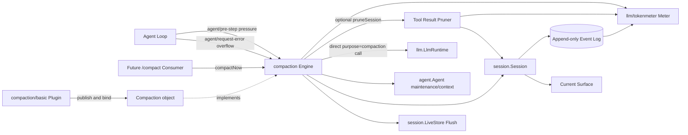
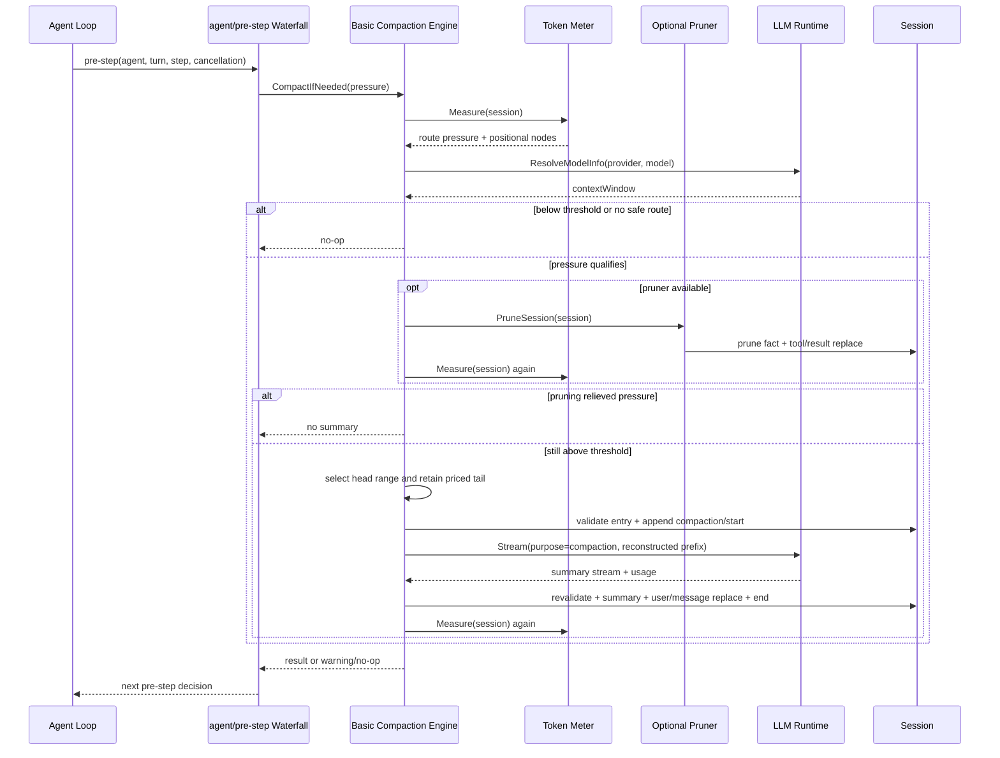
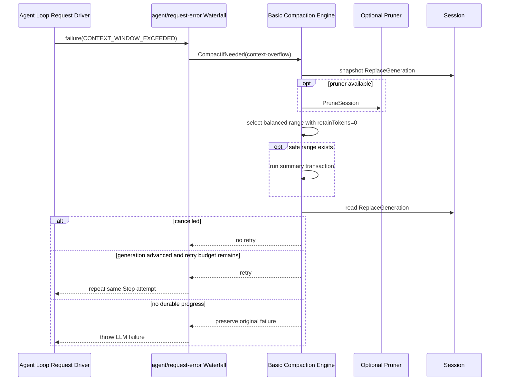
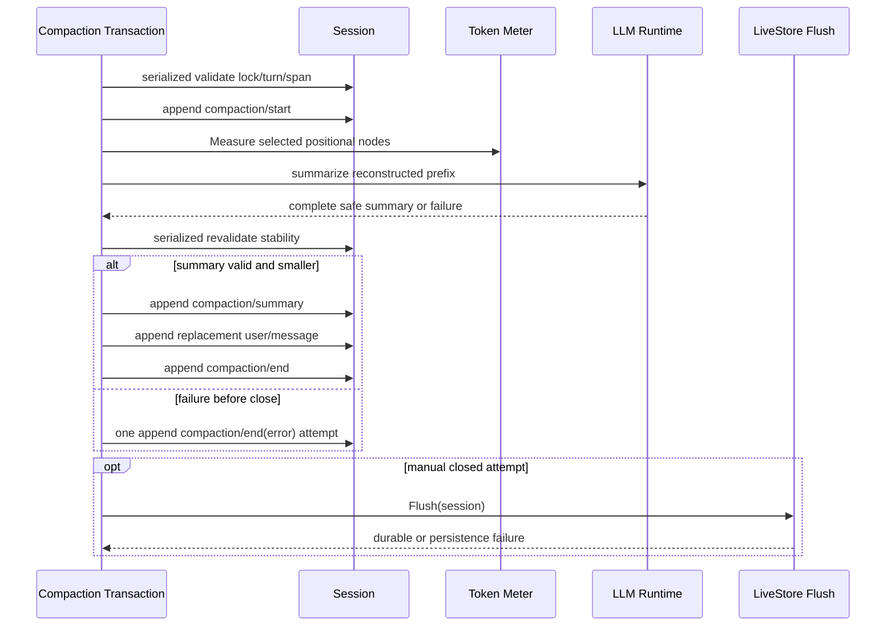
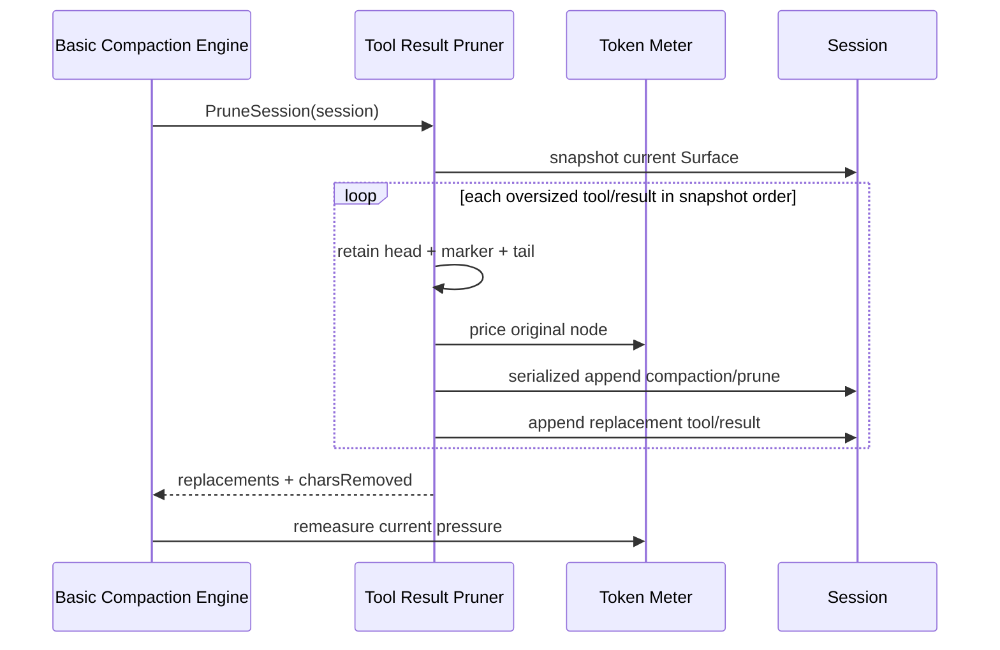

# 24 Context Compaction 设计

状态：Implemented（`/compact` Command Consumer 仍 Deferred）

本文拥有 Goren 的 Context Compaction 能力边界、Service Definition / Provider / Consumer 分工、Token Meter 依赖、`compaction/*` 持久化事实、Surface replacement 事务、自动压力与 context-overflow 恢复流程、Tool Result Pruning 以及未来 `/compact` Consumer 的目标设计。实施明细和验收 Gate 只见[25 Context Compaction 实现进度](./25-context-compaction-implementation-progress.md)；全仓总体状态仍由[08 实施进度](./08-implementation-progress.md)汇总。

Session append-only log、Surface 与 LiveStore 生命周期由[10 Session Core 与生命周期](./10-session-core-and-lifecycle.md)拥有；Tools post-execute 与 Tool result 物化由[12 Tools Registry 与执行流水线](./12-tools-registry-and-execution-pipeline.md)拥有；LLM request、stream、usage 与 model capacity 由[13 Harness LLM Runtime 与 DeepSeek Provider](./13-harness-llm-runtime-and-deepseek-provider.md)拥有；Agent maintenance、`agent/pre-step` 和 `agent/request-error` 分别由[14](./14-agent-registry-inbox-and-events.md)和[15](./15-agent-loop-and-request-driver.md)拥有。本文只定义这些能力如何被 Compaction 消费，不转移其所有权。

## 1. 源证据与基线约束

本文按用户指定的 DeepSeek Harness 最新提交分析：

- 专项源证据 commit：`b150a551b8d465e31e418e1b2eaf5e79bbb7d28e`；
- tag：`dsh-v0.1.1-rc.2`；
- 本地只读参考：`../deepseek-harness`；
- commit 时间：2026-08-21。

该提交已由[01 复制范围与兼容基线](./01-porting-scope-and-baseline.md)作为 Context Compaction capability-scoped exception 接受；不会把全仓兼容基线从 `47f943859bef60e4160492346772ded9b24f765a` 静默升级。`47f9438..b150a55` 的 Compaction runtime、Token Meter projection、Command 参数和 TypeScript 专属机制差异分类也由 `01` 持有。

主要源 owner：

| TypeScript owner | 角色 | Goren 目标 owner |
| --- | --- | --- |
| `packages/compaction/compaction` | Service Definition、事件、结果、checkpoint source、tool pairing | `compaction` |
| `packages/compaction/compaction-basic` | 模型支持的基础 Provider、策略、区间事务、summarizer | `compaction/basic` |
| `packages/compaction/compaction-tool-result-pruner` | 可选无模型 Tool Result Pruner Service | `compaction/toolresultpruner` |
| `packages/compaction/command-compact` | 人工 `/compact` Consumer | `compaction/command`，Commands 进入范围后再实现 |
| `packages/llm/token-meter` | 单例 replay Token Meter | `llm/tokenmeter` |

Go 保留源项目的职责边界和 canonical capability/event/config 名，不复制 TypeScript declaration merging、abstract class、AbortSignal 或闭包式事务实现。状态、事务和生命周期由命名 struct 与方法拥有；Waterfall 只保留为 AgentLoop 调用 Compaction policy 的扩展入口。

## 2. 目标与非目标

### 2.1 目标

- 在模型请求前按最后一个 durable provider/model route 计量上下文压力；
- 在普通压力达到阈值时，保留近期原文并把较老的安全 Surface 区间压成一个 checkpoint；
- 在 Provider 明确报告 `CONTEXT_WINDOW_EXCEEDED` 时，强制尝试一次有用的安全缩减，并只在 Surface 已前进时重试请求；
- 先以无模型 Tool Result Pruner 消除超大结果中部，再决定是否需要 LLM summary；
- 所有模型可见输入都能从 append-only Session log 重建；
- 记录 summarization 的 provider、model、usage、原始输出和 shadowed provenance；
- 支持取消、并发 Surface 变化、部分提交、持久化失败和进程崩溃后的可检测状态；
- 为未来 `/compact` 提供 backend-neutral 的人工 Consumer seam。

### 2.2 非目标

- Compaction 不拥有 LLM 路由、Provider tokenization、Tool execution、Session persistence adapter 或 Agent Turn 状态机；
- 不通过删除旧 Event 缩小 Session log；原始消息和 Tool result 仍保留为 durable facts；
- 不保证精确 tokenizer 计数；固定 Token Meter 是一致的压力近似，不是计费记录；
- 不压缩 system prompt、Tool schema 或不能拆分的单一消息；这些部分单独超限时 Surface compaction 无法修复；
- 不把 Spill 纳入本文。Spill 是 Tool result durable admission 前的外置存储与预览策略，与历史 Surface compaction 是不同能力；
- Commands 未进入范围前不创建 `/compact` handler 或占位 package；
- 不为 Compaction 创建第二套 LLM runtime、Session store、事件总线或全局 Context Manager。

## 3. 架构与依赖方向

依赖规则：

- Agent Loop 主动调用 `agent/pre-step` 与 `agent/request-error` Waterfall，不直接依赖 `compaction/basic`；
- `compaction/basic` 是 `compaction.Engine` 的唯一默认 Provider，依赖 consumer-facing `llm.LlmRuntime`、Token Meter、Agent 和 Session contract；
- Token Meter 属于 `llm` capability，独立于 Compaction，可被其他压力 Consumer 复用；其三个展示 projection 通过可选 Session Projection Registry 注册；
- Tool Result Pruner 是可选 companion service，不是第二个 Compaction backend；
- Session 拥有事件顺序、Surface mutation 和多 producer 串行化；Compaction 不能直接操作 Session mutex 或 persistence Backend；
- summarization 直接调用 `llm.LlmRuntime`，不伪装成 Agent Step，也不经过 AgentLoop request driver；
- 手工路径通过 `Agent.RunMaintenance` 与 Turn admission 串行，并通过 `session.LiveStore.Flush` 建立 durability checkpoint。

### 3.1 Plugin 生命周期与业务对象分离

每个 Provider 包内都区分 Runtime Plugin 与业务实现对象：

- `basic.Plugin` 只声明依赖、发布 `compaction.Engine`、注册 Waterfall/Event effect，并在 `Apply`/`Dispose` 绑定或释放依赖；`basic.Compaction` 拥有 policy 和 use-case orchestration，`automaticCompaction` 拥有跨 hook overflow 状态，`regionCompactor` 与 `llmSummarizer` 分别拥有区间事务和辅助 LLM protocol；
- `toolresultpruner.Plugin` 发布 `ToolResultPruner`，后者拥有字符裁剪和 Session replacement 业务；
- `tokenmeter.Plugin` 发布 `TokenMeter`，后者拥有 estimator 与 per-Session replay fold；
- middleware 和统一 Event observer 是 Plugin Runtime 要求的 adapter，只转发到业务对象，不保存第二份业务状态。

因此 Plugin 不实现 `Engine`、`Pruner` 或 `Meter`。Runtime 发布的是其内部业务对象；工厂仍只构造 Plugin，composition root 不直接组装业务依赖。

### 3.2 独立边界依据

Token Meter、Compaction、Pruner 不折叠为一个包，原因是：

- **Actor**：Token Meter 是任意压力 Consumer 的同步读服务；Compaction 由 Agent hook 或人工命令触发；Pruner 由 Compaction Provider 选择调用；
- **一致性**：Meter 只折叠日志；Compaction 拥有跨异步 LLM 调用的长事务；Pruner 每个 replacement 是独立、同步、可部分成功的短事务；
- **外部依赖**：只有 Basic Compaction 依赖 LLM；Pruner 无模型；Meter 核心只依赖 Session log 和 LLM vocabulary，并可选注册 Session projection Unit；
- **变化原因**：模型压力估算、摘要策略、字符裁剪策略分别演进。

若折叠，Provider 替换会同时改变计量口径，Pruner 会被迫依赖 LLM，其他压力 Consumer 也只能通过 Compaction 读取 token，破坏源 Service Definition / Provider / Consumer 分工。

## 4. 上游调用契约

### 4.1 `agent/pre-step` 自动压力入口

**调用者**：Agent Loop。

**输入**：当前 Agent、`pressure` trigger、当前 Turn cancellation context。

**契约**：

- 在 Inbox claim 与 System Prompt assembly 后、正式模型 request 派生前调用；
- Compaction middleware 可以检查并缩减 Session，但最终继续调用下游 `next`，不改写 proposed user messages；
- 未达到阈值、缺少 durable route 或没有安全区间时返回 no-op；
- 普通 compaction 失败记录 warning 并继续当前 Turn，不能把可恢复的压缩失败伪装成 AgentLoop contract failure；
- cancellation 必须停止 summarization，并由 AgentLoop 的既有取消边界收敛。

### 4.2 `agent/request-error` overflow 恢复入口

**调用者**：Agent Loop 在一次 LLM attempt 以 error/aborted finish 结束后调用。

**输入**：Agent、canonical failure、`context-overflow` trigger、当前取消 context。

**契约**：

- 仅处理 code 为 `CONTEXT_WINDOW_EXCEEDED` 的 Provider failure；
- confirmed overflow 绕过普通阈值并把 retained-tail budget 设为零；
- 每个连续 overflow recovery sequence 受 `maxOverflowRetries` 限制；
- 只有 `Session.Surface().ReplaceGeneration` 大于进入 recovery 前的 generation 才返回 retry；
- Pruner 已落地而 summary 后续失败时，已发生的 Surface 前进仍可作为一次 retry 证据；
- cancellation 后不得 retry；成功 assistant message 或 Agent 回到 idle 会清空该 Agent 的 overflow retry 计数。

### 4.3 未来 `/compact` 人工入口

**调用者**：Commands capability 的 `/compact` Consumer。

**契约**：

- 只接受无参数 `/compact`；
- 调用 backend-neutral `compactNow`，不依赖 Basic Provider 的配置类型；
- 必须通过 `Agent.RunMaintenance` 在 Turn 之间取得 admission；
- 无安全区间时不写 `compaction/start`，返回稳定 no-op 文案；
- 成功或已关闭的失败 attempt 在释放 maintenance admission 前执行 `LiveStore.Flush`；
- Commands capability 未实现前，本入口保持 Deferred。

## 5. 下游能力契约

### 5.1 Token Meter

Token Meter 是 Host singleton，没有配置；所有调用共享固定估算器。它至少提供：

- `Measure`：在同一个 consumed log revision 返回 request pressure、baseline、Surface signed delta、Surface 总价和按当前位置排序的 node price；
- `EstimateMessage`：使用同一估算器计算单条 Message。

计量规则：

- 默认以每四个字符约一个 token，加 role、content block、Tool schema 和 request envelope 结构开销；
- 只有最新成功调用的 canonical request envelope 与当前被计量 envelope 相同，且 Provider usage 不低于完整 heuristic anchor 时，才复用 Provider usage；
- 否则对当前完整 envelope 和 Surface 重新估算；
- `surfaceTokens` 必须等于所有 `nodes[].tokens` 之和；
- 返回值 detached、immutable，并绑定一个 `logRevision`；
- Compaction gating 必须直接调用 `Measure`，不能读取 UI projection；
- 每次 measurement 保留 positional Surface snapshot，因此允许 O(surface)。

`tokenUsage`、`contextPressure` 和 `contextBreakdown` 已实现为 Token Meter 可选注册的展示 Projection Unit。它们由通用 `session/projection.Registry` 驱动，支持 checkpoint/replay，但不成为 Compaction 判断依据。

### 5.2 LLM Runtime

Basic Provider 通过当前 `llm.LlmRuntime` 进行一次 direct stream call：

- route 优先级是 Compaction 显式 provider/model、最后 durable route、Agent options；
- request `Purpose` 为 `compaction`，DeepSeek Adapter 已据此发送 `x-deepseek-harness-compact: 1`；
- 输入前缀复用最后 request header 的 system、tools 和被选 Surface 区间的派生消息，最后追加固定 summarization instruction；
- cancellation context 原样传递；
- error、aborted、`max-tokens`、空文本或 image output 都不能形成 checkpoint；
- Provider 返回的完整 raw output、usage、provider、model 和 generation cap 进入 durable summary fact。

### 5.3 Session

Session 提供三类保证：

1. append-only Event seq 与严格 payload codec；
2. 按当前位置解释的 Surface append/replace；
3. 对独立 producer 的同步串行化。

Session 通过 `SerializeProducer` 拥有多 Event 同步 producer 串行化：callback 内可以完成校验和连续追加，因此 `summary -> replacement -> end` 以及 `prune -> replacement` 不会被其他 producer 插入。mutex 不暴露给 Compaction，LLM 请求也不会跨该同步边界持锁。

### 5.4 Agent 与 LiveStore

- 自动 Compaction 使用 Agent 当前 Session、route options 和 Turn cancellation；
- 手工 Compaction 使用 `RunMaintenance`，保证它与 Turn driver 不并行拥有 Agent；
- `LiveStore.Flush` 只用于手工关闭后的 durability checkpoint；自动路径仍随 Turn 的既有 durable boundary 落盘；
- Compaction 不调用 persistence adapter，不解释 write-behind 或 SQLite failure。

### 5.5 可选 Tool Result Pruner

Pruner 读取当前 Surface 的稳定 snapshot，只处理超预算 `tool/result`：

- 字符预算按 Unicode code point 计算；
- 默认 `thresholdChars=8192`、`headChars=4096`、`tailChars=1024`；
- 非文本 block 原位置保留；切片不能拆分 UTF-16 surrogate pair，但可以拆分 grapheme cluster；
- replacement 保留原 Event 的全部字段，只改 result content；
- 每个 replacement 前同步追加一个 `compaction/prune` shadow-price fact；
- 一次 pass 中较早 replacement 已成功、较晚 replacement 失败时，不回滚前者；
- 第二次执行必须幂等，不再重写已经落入预算的内容。

## 6. 公共 Service 与结果契约

`compaction.Engine` 表达三项能力：

| Operation | 语义 | 结果 |
| --- | --- | --- |
| `CompactIfNeeded` | 对 `pressure` 或 `context-overflow` 运行自动策略 | `CompactionResult` 或 no-op |
| `CompactNow` | 在 idle Agent 上执行一次有用缩减，即使低于自动阈值 | `CompactionResult`、no-op 或 typed manual failure |
| `CompactRegion` | 强制压缩一个按 Surface 位置定义的闭区间 | `CompactionResult` 或 validation/summary/commit failure |

`CompactionResult` 至少包含：

- `compactionId` 与可选 `sourceCommandId`；
- `startSeq`、`summarySeq`、`endSeq`；
- 安全 summary content；
- `shadowedRange`、按 Surface 顺序列出的 `shadowedSeqs`；
- `shadowedTokenCount`。

`shadowedRange.start/end` 是当前 Surface 两个边界 node 的 seq，不是数值区间。历史 replacement 可能让早位置拥有更大的 seq，因此不能用 `start <= end` 或整数遍历判断区间。

人工预期失败使用稳定分类：`busy`、`cancelled`、`changed`、`summary`、`commit`、`persistence`。`commit` 可能意味着部分 mutation 已发生；`persistence` 表示内存事务已经关闭，但 durability checkpoint 失败。

## 7. 持久化事件与 checkpoint source

### 7.1 `compaction/*` Event

所有事件都是 log-only，不进入 Surface：

| Event | 必需事实 | 作用 |
| --- | --- | --- |
| `compaction/start` | `compactionId`、可选 `sourceCommandId`、`turn: number \| null` | 取得 durable compaction lock |
| `compaction/summary` | identity、summary、shadowed range/seqs/token count、provider、model，以及可选 raw output/maxTokens/usage | 保存 summary 事实和 shadow price |
| `compaction/end` | 与 start 相同的 identity/owner，可选 `error` | 关闭成功或失败 attempt |
| `compaction/prune` | shadowed range/seqs/token count | 为紧随的无模型 replacement 提供 shadow price |

实际 summary replacement 是单独的 `user/message`：

- `surfaceOp` 为 replace；
- `sourceEventSeqs` 包含 start、summary 以及全部 shadowed Surface seq；
- message source 使用 `{kind:"plugin", plugin:"compact", compactionId, sourceCommandId?}`。

### 7.2 MessageSource 扩展

Compaction 拥有 `CheckpointSource` 的构造和识别，`llm` 不反向依赖 Compaction。当前实现保持：

- 已知 `form` 继续 strict decode；
- 非空 `plugin` 的 merge-extension source 可以作为 lossless opaque source replay；
- Compaction 通过自己的严格 codec 构造和识别 `plugin=compact` source；
- malformed 已知 core form 仍然失败，不能用 opaque fallback 隐藏协议错误。

## 8. 核心不变量

1. 同一 live Session 最多存在一个未关闭、未被新 `session/end-seed` 淘汰的 Compaction attempt。
2. 自动 attempt 的 `turn` 必须等于当前 open Turn；人工 attempt 的 `turn` 必须为 `null` 且进入时没有 open Turn。
3. `compaction/start` 在任何异步 summarization 前提交，作为 durable lock。
4. 每个已开始 attempt 在失败时只能进行一次 close 尝试；close 失败保留 orphan lock。
5. summary 与 replacement 必须同步相邻；prune fact 与对应 tool-result replacement 也必须同步相邻。
6. 选择范围必须存在于当前 Surface，按位置正向，并且两端不切断 tool-call/result 配对。
7. checkpoint 的估算 token 必须严格小于 shadowed token count。
8. 自动路径提交前要求整个 Surface 与准备时一致；人工路径只要求所选 span 仍连续、平衡且价格一致。
9. replacement 必须引用全部 shadowed nodes；Pruner replacement 只能改变 Tool result content。
10. overflow 只在 `ReplaceGeneration` 前进时允许 retry；cancellation 永远禁止 retry。
11. 所有 summarization 输入、输出、route 和 Surface 变化都能从 Session log 与固定代码重建。
12. Token Meter 是唯一 gating 计量权威；projection 不能反向驱动业务决策。

## 9. 自动压力交互流程

默认 pressure policy：`thresholdRatio=0.8`、`retainRatio=0.16`、`maxTokens=8192`、`compactionRetries=1`、`maxOverflowRetries=1`、`auto=true`。`modelPolicies` 只做 exact provider/model override；unknown config key、非法 ratio、冲突 retention 或不安全整数必须在 Factory 创建 Plugin 前失败。

## 10. Context-overflow 恢复流程

## 11. 区间事务交互流程

入口和提交阶段使用短同步 producer serialization；LLM 请求位于两者之间，不能持有 Session producer lock。`compaction/start/end` 是锁时间点，不是排他容器：人工 summarization 等待期间，独立的 idle injection 可以出现在 marker 中间，人工提交只替换原选中 span。

## 12. Tool Result Pruning 流程

Pruner 不保存被裁剪文本的外置副本；完整原 Event 只存在 append-only Session log 中。若产品要求模型日后按 locator 读取完整输出，应另行实现 Spill，而不是改变 Pruner contract。

## 13. 生命周期、失败与取消

- Basic Plugin 注册并持有 `agent/pre-step`、`agent/request-error`、`agent/status` 和 `session/event` effect，Dispose 时逆序撤销；内部 Compaction 对象持有业务状态；
- 每 Agent overflow retry 计数属于 Engine instance，不写入 Session；成功 assistant 或 idle 清理；
- Token Meter 的 per-Session fold 必须并发安全，并在 Session 不再可达时允许回收；
- summarization cancellation 关闭 stream、停止接收 chunk，并进入一次 close attempt；
- 自动 compaction 的无 durable mutation failure 只 warning 并继续；已发生 prune replacement 时继续使用新 Surface；
- manual failure 明确区分 no-op、busy、changed、summary、commit 和 persistence；
- crash 后 unmatched start 由 log fold 检测；早于最新 `session/end-seed` 的 unmatched start 是旧 lifecycle 证据，不阻塞当前 Session；
- Provider usage、raw output、错误链和配置快照不得包含 credential。

## 14. 已落地的公共前置

下列前置已由各自 owner 实现，Basic Provider 不再保留私有替代路径：

1. `llm` 对 merge-extensible plugin MessageSource 的 lossless decode，已知 form 仍 strict；
2. Session-owned `SerializeProducer` 多 Event 同步串行化；
3. 单例 replay Token Meter、固定 estimator 和三个可选 Projection Unit；
4. Compaction EventKey、cold replay invariant、tool pairing 和 checkpoint source codec；
5. 从 `b150a55` 可重复生成的 TypeScript config/event/result/checkpoint vectors；
6. 默认 composition 的 Factory 注册、启用顺序与 keyless 启动验证。

详细代码与测试证据见[25](./25-context-compaction-implementation-progress.md)。

## 15. 验证所有权

- `llm/tokenmeter` 包测试拥有 estimator、request-envelope anchor、usage reuse 和 Surface replay；
- `session` 包测试拥有同步事件组相邻性、replacement provenance 和并发 producer；
- `compaction` 包测试拥有 Event codec、checkpoint source、tool pairing 和 log invariant；
- `compaction/basic` 包测试拥有策略、区间、summarizer、自动/overflow/manual transaction；
- `compaction/toolresultpruner` 包测试拥有 Unicode budget、字段保留、幂等和部分成功；
- `tests/contract` 拥有最新 TypeScript 到 Go 的 event/config/result differential；
- `tests/architecture` 拥有依赖方向、Factory/Service canonical name 和禁止平行 LLM/Session runtime；
- real-provider compaction smoke 必须自跳过且与 keyless contract suite 分离。

详细 Gate、状态和证据见[25 Context Compaction 实现进度](./25-context-compaction-implementation-progress.md)。

## 16. 未决事项

### 16.1 专项升级基线（已决）

`01` 已接受 `b150a55` 作为 Compaction capability-scoped baseline exception；全仓其他能力继续固定在 `47f9438`。该决定只准入目标源，不等于 Goren 已达到最新源 parity；是否完成仍由[25](./25-context-compaction-implementation-progress.md)的差分和行为 Gate 判断。

### 16.2 默认启用（已决）

Token Meter、Tool Result Pruner 和 Basic Provider 已注册到 Factory Catalog 并进入 Goren `DefaultSpecs`。默认 composition 先发布 Meter 与 Pruner，再发布 Basic Engine；缺失 required capability 时启动失败并按 Runtime 规则逆序回滚，不走 silent fallback。

### 16.3 `/compact` Consumer

Commands 当前不在已实现闭包。Engine 已支持自动入口与人工 `CompactNow`；只有真实 Commands Service、command lifecycle 和 adapter 进入范围后，才实现 `compaction/command`。
