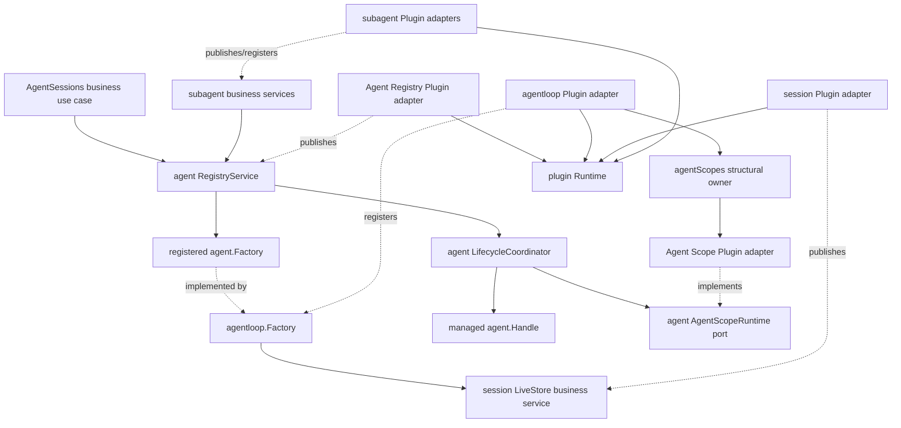

# Agent 构造与父子生命周期重构方案

状态：Final Design，实现与全量验收已完成

最后核对当前实现：2026-08-25

## 0. 文档定位

本文定义 `agent`、`agentloop`、`apiproxy/session` 与 `subagent` 之间的最终职责、依赖方向和验收边界。具体机制拆分到两份同级专题文档：

- [Agent 构造事务与调用流程设计](Agent构造事务与调用流程设计.md)
- [Agent 生命周期与运行期父子所有权设计](Agent生命周期与运行期父子所有权设计.md)

实施与进度分别维护：

- [Agent 重构实施方案](Agent重构实施方案.md)
- [Agent 重构进度矩阵](Agent重构进度矩阵.md)

上述三份设计文档定义已经落地的目标职责；实现与验收证据只在进度矩阵记录。当前文档治理约束为：

- 设计确认前不更新 `zh-CN/README.md`、全局设计索引或实施进度；
- 不新增 `session/prepared` 或其他通过 Session 事件隐式创建 Agent 的路径；
- 未明确要求时，不自动与外部实现对照；兼容性核对必须单独声明基线、证据和影响。

相关 Subagent 设计：

- [Subagent 领域设计](../subagent/docs/design.zh-CN.md)
- [Parent-bound Subagent 技术设计](../subagent/docs/parent-bound-design.zh-CN.md)
- [Parent-bound Subagent 需求](../subagent/docs/parent-bound-requirements.zh-CN.md)

## 1. 最终决策

1. 普通 Agent 和子 Agent 是同一种 Agent。`root`、`parent`、`child` 只是一个精确运行期 Agent epoch 在某段关系中的角色，不形成不同 Agent 类型或不同 Agent Factory。
2. `agent.Registry` 保留统一的 Create、Resume 和 Agent Factory 注册入口。具体 Registry Service 与 Agent Lifecycle Coordinator 是普通 Go 业务对象，不实现 Plugin。
3. `agentloop.Factory` 实现 Agent Factory，统一负责一个 Agent 及其 Session 的物理构造、发布、运行和单体 teardown；`agentloop.Plugin` 只解析依赖、注册 Factory、提供统一 Agent Scope 结构宿主并适配启停。
4. `agent` 模块的 Agent Lifecycle Coordinator 拥有所有 Agent 的完整生命周期，包括运行期父子所有权、materialization admission、managed Handle、parent closing cutoff、in-flight join 和 descendant child-first teardown；Plugin adapter 不保存这些业务状态。
5. `subagent` 只拥有委派语义：Subagent Provider、durable lineage、depth、descriptor、结果、binding、消息投递和驻留策略。它不实现 Agent 生命周期状态机，也不持有可绕过 `agent` 协调器的底层 Handle。
6. `apiproxy/session.AgentSessions` 负责普通 Agent 激活用例，包括按 Session ID 去重、Create/Resume 决策、普通 Session 围栏、CWD、preset 和 model composition。
7. Session 不触发 Agent 创建。Agent 创建是必须返回结果并支持同步回滚的命令，不使用 `session/prepared` 或普通广播事件承载。
8. 逻辑 parent、运行期 parent、结构 owner 和 Initiator 是四个独立概念，不能互相推导。
9. 业务 Service、Coordinator、Factory、Store 和 Provider 不嵌入 `plugin.Base`，不实现 `Manifest/Apply/Dispose`。Plugin adapter 只拥有 Service binding、event bridge、结构挂载和启停 effect。

目标主链路为：

```text
普通 Agent：AgentSessions ─┐
                           ├─> agent.Registry.Create/Resume
子 Agent：subagent use case ┘          |
                                      v
                              Agent lifecycle admission
                                      |
                                      v
                              Agent Factory (agentloop)
                                      |
                                      v
                              managed agent.Handle
```

## 2. 统一术语

### 2.1 Agent Factory

`agent.Factory` 统一称为 **Agent Factory**。它由普通 Go 对象 `agentloop.Factory` 实现，负责构造或恢复一个 Agent，不判断该 Agent 是普通 Agent 还是子 Agent。`agentloop.Plugin` 只负责把该 Factory 接入 Plugin Runtime。

本文不把 Agent Factory 称为 Provider，避免与 `subagent.Provider` 混淆。

### 2.2 Agent Scope

**Agent Scope** 是单个 Agent 的私有运行期组合边界，包含 system-prompt overlay、tools overlay、Agent variables、Agent Service adapter、membership 和 Provisioning 获得的 effects。`ReactLoopAgent` 是业务对象，不直接充当 Plugin。

重构前的私有类型 `agentloop.agentTree` 实现公开的 `agent.Scope`，但 `tree` 容易被误解为父子 Agent 关系。当前实现已将其替换为 `agentScopeRoot`：

- 单个 Agent 的结构容器称为 Agent Scope 或 Agent Scope root；
- Plugin 之间的结构关系称为 Plugin topology；
- Agent 之间的运行期关系称为 runtime parent-child ownership；
- durable Subagent 关系称为 lineage。

### 2.3 Agent epoch

一个 **Agent epoch** 是某个 Session ID 在当前进程中一次精确的 Agent 驻留。冷恢复后的新 Agent 即使使用同一 Session ID，也属于新的 epoch，不继承旧 epoch 的 Handle、closing 状态、运行期 children 或 Plugin installation。

### 2.4 Agent Lifecycle Coordinator

**Agent Lifecycle Coordinator** 是 `agent` 模块中的命名状态 owner。它管理所有 Agent epoch，而不是只管理子 Agent：

- root epoch 的 runtime parent 为空；
- child epoch 指向一个精确且可接纳 descendant 的 `Publishing` 或 `Live` parent epoch；
- 一个 epoch 可以同时是另一个 epoch 的 child 和多个 epoch 的 parent。

### 2.5 Subagent Provider 与 residency policy

`subagent.Provider` 统一称为 **Subagent Provider**。它是按名称注册的委派策略扩展点：所有 Subagent Provider 都支持 one-shot `Start`，支持 continuable 的 Subagent Provider 还可以为首次创建准备 detached Session seed。Subagent Provider 可以通过 Subagent 用例或 Driver 请求 `agent.Registry` 创建 one-shot child，但不实现 Agent Factory、不直接物理构造或恢复 Agent，也不拥有 managed Handle、durable child 驻留或关闭顺序。

**Subagent residency policy** 属于 `subagent`。它根据 one-shot 完成、continuable quiescent、binding disabled、parent closing 等业务事实决定 `KeepResident` 或请求关闭，但不执行 Agent teardown。

## 3. 本次重构修正的问题

### 3.1 主构造链路本身不需要拆除

[`AgentSessions.Ensure`](../apiproxy/session/agent_sessions.go) 调用 `agent.Constructor.Create` 或 `Resume`。`RegistryService` 查找已注册的 Agent Factory，再委托普通 Go 对象 [`agentloop.Factory`](../agentloop/construction.go) 完成 Session 与 Agent 构造。

这条链路应保留。Registry 同时提供构造入口和 live membership 是 `agent` 能力的一部分，不应让调用方绕过它直接调用 Agent Factory。

### 3.2 子 Agent 生命周期被执行模式分别拥有

重构前，one-shot [`inprocess.Driver`](../subagent/internal/inprocess/driver.go) 和 continuable [`continuation.Manager`](../subagent/internal/continuation/manager_materialization.go) 虽然都通过 Registry 创建或恢复 Agent，却分别保存 Handle、closing、children 或 residency 状态：

- one-shot `Run` 持有 Handle 和结果关闭路径；
- continuable `Activation` 持有 Handle、children 和 disposal；
- parent-bound 设计还需要处理 parent close participation 与 descendant child-first 收敛。

这些是所有 Agent 都可能需要的运行期生命周期机制，应该归入 `agent`，而不是继续形成多套 Subagent 生命周期。

### 3.3 Initiator、Custody 与 parent 混合

重构前，AgentLoop 从 Context 中的 `agent.Initiator` 推导 membership owner，并通过 `agent.Custody` 隐式改变 Agent Scope root 的挂载位置。

Initiator 只回答“谁导致本次操作”，Custody 只回答“资源挂在哪里”。二者都不能证明 runtime parent 或 durable lineage。

### 3.4 生命周期状态跨模块重复

重构前，完整生命周期状态分散在 AgentLoop construction admission、Registry membership flags、单体 closing channel、one-shot `Run` 和 continuable `Activation` 中。

Agent activity、membership publication、完整 epoch lifecycle 和 Subagent 用例状态是不同概念，必须分别归属。

### 3.5 业务对象与 Plugin adapter 混合

重构前，Session Store、Agent Registry、AgentLoop Factory/Agent 和部分 Subagent Provider 同时保存业务状态并实现 Plugin lifecycle。这样会把业务关闭、Service binding、event dispatch 和结构卸载压到同一个对象。

目标设计把两类生命周期分开：业务对象只维护领域状态和用例不变量；Plugin adapter 只负责将业务能力装入 Runtime，并在 Apply/Dispose 时调用业务对象的显式启动或关闭命令。

## 4. 最终职责边界

### 4.1 `session`

负责 Session Header、append-only log、detached preparation、live membership、Session events、flush 和 persistence preparation。

Session Store 是普通 Go 业务对象。Session Plugin adapter 发布 `session.LiveStore` Service，并把业务对象决定发布的 Created、Disposed、EventAppended 和 Flush 通过 Plugin Event bridge 送入 Runtime；事件语义仍属于 Session，不属于 adapter。

不负责触发 Agent 创建，不知道 Agent options、Agent Scope、runtime parent-child ownership 或 Subagent residency policy。

Session 与 Agent 在一次 Agent 构造事务中存在必要的一致性耦合，但 `session` 包不依赖 `agent`。该耦合由 Agent Factory 显式编排，不通过事件隐藏。

### 4.2 `agent`

负责：

- `Agent`、`Factory`、`Registry`、`Handle`、`AgentEpoch` 和 `AgentTeardown` 契约；
- Agent Factory 注册与 Create/Resume 路由；
- exact live membership 和 Agent Created/Disposed；
- Agent Lifecycle Coordinator；
- root/child 共用的 materialization admission；
- managed Handle；
- runtime parent-child ownership；
- parent closing cutoff、in-flight construction join；
- descendant child-first teardown；
- Agent Runtime shutdown 的统一关闭顺序。

上述状态由普通 Go `RegistryService` 和 `LifecycleCoordinator` 持有。Agent Registry Plugin adapter 只适配 Service publication 和 Runtime 生命周期；它的 Dispose 发生在 AgentLoop 依赖方已停止之后，并调用 `RegistryService.Shutdown` 永久关闭 Registry 准入、取消剩余构造、按 child-first 顺序收敛全部 epoch。Agent-scoped events 和结构 effect 由 `agentloop` 的 Agent Scope Plugin adapter 执行，其中不保存 lifecycle state。

不负责 Subagent Provider、durable lineage、descriptor、binding、结果或业务驻留决策。

### 4.3 `agentloop`

负责：

- `agentloop.Factory` 实现 Agent Factory；
- 构造或恢复一个 exact Agent 所需的物理准备与回滚；
- fresh Session preparation 或 persistence preparation；
- 构造 unpublished `ReactLoopAgent` 和 Agent Scope root；
- Provisioning；
- Session/Agent membership enter 与 announce；
- lifecycle attach 前创建失败的逆序回滚；
- attach 后由 Coordinator 调用的幂等单体 teardown；
- 单个 Agent 的 activity、cancel、quiesce 和底层 teardown。

`agentloop.Plugin` 不实现 Agent Factory 业务方法。它解析 Session、Persistence、Agent Registry 等 Service，构造 `agentloop.Factory`，并通过 commit 阶段的 `registrationPlugin` 注册 Factory、提供所有 Agent Scope 共用的结构宿主。`FactoryRegistration.Close` 只撤销这一条 Factory 路由、取消并等待它已经接纳的构造；它不关闭既有 Agent，也不永久关闭 Registry。Runtime 整体停止时，Agent Scope 先按结构卸载，随后 Agent Registry Plugin adapter 调用 `RegistryService.Shutdown` 完成最终业务收敛。

不负责 root/child 分支、runtime parent-child ownership、descendant graph、child-first close 或 Subagent policy，也不从 Initiator 推断生命周期 owner。

AgentLoop 的职责变化是收窄而非搬迁：它继续“造出并安全停止一个 Agent”，`agent` 负责“这个 Agent 由谁拥有、有哪些 descendants、按什么顺序关闭”。

### 4.4 `apiproxy/session.AgentSessions`

负责普通 Agent 激活用例：按 Session ID 合并并发创建或恢复，选择 Create/Resume，处理 CWD、preset、默认模型和普通 Session 围栏，再调用 `agent.Registry`。

它不直接调用 Agent Factory，不自行维护 descendant lifecycle，也不通过 Session 事件触发 Agent。

普通 Agent 构造成功后，canonical lifecycle 始终由 Agent Lifecycle Coordinator 持有。`AgentSessions` 可以保存或传递 managed Handle 作为关闭请求能力，但不保存另一份 closing、children 或 teardown 状态。普通 root 默认驻留到显式 managed Close、结构兜底或 Runtime shutdown；请求 Context 结束不会关闭它。

当前 `session.create` 仍同步创建完整的普通 Session composition；本重构不增加“Session 长期存在但没有 Agent”的懒激活语义。

### 4.5 `subagent`

负责 Subagent Provider、parent 授权、durable lineage、delegation depth、child Session metadata、seed、descriptor、result、accepted messages、binding、subscription 和 residency policy。

它不负责 Agent lifecycle 状态机、底层 Handle ownership、runtime descendant graph、parent closing admission、in-flight Agent construction join 或实际 child-first teardown。

现有提案中的 `ChildRuntime`、`ChildLifecycle` 和 `ChildLifecyclePolicy` 不作为目标公共抽象。通用部分归入 `agent`；剩余业务决策统一称为 Subagent residency policy。

Subagent core Service、Manager 和 Provider 是普通 Go 业务对象。`subagent/runtime.Plugin`、spawn/fork Plugin 和 Tool Plugin 只负责依赖解析、注册、事件桥接与模型侧适配；Plugin Dispose 不自行实现 descendant lifecycle。单独卸载 Subagent Plugin 时，Service 只关闭业务准入、启动 managed Agent close 并等待 exact epoch 进入 Closing；Agent Registry 和 AgentLoop 在当前 Runtime 操作返回后完成实际 Scope teardown。

### 4.6 `plugin`

`plugin` 只负责 Scope、Service binding、Event bridge、effect、结构挂载和卸载。Plugin topology 是资源释放机制，不表达 durable lineage 或 runtime parent 授权，也不保存业务状态机。本重构不修改 Plugin Runtime，也不允许 Apply、Dispose、Event 或 Waterfall 回调重入拓扑命令。

所有 Agent Scope root 使用 `agentloop.Plugin` 提供的统一结构宿主。Agent Lifecycle Coordinator 只保存逻辑 runtime ownership，不依赖 `plugin.Plugin`。普通 Agent、one-shot、continuable 和 parent-bound 不再通过选择不同 Plugin parent 表达生命周期策略。

## 5. 目标依赖关系



编译期约束：

- `session` 不导入 `agent` 或 `agentloop`；
- `agentloop` 不导入 `subagent` 或 `apiproxy/session`；
- `apiproxy/session` 与 `subagent` 只通过 `agent.Registry` 创建或恢复 Agent；
- Agent Factory 只由 Registry 调用；
- Subagent residency policy 只能请求 managed lifecycle 操作；
- `agent` 不导入 Subagent 领域类型；
- 业务 Service、Coordinator、Factory、Store 和 Provider 不实现 `plugin.Plugin`；
- Plugin adapter 不保存 Agent epoch、Session log、Subagent residency 或 Agent activity 的 canonical 状态。

## 6. 实施入口

本文不维护实施阶段或完成状态，避免目标设计与执行记录互相覆盖：

- 破坏性接口迁移、跨模块编辑顺序、提交边界和验证 Gate 见 [Agent 重构实施方案](Agent重构实施方案.md)；
- 当前完成状态、代码证据、测试证据和剩余缺口见 [Agent 重构进度矩阵](Agent重构进度矩阵.md)。

实施不得保留旧 `Factory` 签名、Context `Custody`、Registry owner 查询或 Subagent 自定义生命周期作为过渡兼容路径。可以按模块形成可审查的本地提交，但任一阶段都不能保留双轨接口或把不完整状态描述为已验收。

## 7. 验收标准

### 7.1 架构

- 普通 Agent 和所有子 Agent 只通过 `agent.Registry.Create/Resume`；
- Registry 保留 Agent Factory registration，调用方不直接依赖 AgentLoop；
- AgentLoop 不导入 Subagent；
- Session 不依赖 Agent，也不通过事件创建 Agent；
- 所有 Agent epoch 共用 Agent Lifecycle Coordinator；
- Subagent 不实现 Agent lifecycle 状态机和 descendant teardown；
- runtime parent、durable lineage、Initiator 和 structural custody 不互相推导；
- 私有 `agentTree` 改名为 `agentScopeRoot`，不再使用 Agent tree 描述父子关系。

### 7.2 构造与回滚

- Create/Resume 每个失败点都不遗留 Session、Registry entry、Agent Scope 或 Provisioning effect；
- Factory 在 lifecycle attach 前失败时调用方不需要清理未返回对象；
- lifecycle attach 后的 publication 或 Coordinator commit 失败由 Coordinator 关闭已构造但未暴露的 Agent 及其嵌套 descendants；
- Created listener 返回错误并拒绝提交后仍发布配对 Disposed；
- 配置 Agent 不绕过 lifecycle admission。

### 7.3 生命周期与并发

- root 与 child 使用同一个结构状态 `Materializing -> Attached -> Live -> Closing -> Closed`，并使用正交的 publication 状态 `Unpublished -> Publishing -> Published -> Retired`；
- parent close 后不能接纳新 descendant；
- 已接纳构造在 parent close 中被 join；
- descendants 按 child-first 顺序关闭；
- Handle Dispose、parent close、Runtime shutdown 和结构兜底只执行一次底层 teardown；
- Agent activity 和 Subagent 用例状态不复制 lifecycle 状态。

### 7.4 Subagent

- one-shot、continuable 和 parent-bound 只保留各自业务状态与 residency policy；
- Subagent Provider 不实现 Agent Factory，不直接物理构造、恢复或关闭 Agent；one-shot `Start` 发起创建时只能通过 Agent Registry；
- parent 离线后 durable child identity 不变；
- delegation depth 只有 Session Header 一个持久事实来源；
- 同一 Session 的新 epoch 不继承旧 runtime children 或 closing 状态。

## 8. 实施期选择

[Agent 重构实施方案](Agent重构实施方案.md)已固定以下可逆的代码组织选择，不改变本文职责语义：

1. `RegistryService` 持有独立的 `LifecycleCoordinator` 业务对象；Agent Registry Plugin adapter 只发布该 Service，Agent Scope Plugin adapter 才负责 exact Agent-scoped event dispatch。
2. Registry 创建一个 exact `AgentEpoch` 并把它传给 Agent Factory。Factory 只调用 `AgentEpoch.Attach(exact Agent, AgentScopeRuntime)` 把 Agent 与运行期 Scope 绑定到同一个 epoch；它不创建第二个 lifecycle 对象。`AgentScopeRuntime` 是 `agent` consumer-owned 端口，由 Agent Scope Plugin adapter 实现，承载 Agent-scoped event/waterfall、运行期 Provisioning 和幂等单体 teardown；Coordinator 决定 publication 与关闭时机。该端口不暴露 Plugin topology、descendant graph，也不是第二个 Handle。
3. `agentloop.Plugin` 持有统一的 `agentScopes` 结构 owner。`agentScopes` 保存所有 Agent Scope root 的精确 Plugin Handle 并执行卸载命令；`agentScopeRoot` 只请求关闭和清理自身资源，不保存父 Plugin/Handle，也不自卸载。Coordinator 不持有 `plugin.Plugin`。
4. managed Handle 直接引用 exact Coordinator entry，不按 Session ID 重新定位 epoch。

具体接口替换、删除项和测试 Gate 由实施方案单独维护。
