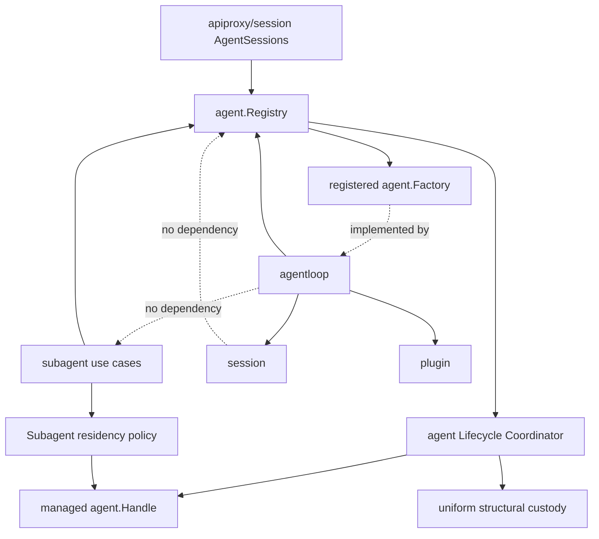

# Agent 构造与父子生命周期重构方案

状态：Final Design，待实施

最后核对当前实现：2026-08-25

## 0. 文档定位

本文定义 `agent`、`agentloop`、`apiproxy/session` 与 `subagent` 之间的最终职责、依赖方向、迁移顺序和验收边界。具体机制拆分到两份同级专题文档：

- [Agent 构造事务与调用流程设计](Agent构造事务与调用流程设计.md)
- [Agent 生命周期与运行期父子所有权设计](Agent生命周期与运行期父子所有权设计.md)

三份文档共同描述一个局部重构，不是已实现行为。实施完成并验收前：

- 不更新 `zh-CN/README.md`、全局设计索引或实施进度；
- 不把目标流程描述成当前行为；
- 不新增 `session/prepared` 或其他通过 Session 事件隐式创建 Agent 的路径；
- 未明确要求时，不自动与外部实现对照；兼容性核对必须单独声明基线、证据和影响。

相关 Subagent 设计：

- [Subagent 领域设计](../subagent/docs/design.zh-CN.md)
- [Parent-bound Subagent 技术设计](../subagent/docs/parent-bound-design.zh-CN.md)
- [Parent-bound Subagent 需求](../subagent/docs/parent-bound-requirements.zh-CN.md)

## 1. 最终决策

1. 普通 Agent 和子 Agent 是同一种 Agent。`root`、`parent`、`child` 只是一个精确运行期 Agent epoch 在某段关系中的角色，不形成不同 Agent 类型或不同 Agent Factory。
2. `agent.Registry` 保留统一的 Create、Resume 和 Agent Factory 注册入口。普通 Agent 与子 Agent 的调用方都不直接依赖 `agentloop`。
3. `agentloop` 实现 Agent Factory，统一负责一个 Agent 及其 Session 的物理构造、发布、运行和单体 teardown；lifecycle attach 前由 AgentLoop 回滚，attach 后由 `agent` 协调器接管失败关闭。
4. `agent` 模块拥有所有 Agent 的完整生命周期，包括运行期父子所有权、materialization admission、managed Handle、parent closing cutoff、in-flight join 和 descendant child-first teardown。
5. `subagent` 只拥有委派语义：Subagent Provider、durable lineage、depth、descriptor、结果、binding、消息投递和驻留策略。它不实现 Agent 生命周期状态机，也不持有可绕过 `agent` 协调器的底层 Handle。
6. `apiproxy/session.AgentSessions` 负责普通 Agent 激活用例，包括按 Session ID 去重、Create/Resume 决策、普通 Session 围栏、CWD、preset 和 model composition。
7. Session 不触发 Agent 创建。Agent 创建是必须返回结果并支持同步回滚的命令，不使用 `session/prepared` 或普通广播事件承载。
8. 逻辑 parent、运行期 parent、结构 owner 和 Initiator 是四个独立概念，不能互相推导。

目标主链路为：

```text
普通 Agent：AgentSessions ─┐
                           ├─> agent.Registry.Create/Resume
子 Agent：subagent use case ┘          |
                                      v
                              Agent lifecycle admission
                                      |
                                      v
                              Agent Factory (agentloop)
                                      |
                                      v
                              managed agent.Handle
```

## 2. 统一术语

### 2.1 Agent Factory

`agent.Factory` 统一称为 **Agent Factory**。它由 `agentloop.Plugin` 实现，负责构造或恢复一个 Agent，不判断该 Agent 是普通 Agent 还是子 Agent。

本文不把 Agent Factory 称为 Provider，避免与 `subagent.Provider` 混淆。

### 2.2 Agent Scope

**Agent Scope** 是单个 Agent 的私有运行期组合边界，包含 system-prompt overlay、tools overlay、Agent variables、`ReactLoopAgent`、membership 和 Provisioning 获得的 effects。

当前私有类型 [`agentloop.agentTree`](../agentloop/tree.go) 实现公开的 `agent.Scope`，但 `tree` 容易被误解为父子 Agent 关系。目标实现将私有类型改名为 `agentScopeRoot`：

- 单个 Agent 的结构容器称为 Agent Scope 或 Agent Scope root；
- Plugin 之间的结构关系称为 Plugin topology；
- Agent 之间的运行期关系称为 runtime parent-child ownership；
- durable Subagent 关系称为 lineage。

### 2.3 Agent epoch

一个 **Agent epoch** 是某个 Session ID 在当前进程中一次精确的 Agent 驻留。冷恢复后的新 Agent 即使使用同一 Session ID，也属于新的 epoch，不继承旧 epoch 的 Handle、closing 状态、运行期 children 或 Plugin installation。

### 2.4 Agent Lifecycle Coordinator

**Agent Lifecycle Coordinator** 是 `agent` 模块中的命名状态 owner。它管理所有 Agent epoch，而不是只管理子 Agent：

- root epoch 的 runtime parent 为空；
- child epoch 指向一个精确且可接纳 descendant 的 `Publishing` 或 `Live` parent epoch；
- 一个 epoch 可以同时是另一个 epoch 的 child 和多个 epoch 的 parent。

### 2.5 Subagent Provider 与 residency policy

`subagent.Provider` 统一称为 **Subagent Provider**。它是按名称注册的委派策略扩展点：所有 Subagent Provider 都支持 one-shot `Start`，支持 continuable 的 Subagent Provider 还可以为首次创建准备 detached Session seed。Subagent Provider 可以通过 Subagent 用例或 Driver 请求 `agent.Registry` 创建 one-shot child，但不实现 Agent Factory、不直接物理构造或恢复 Agent，也不拥有 managed Handle、durable child 驻留或关闭顺序。

**Subagent residency policy** 属于 `subagent`。它根据 one-shot 完成、continuable quiescent、binding disabled、parent closing 等业务事实决定 `KeepResident` 或请求关闭，但不执行 Agent teardown。

## 3. 当前问题

### 3.1 主构造链路本身不需要拆除

当前 [`AgentSessions.Ensure`](../apiproxy/session/agent_sessions.go) 调用 `agent.Registry.Create` 或 `Resume`。Registry 查找已注册的 Agent Factory，再委托 [`agentloop.Plugin`](../agentloop/plugin.go) 完成 Session 与 Agent 构造。

这条链路应保留。Registry 同时提供构造入口和 live membership 是 `agent` 能力的一部分，不应让调用方绕过它直接调用 Agent Factory。

### 3.2 子 Agent 生命周期被执行模式分别拥有

one-shot [`inprocess.Driver`](../subagent/internal/inprocess/driver.go) 和 continuable [`continuation.Manager`](../subagent/internal/continuation/manager_materialization.go) 都通过 Registry 创建或恢复 Agent，但各自在 Subagent 内保存 Handle、closing、children 或 residency 状态：

- one-shot `Run` 持有 Handle 和结果关闭路径；
- continuable `Activation` 持有 Handle、children 和 disposal；
- parent-bound 设计还需要处理 parent close 与 descendant drain。

这些是所有 Agent 都可能需要的运行期生命周期机制，应该归入 `agent`，而不是继续形成多套 Subagent 生命周期。

### 3.3 Initiator、Custody 与 parent 混合

当前 [`preparedAgent.publish`](../agentloop/prepared_agent.go) 从 Context 读取 `agent.Initiator`，再把它传给 membership 作为 owner；[`agent.Custody`](../agent/custody.go) 又通过 Context 隐式改变 Agent Scope root 的挂载位置。

Initiator 只回答“谁导致本次操作”，Custody 只回答“资源挂在哪里”。二者都不能证明 runtime parent 或 durable lineage。

### 3.4 生命周期状态跨模块重复

当前状态分散在 AgentLoop construction admission、Registry membership flags、`agentLifecycle` closing channels、one-shot `Run`、continuable `Activation` 和 parent-bound coordination 草案中。

Agent activity、membership publication、完整 epoch lifecycle 和 Subagent 用例状态是不同概念，必须分别归属。

## 4. 最终职责边界

### 4.1 `session`

负责 Session Header、append-only log、detached preparation、live membership、Session events、flush 和 persistence preparation。

不负责触发 Agent 创建，不知道 Agent options、Agent Scope、runtime parent-child ownership 或 Subagent residency policy。

Session 与 Agent 在一次 Agent 构造事务中存在必要的一致性耦合，但 `session` 包不依赖 `agent`。该耦合由 Agent Factory 显式编排，不通过事件隐藏。

### 4.2 `agent`

负责：

- `Agent`、`Factory`、`Registry`、`Handle` 和 `AgentLifecycle` 契约；
- Agent Factory 注册与 Create/Resume 路由；
- exact live membership 和 Agent Created/Disposed；
- Agent Lifecycle Coordinator；
- root/child 共用的 materialization admission；
- managed Handle；
- runtime parent-child ownership；
- parent closing cutoff、in-flight construction join；
- descendant child-first teardown；
- Agent Runtime shutdown 的统一关闭顺序。

不负责 Subagent Provider、durable lineage、descriptor、binding、结果或业务驻留决策。

### 4.3 `agentloop`

负责：

- 实现并注册 Agent Factory；
- Factory 全局 construction admission 和 shutdown drain；
- fresh Session preparation 或 persistence preparation；
- 构造 unpublished `ReactLoopAgent` 和 Agent Scope root；
- Provisioning；
- Session/Agent membership enter 与 announce；
- lifecycle attach 前创建失败的逆序回滚；
- attach 后由 Coordinator 调用的幂等单体 teardown；
- 单个 Agent 的 activity、cancel、quiesce 和底层 teardown。

不负责 root/child 分支、runtime parent-child ownership、descendant graph、child-first close 或 Subagent policy，也不从 Initiator 推断生命周期 owner。

AgentLoop 的职责变化是收窄而非搬迁：它继续“造出并安全停止一个 Agent”，`agent` 负责“这个 Agent 由谁拥有、有哪些 descendants、按什么顺序关闭”。

### 4.4 `apiproxy/session.AgentSessions`

负责普通 Agent 激活用例：按 Session ID 合并并发创建或恢复，选择 Create/Resume，处理 CWD、preset、默认模型和普通 Session 围栏，再调用 `agent.Registry`。

它不直接调用 Agent Factory，不自行维护 descendant lifecycle，也不通过 Session 事件触发 Agent。

普通 Agent 构造成功后，canonical lifecycle 始终由 Agent Lifecycle Coordinator 持有。`AgentSessions` 可以保存或传递 managed Handle 作为关闭请求能力，但不保存另一份 closing、children 或 teardown 状态。普通 root 默认驻留到显式 managed Close、结构兜底或 Runtime shutdown；请求 Context 结束不会关闭它。

当前 `session.create` 仍同步创建完整的普通 Session composition；本重构不增加“Session 长期存在但没有 Agent”的懒激活语义。

### 4.5 `subagent`

负责 Subagent Provider、parent 授权、durable lineage、delegation depth、child Session metadata、seed、descriptor、result、accepted messages、binding、subscription 和 residency policy。

它不负责 Agent lifecycle 状态机、底层 Handle ownership、runtime descendant graph、parent closing admission、in-flight Agent construction join 或实际 child-first teardown。

现有提案中的 `ChildRuntime`、`ChildLifecycle` 和 `ChildLifecyclePolicy` 不作为目标公共抽象。通用部分归入 `agent`；剩余业务决策统一称为 Subagent residency policy。

### 4.6 `plugin`

`plugin` 只负责 Scope、effect、结构挂载和卸载。Plugin topology 是资源释放机制，不表达 durable lineage 或 runtime parent 授权。

所有 Agent Scope root 使用 Agent Lifecycle Coordinator 提供的统一结构 custody。普通 Agent、one-shot、continuable 和 parent-bound 不再通过选择不同 Plugin parent 表达生命周期策略。

## 5. 目标依赖关系



编译期约束：

- `session` 不导入 `agent` 或 `agentloop`；
- `agentloop` 不导入 `subagent` 或 `apiproxy/session`；
- `apiproxy/session` 与 `subagent` 只通过 `agent.Registry` 创建或恢复 Agent；
- Agent Factory 只由 Registry 调用；
- Subagent residency policy 只能请求 managed lifecycle 操作；
- `agent` 不导入 Subagent 领域类型。

## 6. 迁移方案

### P0：锁定当前行为

- 覆盖普通 Create/Resume、配置 Agent、one-shot 和 continuable；
- 覆盖 Created veto、Factory 失败回滚和 Dispose 幂等；
- 覆盖 Initiator 与 runtime parent 的现状差异；
- 覆盖 parent close、并发 child materialization 和 Runtime shutdown。

### P1：引入 Agent Lifecycle Coordinator

- 在 `agent` 模块增加命名 Coordinator 和包含 Publishing 边界的 managed epoch 状态；
- Registry Create/Resume 在调用 Factory 前 reserve epoch；
- root 与 child 使用同一个 admission 和状态机；
- runtime parent 作为显式构造输入，不再从 Initiator 推断；
- AgentLoop 在 publication 前把单体 teardown 绑定给 Coordinator；
- 对外 Handle 的 Dispose 进入 managed close transaction；
- 配置 Agent 也必须通过 Registry Create/Resume。

### P2：迁移 runtime ownership 与 custody

- 把 `registryEntry.owner` 的职责迁入 Lifecycle Coordinator；
- 所有 Agent Scope root 使用 Coordinator 提供的统一结构 custody；
- 删除 Context 隐式 `Custody.Bind` 和 `custodyFrom`；
- membership 不再读取 Initiator 作为 owner；
- 删除 Host 对 `Roots`、`IsOwnedBy` 的授权依赖；
- Coordinator 完成替代后，再删除 Registry 中重复的 owner 状态。

### P3：统一 Subagent 生命周期接入

- one-shot `Run` 删除底层 Handle ownership 和自定义关闭状态；
- continuable `Activation` 删除底层 lifecycle、children 和 disposal 状态；
- Subagent 用例只保存 managed Handle 或 exact epoch reference；
- one-shot、continuable、parent-bound 分别实现 residency policy；
- 所有关闭请求进入 Agent Lifecycle Coordinator；
- Subagent Provider 只选择和准备委派策略：one-shot 通过用例或 Driver 请求 Registry 创建，continuable 仅为 fresh child 返回 seed；任何路径都不直接调用 Agent Factory，也不拥有 managed lifecycle。

### P4：父关闭与 Runtime shutdown

- 实现 parent closing cutoff、in-flight materialization join；
- 实现 child-first close；
- 验证重复 close、并发 close 和结构兜底只汇合到一次 teardown；
- 固化 Runtime 服务停止顺序；
- 验证 AgentLoop membership disposal 不递归关闭 descendants。

### P5：清理重复状态并接入 parent-bound

- 删除已迁移的 Subagent child graph、closing roots 和 per-ID lifecycle locks；
- 删除 `agent.Options.SubagentDepth`；
- 把 parent-bound binding 和 subscription 接入同一个 managed Agent lifecycle；
- 不增加 parent-bound 专用 Handle、Lifecycle 或 descendant owner。

每个阶段必须保持可编译、可测试；不保留第二条长期 Create/Resume 或生命周期兼容路径。

## 7. 验收标准

### 7.1 架构

- 普通 Agent 和所有子 Agent 只通过 `agent.Registry.Create/Resume`；
- Registry 保留 Agent Factory registration，调用方不直接依赖 AgentLoop；
- AgentLoop 不导入 Subagent；
- Session 不依赖 Agent，也不通过事件创建 Agent；
- 所有 Agent epoch 共用 Agent Lifecycle Coordinator；
- Subagent 不实现 Agent lifecycle 状态机和 descendant teardown；
- runtime parent、durable lineage、Initiator 和 structural custody 不互相推导；
- 私有 `agentTree` 改名为 `agentScopeRoot`，不再使用 Agent tree 描述父子关系。

### 7.2 构造与回滚

- Create/Resume 每个失败点都不遗留 Session、Registry entry、Agent Scope 或 Provisioning effect；
- Factory 在 lifecycle attach 前失败时调用方不需要清理未返回对象；
- lifecycle attach 后的 publication 或 Coordinator commit 失败由 Coordinator 关闭已构造但未暴露的 Agent 及其嵌套 descendants；
- Created veto 保持配对 Disposed；
- 配置 Agent 不绕过 lifecycle admission。

### 7.3 生命周期与并发

- root 与 child 使用同一个 `Materializing -> Publishing -> Live -> Closing -> Closed` 状态机；
- parent close 后不能接纳新 descendant；
- 已接纳构造在 parent close 中被 join；
- descendants 按 child-first 顺序关闭；
- Handle Dispose、parent close、Runtime shutdown 和结构兜底只执行一次底层 teardown；
- Agent activity 和 Subagent 用例状态不复制 lifecycle 状态。

### 7.4 Subagent

- one-shot、continuable 和 parent-bound 只保留各自业务状态与 residency policy；
- Subagent Provider 不实现 Agent Factory，不直接物理构造、恢复或关闭 Agent；one-shot `Start` 发起创建时只能通过 Agent Registry；
- parent 离线后 durable child identity 不变；
- delegation depth 只有 Session Header 一个持久事实来源；
- 同一 Session 的新 epoch 不继承旧 runtime children 或 closing 状态。

## 8. 实施期选择

以下仅为代码组织选择，不改变本文语义：

1. Lifecycle Coordinator 是 `RegistryPlugin` 内部命名 owner，还是 `agent` 包中的独立 Service；无论采用哪种形式，都必须由 `agent` 模块拥有，并且只有一个 canonical 实例。
2. Registry 传给 Agent Factory 的窄 lifecycle attachment 接口名称；该接口只提供本次 reservation 的 structural custody，以及绑定 exact Agent 和幂等单体 teardown 的操作，不能暴露 descendant graph 或成为第二个公开 Handle。
3. 统一 structural custody 的私有 Plugin 类型和 Manifest name；不能继续由调用 Context 隐式选择 owner。
4. managed Handle 保存 epoch token 还是通过 exact Agent identity 定位 Coordinator entry；对外语义必须防止旧 Handle 关闭同 Session ID 的新 epoch。

这些选择在实现时通过类型、测试和 package README 固化，不再改变本文的职责与调用方向。
