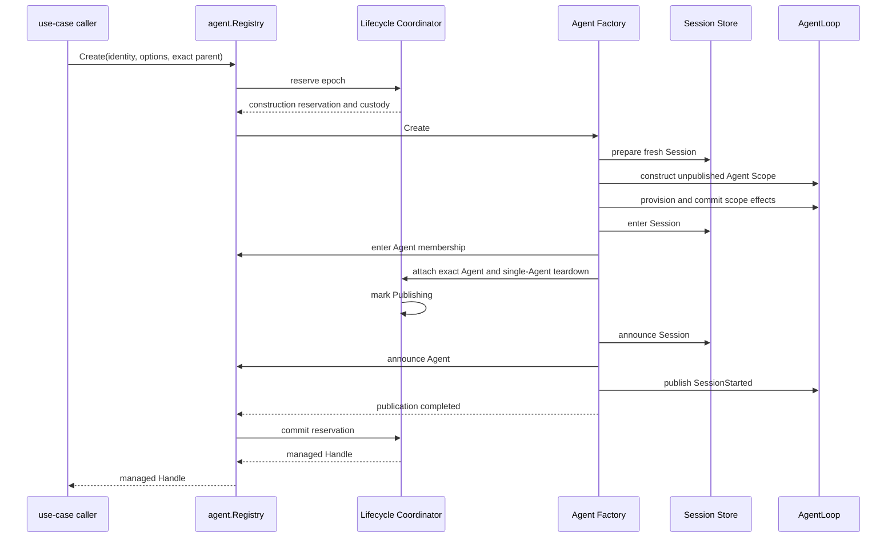

# Agent 构造事务与调用流程设计

状态：Final Design，待实施

上位方案：[Agent 构造与父子生命周期重构方案](Agent构造与父子生命周期重构方案.md)

## 1. 目标

本文只定义 Agent 的统一创建、恢复、发布、回滚和调用关系。完整 epoch ownership、parent close 和 descendant teardown 见 [Agent 生命周期与运行期父子所有权设计](Agent生命周期与运行期父子所有权设计.md)。

构造边界必须满足：

- 普通 Agent 和子 Agent 使用同一个 Registry 与 Agent Factory；
- 调用方不直接依赖 `agentloop`；
- Session 与 Agent 的联合发布是一个同步、可回滚事务；
- AgentLoop 不解释 root、child、lineage 或 Subagent policy；
- 调用方只能得到完整的 managed Handle 或错误；
- 不通过 Session 事件触发 Agent 创建。

## 2. 当前链路

### 2.1 普通 Agent

当前普通 Agent 经 [`AgentSessions.Ensure`](../apiproxy/session/agent_sessions.go) 调用 `agent.Registry.Create` 或 `Resume`。Registry 再调用已注册的 Agent Factory，最终进入 [`agentloop.Plugin.CreateAgent`](../agentloop/plugin.go) 或 `ResumeAgent`。

```text
Session API
  -> AgentSessions.Ensure
  -> agent.Registry.Create/Resume
  -> registered agent.Factory
  -> agentloop.Plugin
```

这条调用方向正确，目标设计保留。

### 2.2 子 Agent

当前 one-shot [`inprocess.Driver`](../subagent/internal/inprocess/driver.go) 与 continuable [`continuation.Manager`](../subagent/internal/continuation/manager_materialization.go) 也通过 Registry 创建或恢复 Agent。

目标设计继续共用相同入口，但把 runtime parent admission 和 managed Handle commit 移入 `agent`，并删除 Context 中隐式 Custody 和 Initiator owner 推断。

## 3. 构造参与者

### 3.1 调用方

调用方只拥有用例决策：

- `AgentSessions` 决定普通 Agent 的 Session ID、Create/Resume、CWD、preset 和 model composition；
- Subagent 用例决定 exact parent、durable lineage、descriptor 和 Agent options，并调用选定的 Subagent Provider 取得或执行委派策略；
- 配置启动决定配置 Agent 的 identity 与 composition。

调用方不选择 AgentLoop 实现，不操作 Registry membership，也不自行构造 Agent Scope。

### 3.2 Agent Registry

Registry 是唯一公开构造入口，负责：

- Agent Factory 注册和撤销；
- Create/Resume 请求入口；
- 调用 Agent Lifecycle Coordinator reserve epoch；
- 调用当前 Agent Factory；
- 将成功构造提交给 Coordinator；
- live membership 查询；
- Agent Created/Disposed publication。

Registry 的 Factory routing 不是应删除的间接层。它保证消费者依赖 `agent` 契约，而不是依赖具体 AgentLoop。

### 3.3 Agent Lifecycle Coordinator

Coordinator 在 Factory 调用前 reserve exact epoch，并在 Factory publication 前接管已经构造的单体 teardown；构造成功后由 Registry 返回 managed Handle。

它不构造 Session、Agent Scope 或 ReactLoopAgent。构造期间只管理 admission、runtime parent 和成功结果的 ownership handoff。

### 3.4 Agent Factory 与 AgentLoop

Agent Factory 是 `agent` 定义、由 AgentLoop 实现的内部构造能力。AgentLoop 负责：

- 获取 fresh 或 persisted Session preparation；
- 创建 unpublished Agent Scope 和 ReactLoopAgent；
- 执行 Provisioning；
- 进入 Session 与 Agent membership；
- 按顺序 announce；
- 构造失败逆序回滚；
- 提供单个 Agent 的底层 teardown。

Agent Factory 只由 Registry 调用。配置 Agent 也必须通过 Registry，不再由 AgentLoop 绕过 lifecycle admission 直接发布。

### 3.5 Session Store

Session Store 拥有 Session preparation、membership 和 Session lifecycle publication。

在 Agent 构造路径中，AgentLoop 调用 Session Store 的 prepare、enter 和 announce；这不表示 AgentLoop 拥有 `session/created`。事件 owner 仍是 Session Store。

## 4. 目标 Factory 边界

Factory 的构造输入必须显式包含：

- shared Agent/Session identity；
- Create 或 Resume 所需信息；
- Agent options；
- unpublished Scope Provisioning；
- Coordinator 提供的结构 custody；
- 构造期取消信号。

runtime parent 不由 AgentLoop 解释。Coordinator 可以向 Factory 传递不暴露逻辑 parent 的结构 custody，但 AgentLoop 不读取 Initiator、Session Header 或 Subagent 类型来推导 owner。

Factory 在 publication 前把以下构造结果绑定到 Coordinator reservation：

- exact Agent；
- 单个 Agent 的底层 teardown；
- 构造完成所需的不可变 identity。

该结果不是第二个公开 Handle。绑定成功后，Coordinator 在 publication 期间拥有回滚责任；Registry 只有在 Factory publication 与 Coordinator commit 都成功后才向调用方返回 managed `agent.Handle`。

## 5. Fresh Create

### 5.1 调用顺序



### 5.2 可见性

Provisioning 完成前，Session、Agent 和 Agent Scope 都不得对 Registry consumer 可见。

进入 membership 后、announce 前可以被事务内部解析，但仍不允许返回调用方。只有以下条件全部满足后，Create 才成功：

- Session 与 Agent exact identity 一致；
- Provisioning 已提交；
- Session 和 Agent membership 均进入；
- Session Created 和 Agent Created 均完成同步发布；
- SessionStarted 已完成同步扩展点；
- Coordinator 已从 Publishing 提交为 Live epoch。

`Publishing` 期间 exact Agent 已绑定到 Coordinator，但 managed Handle 尚未向原调用方返回。同步 `agent/created` listener 可以以该 exact Agent 为 runtime parent 创建 child；若 parent 后续 publication 被 veto，Coordinator 必须先关闭这些已提交或仍在构造的 descendants，再回滚 parent。

## 6. Resume

Resume 与 Create 共用 Agent 物理构造、Provisioning、membership、announce 和 Coordinator commit，只替换 Session preparation 来源：

```text
Persistence prepare
  -> restored unpublished Session
  -> common Agent construction
  -> common membership publication
  -> common managed epoch commit
```

历史 Session 的调用语义保持不变：当普通或 Subagent 用例需要一个没有 live Agent 的 durable Session 时，通过 Registry Resume 恢复。

恢复不会继承旧进程 epoch 的 runtime parent、Handle、closing、children 或 Plugin installation。调用方必须为新 epoch 显式提供 runtime parent；durable lineage 仍来自 Session Header。

## 7. Session 事件边界

### 7.1 `session/created`

Session Store 发布 `session/created`。AgentLoop 只决定在联合构造事务中的调用时点：

```text
Session Store enter
  -> Agent Registry enter
  -> Session Store announce session/created
  -> Agent Registry announce agent/created
```

同步 `session/created` veto 必须回滚 Agent membership、Session membership、Agent Scope 和 Provisioning；已经观察到 Created 的 listener 必须获得配对 Disposed。

### 7.2 不增加 `session/prepared`

Agent 创建需要唯一执行者、返回 exact Handle、同步失败、取消和完整回滚。普通广播事件不能安全表达这些语义。

`SessionStore.Prepare` 还服务于 create、resume、fork、persistence 和测试；把它映射成 Agent 创建事件会误触发无关路径。因此：

- Session 不触发 Agent；
- `session/created` 只表达 Session lifecycle；
- Agent 创建或恢复由应用用例显式调用 Registry；
- 将来若需要“Session 无 Agent 长期存在”，另行设计同步 Agent activation 命令。

## 8. 构造状态与回滚

Factory 内部构造状态是短暂实现状态，不持久化：

```text
Admitted
  -> SessionPrepared
  -> ScopeMountedUnpublished
  -> ScopeProvisioned
  -> MembershipEntered
  -> LifecycleAttached
  -> Publishing
  -> Announced
  -> FactoryReturned
  -> CoordinatorCommitted
```

`LifecycleAttached` 之前，AgentLoop 拥有构造回滚责任。绑定成功后，Coordinator 接管单体 teardown；后续 announce、Factory return 或 commit 失败都通过 reservation abort 关闭嵌套 descendants 和当前 Agent。`FactoryReturned` 与 `CoordinatorCommitted` 之间仍未向业务调用方暴露 Handle。

绑定前任一步骤失败都由 AgentLoop 逆序释放已获得资源：

```text
stop serving if started
  -> remove Agent membership if entered
  -> release Session membership if entered
  -> remove runtime-context routing
  -> dispose Provisioning effects
  -> unload Agent Scope root
  -> dispose unpublished Session preparation
```

绑定后的失败由 Registry 请求 Coordinator abort；AgentLoop 的单体 teardown 保持幂等。调用方不会收到半初始化 Handle，也不负责清理未成功返回的构造。

## 9. 并发语义

### 9.1 exact identity

同一 Session ID 的并发请求可以进行私有准备，但只允许一个 exact epoch 提交 live membership。失败方不能覆盖已发布实例，也不能用旧 disposer 删除新实例。

### 9.2 parent close race

Coordinator reserve 发生在 Factory 调用前：

- parent 已 Closing：立即拒绝；
- reserve 后 parent 开始 Closing：parent close 等待本次构造；
- Factory 失败：撤销 reservation；
- child 进入 Publishing 后：已经纳入 parent ownership，即使尚未向 child 调用方返回；
- publication 成功且 commit 允许：child 转为 Live；
- publication 或 commit 被拒绝：关闭未暴露的 child 及其嵌套 descendants，再撤销 reservation。

### 9.3 construction cancellation

调用 Context 或构造期信号只取消尚未返回的构造事务。managed Handle 返回后，调用 Context 不再控制 Agent 生命周期；后续通过 Handle、parent close 或 Runtime shutdown 关闭。

## 10. AgentLoop 职责变化

保持：

- Session preparation；
- ReactLoopAgent 与 Agent Scope 构造；
- Provisioning；
- membership 与 announce；
- activity、cancel、quiesce；
- lifecycle attach 前的 Factory rollback，以及 attach 后可由 Coordinator 调用的幂等单体 teardown；
- Factory 全局 shutdown admission。

移出：

- 从 Initiator 推断 owner；
- runtime parent-child ownership；
- descendant admission 与关闭；
- 面向业务调用方的 managed Handle ownership；
- root/child 和 Subagent policy 判断。

私有 [`agentTree`](../agentloop/tree.go) 改名为 `agentScopeRoot`。该调整只消除术语歧义，不改变公开 `agent.Scope`。

## 11. 测试要求

至少覆盖：

- fresh Create 和 Resume 使用同一 publication 顺序；
- 普通 Agent、one-shot 和 continuable 使用同一 Factory；
- 配置 Agent 不绕过 Registry admission；
- Provisioning 每个失败点逆序清理；
- Session Created veto 与 Agent Created veto 配对回滚；
- `agent/created` listener 可以在 parent Publishing 阶段共同激活 child；
- parent publication veto 会关闭 Created listener 已创建的 descendants；
- Coordinator commit 失败关闭未暴露 Agent；
- 同 ID 并发只有一个成功；
- 构造取消不会遗留 Session、Agent、Scope 或 routing；
- Initiator 不改变 runtime parent；
- AgentLoop 不导入 Subagent。
