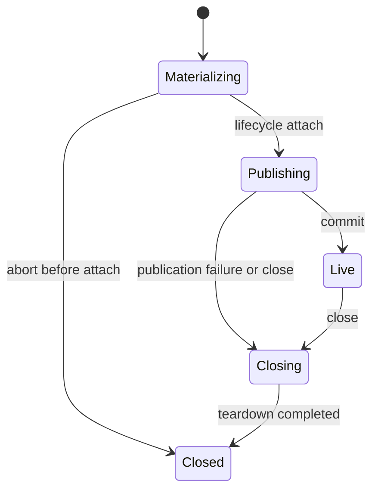

# Agent 生命周期与运行期父子所有权设计

状态：Final Design，待实施

上位方案：[Agent 构造与父子生命周期重构方案](Agent构造与父子生命周期重构方案.md)

构造细节：[Agent 构造事务与调用流程设计](Agent构造事务与调用流程设计.md)

## 1. 目标

本文定义所有 Agent 共用的 epoch lifecycle、runtime parent-child ownership、managed Handle、关闭并发和 Runtime shutdown。

核心原则：

- Agent 生命周期属于 `agent`，不属于 `subagent`；
- root 与 child 使用同一套 lifecycle；
- Subagent 只决定业务上的保持或关闭时机；
- runtime ownership 不等于 durable lineage、Initiator 或 Plugin topology；
- 所有关闭原因最终汇合到一个幂等 close transaction。

## 2. 为什么属于 `agent`

child 只是 Agent 在某段运行期关系中的角色：

- 普通 Agent 可以成为 parent；
- 一个 child 也可以继续成为其他 Agent 的 parent；
- root 与 child 都需要 exact Handle、closing cutoff、in-flight join 和 teardown；
- 这些不变量不随 one-shot、continuable 或 parent-bound 改变。

如果由 `subagent` 拥有，普通 Agent close、配置 Agent、非 Subagent 创建路径和未来其他 Agent consumer 都必须复制相同机制。因此通用状态和关闭算法归入 `agent`，Subagent 仅保留领域策略。

## 3. Agent Lifecycle Coordinator

### 3.1 职责

Agent Lifecycle Coordinator 是 `agent` 模块中的唯一 lifecycle 状态 owner，负责：

- 为 Create/Resume reserve exact epoch；
- 验证 runtime parent 是 exact 且可接纳 descendant 的 `Publishing` 或 `Live` epoch；
- 记录 in-flight materialization；
- 在 publication 前接管 AgentLoop 已构造的单体 teardown；
- 生成 managed Handle；
- 维护 runtime parent-child ownership；
- parent closing admission cutoff；
- 等待已经接纳的 child materialization；
- descendant child-first teardown；
- root close 和 Runtime CloseAll；
- 收敛重复 close 与结构兜底。

### 3.2 非职责

Coordinator 不负责：

- 创建 Session、Agent Scope 或 ReactLoopAgent；
- Agent activity、turn、step、Tool 或 LLM；
- durable lineage、delegation depth 或 descriptor；
- one-shot result、continuable messages 或 binding；
- 判断业务上何时 KeepResident；
- Host 授权。

### 3.3 组织形式

Coordinator 可以是 `RegistryPlugin` 内部的命名 owner，也可以是 `agent` 包内的独立 Service。无论采用哪种形式：

- canonical 实例只能有一个；
- Registry Create/Resume 必须经过它；
- managed Handle 必须回到它；
- Subagent 和 AgentLoop 都不能另建第二套 lifecycle registry。

## 4. Epoch identity

一个 entry 表示一个 exact Agent epoch，而不只是 Session ID。它至少需要区分：

- Session identity；
- exact Agent 对象；
- epoch identity；
- runtime parent epoch；
- managed lifecycle 状态；
- Factory publication 前绑定的单体 teardown；
- admitted child materialization；
- live children；
- close transaction 与结果。

同一 Session ID 冷恢复后会产生新 epoch。旧 Handle、旧 parent relation 或旧 close completion 不能作用于新 epoch。

实现可以使用不可复用的 epoch token，也可以使用 exact Agent identity；不能只凭 Session ID 执行关闭。

## 5. 统一状态机

所有 root 与 child epoch 共用：



`Materializing` 在尚未 attach exact Agent 时可以直接 abort 并撤销 reservation；一旦完成 lifecycle attach，任何 publication failure 或 close 都必须先进入 `Closing`，通过统一 close transaction 释放 Agent 及其 descendants。

### 5.1 Materializing

Registry 已接纳 Create/Resume，Coordinator 已登记 reservation，Factory 尚未成功提交。

此时：

- 对 Registry consumer 不可见；
- 可能持有 in-flight cancellation；
- parent close 必须等待或使 commit 失败；
- 失败只撤销本次 reservation 和 Factory 私有资源。

### 5.2 Publishing

Factory 已构造 exact Agent、进入必要 membership，并把单体 teardown 绑定到 Coordinator，但 Created 与 SessionStarted publication 尚未全部完成。

此时：

- managed Handle 尚未向原调用方返回；
- exact Agent 已具有 runtime ownership entry；
- 同步 `agent/created` listener 可以创建 child；
- 这些 child 从 reserve 起就属于该 parent epoch；
- 后续 publication veto 必须关闭嵌套 descendants，再回滚 parent。

Publishing 不是持久状态，也不是 Agent activity。它只解决同步 publication 扩展点与 lifecycle ownership 的顺序。

### 5.3 Live

Factory 已完成 Session/Agent publication，Coordinator 已将 epoch 从 `Publishing` 提交为 `Live`；Registry 随后可以返回 managed Handle。

此时：

- 可以接纳 child materialization；
- 可以由 Agent use case 驱动；
- 可以接收显式 close、parent close 或 Runtime shutdown。

### 5.4 Closing

close transaction 已开始。

进入 Closing 必须原子完成：

- 关闭 ClosingSignal；
- 拒绝新的 descendant admission；
- 固定本次 close transaction；
- 后续 close caller 只 join，不重复执行。

### 5.5 Closed

in-flight materialization、descendants 和本 epoch 的单体 teardown 均已完成。entry 可以从 live indexes 删除，但 close result 必须对正在 join 的调用方保持稳定。

## 6. 正交状态

单一 lifecycle 枚举不能替代所有并发标志。以下状态与主状态正交：

- materialization reservation 是否已经获得 Factory 结果；
- parent close 是否正在等待该 reservation；
- close transaction 是否已创建及其 completion；
- Agent Created/Disposed 是否已经发布；
- membership announce 期间是否收到 remove request。

这些状态由各 owner 私有管理：

- Coordinator 管 epoch lifecycle 与 in-flight materialization；
- Agent Registry entry 管 membership announce/remove；
- Session Store entry 管 Session announce/append/detach；
- AgentLoop 管 activity 和单体 teardown。

不能用一个跨模块“大状态机”合并它们。

## 7. Runtime parent-child ownership

### 7.1 建立关系

子 Agent 调用方必须在 Registry Create/Resume 边界显式提供 exact runtime parent。Registry 把它交给 Coordinator reserve，而不是交给 AgentLoop 解释。

Coordinator 只接受：

- parent 属于当前 canonical Coordinator；
- parent exact epoch 为 Publishing 或 Live；Publishing epoch 尚未向原调用方返回，但已进入 Registry 的 exact Agent 可以作为嵌套构造的 parent；
- child identity 尚未被另一个 live epoch 占用；
- 当前调用未超过已有的通用结构约束。

durable lineage、delegation depth 和 Subagent 授权由调用方在 reserve 前完成，Coordinator 不重复解释 Subagent 领域规则。

### 7.2 root

没有 runtime parent 的 epoch 是当前 runtime root。root 不是不同 Agent 类型，只是 ownership relation 为空。

Host 普通 Agent、配置 Agent 或未来非 Subagent consumer 创建的 Agent 都可以是 root。

### 7.3 child 同时成为 parent

任何 `Publishing` 或 `Live` epoch 都可以成为其他 Agent 的 runtime parent。Coordinator 不以 origin、调用包或 root 身份限制这一点。

Subagent depth 和 cycle policy 仍由 Subagent durable lineage 控制；runtime graph 因 exact epoch identity 和同 ID collision 不能把同一 epoch 重复插入。

### 7.4 graph 生命周期

runtime graph：

- 只存在于当前进程；
- 不持久化；
- child reserve 时登记受 parent 管理的 materialization，lifecycle attach 或 commit 后形成可关闭的 child edge；
- child abort 或 Closed 时删除 reservation 或 edge；
- 新 epoch 不继承旧 edge；
- 仅用于 lifecycle ordering，不用于 Host 授权。

## 8. 四种不同关系

| 概念 | 回答的问题 | Owner | 生命周期 |
| --- | --- | --- | --- |
| Initiator | 谁导致了当前调用或 Agent activity | 调用 Context | 单次调用链 |
| runtime parent | 当前 epoch 由哪个可接纳 descendant 的 exact Agent epoch 拥有 | Agent Lifecycle Coordinator | 当前进程 epoch |
| durable lineage | 哪个 Session 在业务上委派了该 Subagent Session | Subagent + Session Header | 跨恢复持久 |
| structural custody | Agent Scope root 挂载在哪里 | Agent Lifecycle Coordinator + Plugin Runtime | 当前进程结构 |

约束：

- Initiator 只用于因果归因和观察；
- runtime parent 由 Create/Resume 显式输入，不能从 Initiator 推断；
- durable lineage 不能证明当前 parent live；
- runtime parent 不能改变 durable lineage；
- Plugin parent 不能作为 Subagent 授权；
- 所有 Agent 使用统一 structural custody，不通过 topology 表达策略。

## 9. Managed Handle

### 9.1 语义

公开 `agent.Handle` 表示 exact Agent epoch 和请求其生命周期关闭的能力。Handle holder 不直接拥有 AgentLoop 的底层 Scope handle。

```text
Handle.Dispose
  -> Lifecycle Coordinator.Close(exact epoch)
  -> descendant cutoff and drain
  -> AgentLoop single-Agent teardown
```

旧 Handle 对新 epoch 调用 Dispose 必须是无效的精确关闭或稳定返回旧 close result，不能关闭同 Session ID 的新 Agent。

### 9.2 Factory handoff

```text
Lifecycle attach 前：AgentLoop 负责构造回滚
Lifecycle attach 后、Coordinator commit 前：Registry 与 Coordinator 负责 publication 回滚或立即 teardown
Coordinator commit 后：managed Handle 可见
```

`LifecycleAttached` 才是底层 teardown 责任从 AgentLoop 移交给 Coordinator 的边界；成功返回只表示 managed Handle 开始对调用方可见。`HandleTransferred` 没有独立业务含义：Handle 是指向 Coordinator epoch 的关闭能力，不是被搬运的资源所有权，因此不增加同名状态、事件或持久化字段。

### 9.3 重复引用

多个 use case 可以持有指向同一 managed epoch 的 Handle 或只读 reference。它们不复制生命周期状态；所有 Close 都 join Coordinator 中的同一个 close transaction。

## 10. Close algorithm

### 10.1 单个 epoch

```text
Close(epoch, reason)
  -> compare exact epoch
  -> Publishing or Live to Closing
  -> close ClosingSignal
  -> reject new child reservations
  -> wait admitted materialization
  -> snapshot direct live children
  -> close each child recursively
  -> invoke AgentLoop single-Agent teardown
  -> unlink from runtime parent
  -> mark Closed
  -> publish stable result to joiners
```

所有 direct children 必须执行；一个 child close 失败不能使其他 child 被跳过。错误聚合后仍继续 parent 单体 teardown。

### 10.2 child-first

关闭顺序按 runtime ownership 后序执行：

```text
grandchildren
  -> child
  -> parent
```

该顺序保证 child 不会在 parent Agent Scope、Session 或 scoped capability 已卸载后继续运行。

### 10.3 关闭原因

关闭原因用于诊断、Agent cancel mapping 和 Subagent observation，但不产生不同 teardown 实现。至少区分：

- explicit close；
- holder release；
- parent closing；
- residency policy close；
- Agent Runtime shutdown；
- Factory/Plugin structural fallback。

Agent cancel reason、Inbox preservation 和等待策略由 Agent lifecycle 与 AgentLoop 的窄映射定义；Subagent policy 不先自行 cancel 再调用 Close。

## 11. Parent close 与 materialization race

### 11.1 close 先发生

parent 已进入 Closing 后，新的 child reserve 立即失败，不调用 Factory。

### 11.2 reserve 先发生

child 已进入 Materializing 或 Publishing 后 parent 才 Closing：

1. parent close 记录并等待该 reservation；
2. Factory 失败则撤销 reservation；
3. child 进入 Publishing 后即纳入 parent ownership；
4. publication 成功且 commit 仍允许，则 child 转为 Live 后立即进入 parent close；
5. publication 或 commit 被拒绝，则关闭未暴露 Agent 及其嵌套 descendants；
6. parent 只在 reservation 和 child teardown 完成后继续自己的单体 teardown。

### 11.3 同 ID 并发

Coordinator admission 与 Registry membership collision 共同保证同一 Session ID 只有一个 live epoch。旧 reservation、旧 disposer 或旧 Handle 都不能删除或关闭获胜的新 epoch。

## 12. Agent activity 与 Subagent state

### 12.1 Agent activity

`idle`、`running`、maintenance、turn cancellation 属于 AgentLoop。Coordinator 可以等待 AgentLoop 单体 teardown，但不复制 activity 状态。

普通 Agent 的 Create/Resume 由 `AgentSessions` 发起，但成功后的 canonical lifecycle 由 Coordinator 负责。`AgentSessions` 只持有或传递 managed Handle 作为用例能力，不建立自己的 closing 状态或 descendant graph。普通 root 默认驻留到显式 managed Close、结构兜底或 Runtime shutdown；创建请求的 Context 结束不等于 Agent 关闭。

### 12.2 Subagent state

以下属于 Subagent 用例：

- one-shot result pending/settled；
- continuable accepted messages；
- descriptor；
- binding enabled/disabled；
- subscription installation；
- residency policy snapshot。

这些事实只能产生 `KeepResident` 或 managed Close 请求，不能直接修改 Coordinator 状态、关闭 descendants 或调用底层 teardown。

### 12.3 Residency policy

one-shot、continuable 和 parent-bound 可以使用不同 policy，但共用 Agent lifecycle：

```text
one-shot settled and released -> Close
continuable quiescent -> KeepResident
continuable explicit close -> Close
parent-bound binding enabled -> KeepResident
parent-bound binding disabled -> Close
parent closing -> managed lifecycle close regardless of residency preference
```

parent closing 和 Runtime shutdown 是 Agent lifecycle hard boundary，Subagent policy 不能 veto。

## 13. Structural custody

目标结构不把 child Scope 挂到逻辑 parent 或某个 Subagent 执行模式 owner 下。Agent Lifecycle Coordinator 为所有 Agent Scope root 提供统一 custody：

```text
Agent lifecycle structural owner
  -> Agent Scope root A
  -> Agent Scope root B
  -> Agent Scope root C
```

runtime parent-child ownership 保存在 Coordinator state：

```text
A owns B
B owns C
```

两者不要求形成同构 topology。这样可以：

- 避免 parent teardown 中递归修改 Plugin topology；
- 避免 one-shot、continuable 和 parent-bound 选择不同结构 owner；
- 让 child-first 关闭由一个 Coordinator 显式执行；
- 保留 Plugin Runtime 对全部 Agent Scope 的兜底卸载能力。

当前 Context 隐式 `Custody.Bind` 和 `custodyFrom` 在迁移完成后删除。

## 14. Runtime shutdown

目标顺序：

```text
inbound cutoff
  -> ordinary and Subagent use cases stop admission
  -> Lifecycle Coordinator stop epoch admission
  -> join in-flight materialization
  -> close roots and descendants child-first
  -> AgentLoop stop Factory construction admission
  -> AgentLoop drain raw construction and structural fallback
  -> Agent Registry verify no live membership
  -> Session Store and persistence stop
```

Factory admission 与 lifecycle admission 是两个不同边界：

- Factory admission 回答“还能否开始物理构造”；
- lifecycle admission 回答“这个 exact parent epoch 还能否接纳 child”。

Plugin Runtime structural unload 是异常或整体关闭兜底，不代替 Coordinator 的业务 child-first drain。若结构兜底先发生，Coordinator 必须通过 exact lifecycle completion 或 Agent Disposed observation 收敛 entry，不能保留伪 Live 状态。

## 15. 持久状态边界

持久状态包括：

- Session Header 中的 origin、parent Session、delegation depth 和 composition identity；
- Session append-only events；
- Subagent descriptor；
- parent-bound binding、revision、policy 和 subscription definition。

不持久化：

- Agent pointer；
- managed Handle 和底层 teardown；
- runtime parent-child ownership；
- Materializing、Publishing、Live、Closing；
- Initiator；
- structural custody 和 Plugin installation；
- per-ID admission locks。

delegation depth 只保留 Session Header 中的 durable 值。目标实现删除 `agent.Options.SubagentDepth`，避免运行选项与 lineage 成为两个事实来源。

## 16. 失败与观察

- Coordinator Close 聚合 descendant 与单体 teardown 错误，但继续完成其余关闭；
- 重复 Close 返回同一 transaction 的稳定结果；
- Agent Created/Disposed 仍由 Agent Registry 发布；
- Subagent Started/Ended 等业务 facts 由 Subagent 用例发布，不成为 lifecycle commit；
- observer failure 不创建第二条 close 路径；
- Factory 或 Coordinator 内部错误不得包含 credential、prompt secret 或未清理的结构引用。

## 17. 测试要求

至少覆盖：

- root 与 child 使用同一状态机；
- child 可以继续成为 parent；
- parent Closing 后拒绝新 child；
- parent close 与 child Materializing 的所有竞态分支；
- `agent/created` 同步 listener 在 Publishing parent 下创建 child；
- parent Created veto 关闭 publication 中创建的 descendants；
- descendant child-first 顺序；
- 一个 child close 失败不跳过 siblings 和 parent；
- Handle Dispose 幂等并返回稳定结果；
- 旧 Handle 不能关闭新 epoch；
- Runtime shutdown join 所有 materialization；
- structural fallback 后 Coordinator 不保留伪 Live entry；
- Initiator 不改变 runtime parent；
- runtime ownership 不参与 durable authorization；
- one-shot、continuable、parent-bound policy 不持有底层 teardown；
- race 测试无重复 close、丢失 wakeup 或残留 entry。
