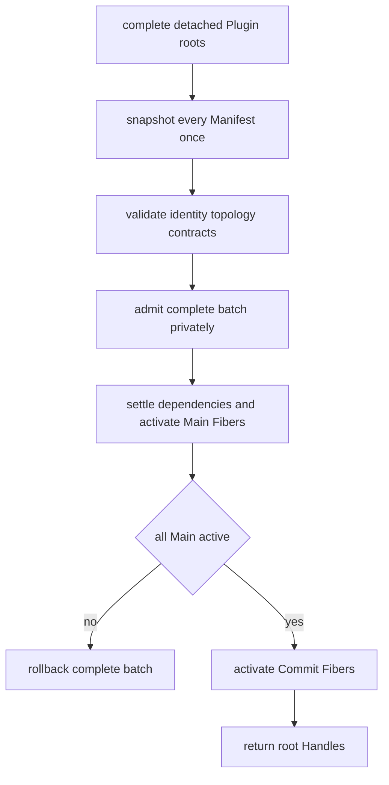
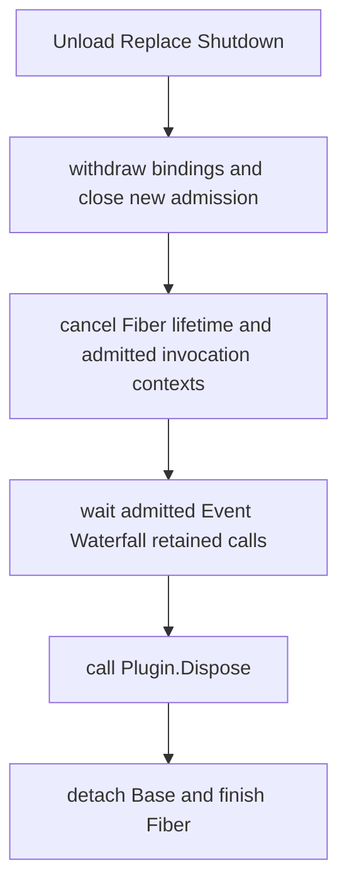

# Go Cordis 风格通用 Plugin 事件领域运行时设计方案

状态：Implemented，2026-08-20 已按当前实现复核

## 1. 定位与设计目标

Goren 的 `plugin` 是可独立使用的 Go 服务模块运行时。它组合五项能力：

```text
Plugin 生命周期
  + typed Service 依赖
  + Scope 可见性
  + Waterfall 洋葱扩展
  + typed Event 事实分发
```

DeepSeek Harness 和 Cordis 只用于核对责任与运行语义，不是 Go API 或目录结构模板。Go 实现采用静态链接、具名类型、接口和对象方法，不翻译 TypeScript 的 Context 链、对象字面量服务、函数工厂或动态 Profile。

设计目标是：

- Plugin 本身就是服务模块对象，不需要 `Define` 或只负责转发的包装 Plugin；
- Service 方法和应用服务拥有主流程，Waterfall 与 Event 只占据明确扩展点；
- Runtime 独占 Fiber、Scope、依赖图、binding、调用准入和回滚状态；
- Service 使用业务 interface，Event 和 Waterfall 输入输出使用具名业务类型；
- 公共泛型约束使用 `Service`、`Event`、`WaterfallInput`、`WaterfallOutput`，不使用 `any`；
- 启动、替换或停止失败不会留下可见 Service、Observer 或 Middleware；
- Goren 业务不能反向侵入通用 `plugin` 包。

本框架不负责动态代码加载、配置文件读取、脚本求值、Event Store、消息队列、RPC、HTTP、数据库或任意方法拦截。

## 2. 术语与职责

| 术语 | 含义 | 不负责 |
| --- | --- | --- |
| Plugin | 已构造的服务模块实例 | Runtime 内部注册表 |
| Manifest | 无 I/O 的完整静态声明 | 动态查询或资源启动 |
| Runtime | 生命周期、依赖和调用协调入口 | 配置读取、Plugin 构造、业务流程 |
| Fiber | 一个 Plugin 的一次激活 | 领域状态机 |
| Scope | Service、Event、Waterfall 的可见性边界 | 租户或业务上下文 |
| Service | Plugin 提供的 typed 同步能力 | 远程协议 |
| Waterfall | owner 主动运行的 typed 洋葱链 | 事实通知 |
| Event | 已发生事实的进程内通知 | 持久化、重放、前置决策 |
| Factory | 一个 Plugin 的严格配置解码、校验与构造边界 | mount 和生命周期 |
| Catalog | 已静态链接 Factory 的名称目录 | 配置读取、构造、启动 |
| Handle | Runtime 内某棵已挂载子树的身份 | 自行停止 |
| InvocationLease | 方法返回后仍继续工作的调用租约 | Plugin 或资源生命周期 |

Runtime 内部可以使用 Fiber、binding 和 release stack 等实现概念，但不把 Scope、Registry、disposer 或公开 Plugin Context 交给业务对象。

## 3. 模块边界

```text
plugin/
  runtime.go, activation.go, dependency.go   生命周期与依赖结算
  tree.go, mount.go, scope.go                私有树与可见性
  binding.go, service.go                     Service binding
  event.go, waterfall.go                     扩展分发
  invocation.go                              调用准入与排空
  diagnostics.go                             只读运行状态
  factory/                                   构造边界
  example/                                   公共 API 示例
```

这些文件属于同一个 `plugin` 模块，不拆成与 `plugin` 平级的 runtime、fiber、event 或 effect 模块。`factory` 是配置擦除与实例构造边界，`example` 只演示库的使用，因此保留为子包。

`plugin` 不依赖 Agent、Session、LLM、Tools、HTTP 或数据库。每个业务领域自行实现 Plugin 和 Factory；应用 composition root 只选择 Factory、提供配置并构造根 Plugin。

## 4. Plugin 公共契约

### 4.1 生命周期

```go
type Plugin interface {
    RuntimePlugin() *Base
    Manifest() Manifest
    Apply(context.Context) error
    Dispose(context.Context) error
}
```

每个 Plugin 以指针对象嵌入 `plugin.Base`。`Base` 只是 Runtime 的私有激活锚点，不是业务 Context。

`Manifest` 必须确定、无 I/O，Runtime 在构造声明树时只读取一次。`Apply` 在依赖已解析后启动 Plugin 自己的资源；`Dispose` 必须幂等并能清理部分完成的 `Apply`。长期任务观察 `plugin.Lifetime(owner)`，Runtime 会在 `Dispose` 前取消它。

### 4.2 Manifest 与完整树

```go
type Manifest struct {
    Name       string
    Provides   []ServiceType
    Requires   []ServiceType
    Optional   []ServiceType
    Events     []EventSubscription
    Waterfalls []WaterfallMiddlewareBinding
    Children   []ChildPlugin
}
```

Manifest 声明全部运行时关系：

- `Provides`：Plugin 对象直接实现的 Service；
- `Requires`：缺失时不能激活的 Service；
- `Optional`：Apply 时存在则注入、缺失也可激活的 Service；
- `Events`：送入本 Plugin 统一 `EventObserver` 入口的 Event 类型；
- `Waterfalls`：本 Plugin 拥有的 Middleware 对象；
- `Children`：本 Plugin 在进入 Runtime 前已经构造好的子 Plugin。

组合型 Plugin 私有构造自己的子树，通过 `SameScope` 或 `NestedScope` 声明可见性，通过 `ActivationMain` 或 `ActivationCommit` 声明激活阶段。Runtime 不要求业务调用方构造公开 Tree，也不允许 Child 在 `Apply` 中临时补齐静态拓扑。

`ActivationCommit` 只用于必须在全部 Main Plugin 激活后才能暴露的外部入口，例如监听端口。Commit Plugin 不能提供 Service，停止时先于 Main Plugin 撤销。

### 4.3 Service

业务能力由 owner package 定义：

```go
type Clock interface {
    plugin.Service
    Now() time.Time
}
```

Provider Plugin 直接实现该接口，并在 Manifest 中声明 `plugin.ServiceOf[Clock]()`。Consumer 先在 Manifest 声明 `Requires` 或 `Optional`，然后只在 `Apply` 中调用：

```go
clock, err := plugin.Require[Clock](consumer)
optionalClock, ok := plugin.Resolve[Clock](consumer)
```

`Require`/`Resolve` 不是 Service Locator：只能读取当前 Fiber 已结算且已声明的依赖快照，`Apply` 返回后立即关闭。业务方法使用保存的 Go interface，调用链不再经过 Runtime。

Service 身份来自 `reflect.TypeFor[S]()` 对应的具名 interface 类型。这里使用反射是因为删除 Definition 单例后，共同导入业务 interface 的 Provider 和 Consumer 必须得到同一类型键；Runtime 不通过反射调用业务方法、创建 Plugin 或解码业务值。每次创建一个 `key struct{ marker byte }` 只能得到对象身份，反而要求共享 Definition 实例，不适合当前 API。

### 4.4 Event

Event 是具名 struct，并在零值上提供稳定元数据：

```go
type CounterAdvanced struct {
    Value int
}

func (CounterAdvanced) EventName() string {
    return "counter/advanced"
}

func (CounterAdvanced) EventDelivery() plugin.DeliveryPolicy {
    return plugin.DeliveryOrdered
}
```

一个监听 Plugin 只实现一个 `ObserveEvent(context.Context, plugin.Event)` 入口，却可以在 Manifest 中声明多个 `plugin.EventOf[E]()`。Runtime 只投递显式声明的类型；Plugin 内用 type switch 转给具名业务方法。每个 Event 类型的名称和投递策略必须恒定。

事实 owner 在逻辑提交后调用 `plugin.Publish`。事件从 source Scope 向 root 路由：局部 Observer 先于祖先。`DeliveryOrdered` 顺序执行并返回首个失败；`DeliveryParallel` 并发执行并聚合失败；`DeliveryBestEffort` 报告失败但不让发布者失败，因而 Runtime 必须配置 `EventFailureReporter`。

Event Sourcing 与事件分发是两件事：Session 等业务 owner 可以先向自己的 append-only log 追加事实，再按需发布进程内 Event。Plugin Runtime 不保存、不重放、不 flush Event。

### 4.5 Waterfall

```go
type WaterfallAction[I WaterfallInput, O WaterfallOutput] interface {
    Execute(context.Context, I) (O, error)
}

type WaterfallMiddleware[I WaterfallInput, O WaterfallOutput] interface {
    Intercept(context.Context, I, WaterfallAction[I, O]) (O, error)
}
```

输入和输出嵌入对应 Base marker，必须是具名业务类型。Plugin 在 Manifest 中用 `WaterfallOf[I, O](middleware)` 声明自己拥有的 Middleware。owner 在明确扩展点调用 `plugin.Run`，由 root 到 source 形成洋葱链。

最内层业务动作和每一层 Runtime step 都是 `WaterfallAction`，不再拆出 Terminal、Middleware Next、Callback 三套相同协议。每个下游 step 只能执行一次，Middleware 可以改写输入或输出、短路或返回错误。

标准顺序是：

```text
Service method
  -> Run Waterfall
  -> innermost Action 执行业务流程
  -> owner 完成逻辑提交
  -> Publish Event
```

Waterfall 可以影响动作，Event 只通知已经发生的事实，二者不会自动互相转换。

### 4.6 RunRetained 与 Release

普通 `Run` 在 `Execute` 返回时释放参与调用的 Fiber 准入。对于 `ChunkStream` 一类惰性结果，方法已经返回但读取、取消或关闭仍在调用 Plugin 代码，立即释放会允许 Runtime 提前 Dispose 参与者。

`RunRetained` 因此返回 `InvocationLease`：

- `lease.Context()` 在调用方或任一参与 Plugin 停止时取消；
- 结果到达终态、读取失败或显式关闭时，结果包装器调用 `lease.Release()`；
- `Release` 幂等，只结束这次调用并允许 Fiber 排空，不停止 Plugin、服务、网络连接或业务资源；
- 普通 Plugin 不需要使用它；当前 LLM Runtime 在流包装器内自动管理，业务调用方看不到租约。

这是惰性调用的生命周期正确性机制，不是新增业务功能。

## 5. Runtime 核心流程

### 5.1 启动



Runtime 根据 Service 图激活 Provider 和 Consumer，不依赖声明顺序。`Apply` 只在 Fiber 为 `starting` 时取得依赖；成功后 Runtime 原子发布 Service、Event 和 Waterfall binding。任一节点失败，整批按依赖安全的逆序回滚并调用已进入 Apply 的 Plugin `Dispose`。

### 5.2 动态挂载与替换

`Mount` 增加 root Plugin；`MountChild` 在父 Scope 挂载 Child Fiber；`MountScopedChild` 创建一个嵌套 Scope。Plugin 内确有动态子生命周期时，可以使用对应的 package 函数，由 Runtime 验证当前 parent 身份。

`Replace` 只接受名称、Service、Event、Waterfall 和子树契约兼容的候选 Main 子树。Runtime 在私有视图准备候选，失败时保持旧树；成功时停止依赖方、切换 binding、停止旧树并重新结算依赖。含 Commit 节点的子树不能替换，因为任意外部副作用无法承诺通用原子回滚。

### 5.3 停止、调用准入与排空



停止顺序是 dependent-first、child-first；Commit Fiber 先于 Main Fiber。Runtime 在锁内只取得路由快照和调用租约，在锁外调用 Plugin、Observer、Middleware、Action 和 reporter。生命周期回调中同步修改同一个 Runtime 的拓扑会返回 `ErrTopologyMutation`，避免重入死锁。

外部只调用 `Runtime.Unload`、`Replace` 或 `Shutdown`。`Handle` 没有 `Stop`，业务对象也不调用“准入”或“排空”；这些是 Runtime 的自动控制。

### 5.4 Scope 路由

| 机制 | 查找方向 | 规则 |
| --- | --- | --- |
| Service | source → root | 最近的 active Provider 覆盖祖先 |
| Event | source → root | exact、祖先、global；局部先执行 |
| Waterfall | root → source | 祖先策略在外层，局部策略在内层 |

Scope 是 Runtime 私有对象。公开 `ScopeKey` 只出现在只读诊断和 lineage 工具中，Service 不保存 Scope，也不关心自己位于哪棵插件子树。

## 6. Factory、Catalog 与 Server Assembly

配置和 Runtime 是两条独立责任链：

```text
deployment config
  -> Catalog.Lookup(factory name)
  -> domain Factory.Create(raw JSON)
  -> validated Plugin instance
  -> composite Server Manifest.Children
  -> Runtime.Start(Server)
```

`plugin/factory.Factory` 只有 `Name` 与 `Create`。每个领域 Factory 自己拥有具名 Config、严格字段解码、默认值、组合校验和 Plugin 构造。公共 helper 只检查 JSON object、任意深度 duplicate key、空配置和 Create Context；unknown field、字段类型及业务范围仍由 owner Factory 负责。

Catalog 只保证 Factory 名称唯一并提供查找，不读取配置、不创建 Plugin、不 mount，也不进入 Runtime 核心。

Goren 的 `internal/assembly` 只做进程级编排：注册静态 Factory 白名单、形成 `PluginSpec`、调用 Factory 并构造完整 `Server` 子树。每个 Factory 名必须与返回 Plugin 的 `Manifest.Name` 一致。`cmd/goren` 创建 Catalog、Specs 和 Server 后，只把一个完整 root 交给 Runtime。

## 7. 如何实现一个 Plugin

必须实现：

1. 嵌入 `plugin.Base`；
2. 返回稳定 `Manifest`；
3. 实现 `Apply`；
4. 实现幂等 `Dispose`。

按需实现：

- Service Provider：实现业务 Service interface，并声明 `Provides`；
- Service Consumer：声明 `Requires`/`Optional`，在 Apply 中 `Require`/`Resolve`；
- Event Observer：实现统一 `EventObserver`，声明一个或多个 `EventOf[E]()`；
- Event Publisher：在业务逻辑提交后调用 `Publish`；
- Waterfall Middleware：实现或持有 Middleware，并声明 `WaterfallOf[I, O]`；
- Waterfall owner：以具名 Action 调用 `Run`；
- Composite Plugin：构造 Child 实例并在 `Manifest.Children` 声明；
- 惰性 Waterfall 输出：仅由能够把租约绑定到结果终态的 owner 使用 `RunRetained`。

如需从部署配置创建 Plugin，再在 owner 的 `factory` 子包实现 `plugin/factory.Factory`。没有配置的 Plugin 仍必须严格接受且只接受 `{}`。Plugin 本身不接触 `json.RawMessage`。

示例只见 `plugin/example`：Service、Scope 继承、Event 和 Waterfall 可以独立或组合使用，均不是每个 Plugin 的强制接口。

## 8. 实现不变量与证据

- 一个 Plugin 实例同一时刻最多绑定一个 Fiber；
- Manifest 是完整、稳定、无 I/O 的声明；
- 同一 exact Scope 和 Service 类型最多一个 active Provider；
- active Plugin 的 required dependency 都指向 active Provider；
- `Require`/`Resolve` 只在 Apply 中开放；
- 非 active Fiber 不参与新 dispatch；
- Service、Event、Waterfall 使用独立类型键和 Registry；
- Runtime 不在状态锁内执行用户代码；
- 停止先撤销可见 binding、取消调用、等待排空，再 Dispose；
- Event 是通知机制，不是 Event Store；
- 公共泛型 API 不使用 `any` 或 `interface{}`；
- 不存在 Context、Definition、Provide、Observe、Use、Registration 兼容路径。

实现证据位于 `plugin/*.go`、`plugin/*_test.go` 和 `plugin/example/*_test.go`；跨语言行为证据位于 `tests/contract`，全仓状态见[08 实施进度](./08-implementation-progress.md)。Goren 默认组合见[09 Plugin Runtime 与 Server Assembly](./09-plugin-runtime-and-server-assembly.md)。
