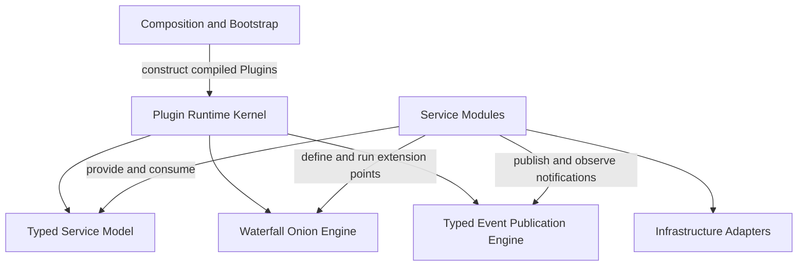
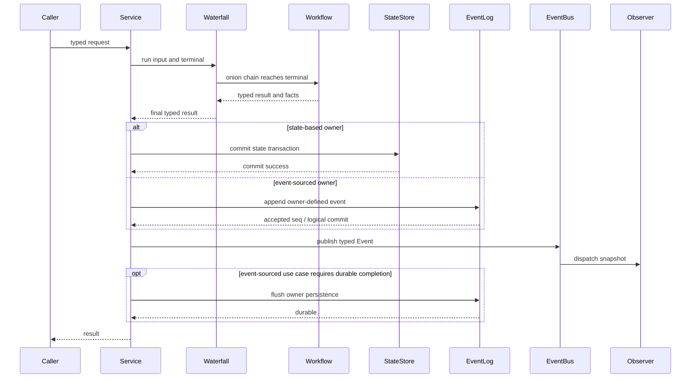

# Go Cordis 风格通用 Plugin 事件领域框架设计方案

状态：架构已确认，作为 `plugin` 一次性重构目标

## 1. 系统定位

本项目要实现的不是一个只服务于 Goren 当前启动流程的依赖注入容器，也不是对 Cordis TypeScript API 的逐行翻译。

目标是一个可独立复用的 Go 服务开发框架：以 Plugin 组合服务模块，以 typed Service 建立主调用链，以 Waterfall 提供洋葱式扩展，以 typed Event 传播已经发生的事实，并由 Fiber、Scope 和 Effect 统一管理生命周期与可见性。

```text
Go service framework
  = Plugin composition
  + typed Service dependencies
  + Waterfall onion interception
  + typed Event fact notification
  + structured lifecycle
```

Goren 是该框架的第一个完整使用者。框架设计不能依赖 Agent、Session、LLM、Tools 或 Goren 的具体业务模型。

## 2. Staff 级设计与实现顺序

本框架按以下顺序推进：

1. 明确系统目标、非目标和适用范围；
2. 固定统一术语；
3. 确定对象职责、依赖方向和关键不变量；
4. 定义端到端核心流程与失败语义；
5. 确定 `plugin` 模块内部责任区；
6. 先固定 Definition identity、Scope 和 Mount Transaction；
7. 实现 scoped Service Registry、实际 Provider 依赖图和 Fiber Supervisor；
8. 实现 Waterfall、Event、Child Fiber 和 Replacement，并同步增加 owner 行为测试；
9. 以可编译 Go example 验证插件作者 API；
10. 最后迁移 Goren 各服务模块。

设计文档说明“为什么这样分、谁拥有语义、流程必须满足什么”，并固定插件作者必须依赖的最小公共契约骨架。具体私有 struct 字段、锁、索引和算法仍由代码表达，避免文档与代码形成两套实现来源。

## 3. 设计目标

### 3.1 通用服务组合

服务开发者可以把一个能力实现为 Plugin，声明它提供和消费的 Service，并由 Runtime 按依赖关系启动、停止和替换。

### 3.2 显式主流程与可扩展流程并存

领域或应用服务继续拥有清晰的 Workflow。框架允许其他 Plugin 在明确的扩展点前后介入，但不能把主流程拆散成无法追踪的 Observer 集合。

### 3.3 Waterfall、领域提交与 Event 协作

Waterfall 包裹一个尚未完成的动作；业务 owner 决定什么构成权威提交；Event 传播提交后已经发生的 typed fact。Plugin Runtime 只提供一种 Event 分发机制，不根据事实是否持久化建立第二套 Event 类型体系。

```text
request
  -> Waterfall onion
  -> owner Workflow terminal
  -> Waterfall unwind success
  -> owner commit boundary
       -> state-based: commit state transaction
       -> event-sourced: append owner-defined event to append-only log
  -> publish typed Event
  -> event-sourced owner optionally flushes its log
```

Event Sourcing 是业务 owner 的状态存储方式，不是 Plugin Runtime 的第二种 Event。Event Sourcing owner 可以把刚追加的同一个业务事件通过 Event Definition 发布；Event Bus 不保存历史，也不保证后端已经 `flush`。

### 3.4 结构化生命周期

Plugin 对象通过 `Apply`/`Dispose` 拥有数据库连接、监听端口、后台任务等自身运行资源；Runtime 在 Fiber 内部把该 Plugin 生命周期、Service Binding、Middleware Binding、Observer Subscription 和 Child Plugin 统一记录为可逆 Effect。Effect 是 Runtime/Fiber 私有机制，不是插件作者需要实现的扩展接口。失败、卸载和替换不能留下部分注册或孤儿任务。

### 3.5 Go 静态类型安全

Service、Event、Waterfall input/output 都由 named Go type 或 interface 表达。公共泛型使用具有业务含义的约束，不使用 `any`、空 interface、反射调用或 `map[string]any` 传递框架内部业务值。

### 3.6 可嵌入和可诊断

框架既可作为完整应用底座，也可嵌入测试、命令行服务或其他 Go 程序。Runtime 必须能够给出 Plugin/Fiber 状态、依赖、作用域、Binding/Subscription 和失败原因。

## 4. 非目标

首版不负责：

- 动态加载 `.so`、WASM、远程代码或未编译 Plugin；
- 兼容 Cordis Profile、`!!js`、Proxy、decorator 或 JavaScript 配置求值；
- 替代领域模型、应用服务、事务管理器或持久化框架；
- 把 Event 机制做成持久化 Event Store、消息队列或分布式总线；
- 自动把每个 Service method 变成 Waterfall；
- 通过全局 Service Locator 隐藏依赖；
- 为 Goren 当前旧 API 保留兼容层；
- 首版提供代码生成 CLI。所谓脚手架首先指统一的模块模型、运行时契约、测试方式和开发流程。

## 5. 统一术语

| 术语 | 含义 | 不负责 |
| --- | --- | --- |
| Runtime | 一个独立的 Plugin 运行环境和协调入口 | 配置读取、业务流程 |
| Plugin | 一个可组合的服务模块实例，也是自身运行资源的生命周期 owner | Runtime registry、其他 Plugin 资源 |
| Manifest | Plugin 的身份与 Service 依赖声明 | 动态依赖查找 |
| Fiber | Plugin 的一次运行实例和生命周期 owner | 业务状态机 |
| Context | Fiber 与 Runtime 交互的受限句柄 | Service Locator、业务上下文 |
| Scope | Service 可见性、Waterfall 累积和 Event 路由边界 | 生命周期 owner |
| Effect | Runtime/Fiber 私有的一条可逆生命周期记录 | 插件作者 API、业务事务、Event 历史 |
| Mount Transaction | 一次 Plugin 启动的生命周期登记、注册暂存、校验、提交和回滚 | 领域事务 |
| Service | Plugin 向其他 Plugin 提供的 typed 同步能力 | 远程 RPC 协议 |
| Service Definition | Service 的 canonical identity 与 Go 类型定义 | Service 实现 |
| Service Provider | 提供一个 Service 的 Plugin/Fiber | Service Consumer Workflow |
| Service Consumer | 声明并使用 Service 的 Plugin/Fiber，也称服务依赖方 | Event Observer、Provider 生命周期 |
| Waterfall | 围绕一个动作形成的 typed 洋葱调用链 | 已发生事实广播 |
| Middleware | Waterfall 中一个可继续、包裹或短路的命名对象 | 主业务 owner |
| Terminal | Waterfall 最内层、由动作 owner 提供的真实 Workflow | 通用框架策略 |
| Event | owner 提交后通过 Runtime 传播的 typed fact | 权威历史、前置授权或动作改写 |
| Observer | 观察 Event 的命名对象 | Event 存储、事件所属事务 |
| Event Sourcing | 业务 owner 以 append-only event log 作为状态来源的存储模型 | Plugin Event 分发机制 |
| Binding | Service Provider 或 Middleware 在 Scope 中的可见绑定 | 生命周期所有权 |
| Subscription | Observer 在 Scope 中的可见订阅 | 生命周期所有权 |
| Catalog | 可选的已编译 Plugin Configurator 目录 | Runtime 核心流程 |
| Factory | 已完成 typed config 校验的 Plugin 构造对象 | Runtime mount |

本文统一使用 `Service`，不同时建立一套语义重复的 Capability API。Service 在架构意义上就是 Runtime 可发布的 typed capability。

## 6. 核心设计原则

### 6.1 Service 是主调用链

Service Consumer 在启动时取得 typed Service，之后直接调用 Go interface。普通业务调用不再次经过 Runtime dispatch。

```text
Service Consumer -> Service interface -> Service Provider object
```

Waterfall 和 Event 是围绕 Service Workflow 的扩展机制，不替代 Service。

### 6.2 Waterfall 在动作完成前，Event 在逻辑提交后

Waterfall 可以：

- 校验或丰富 input；
- 在调用下游前后执行逻辑；
- 改写 output；
- 明确短路；
- 传播 error。

Event 只能表达已经发生的事实。需要拒绝、选择、修改或重试动作时，不使用 Event。Event Sourcing owner 的逻辑提交点可以是业务事件被权威日志接受；这不等于已经完成后端 `flush`。

### 6.3 领域 owner 主动调用扩展点

框架不拦截任意 Go method。Service owner 明确定义哪些动作可扩展，并在自己的 Workflow 中主动运行对应 Waterfall、完成 owner-defined commit、发布 Event。

### 6.4 生命周期与可见性分离

Fiber 拥有 Runtime 生命周期，Scope 拥有可见性。Plugin 自身生命周期、Service Binding、Middleware Binding、Observer Subscription 和 Child Plugin 都是 Runtime 私有的 Fiber-owned Effect；只有三类注册 Effect 参与 Scope 路由和 Registry 查找。

### 6.5 启动与领域事务分离

Mount Transaction 只保证 Plugin 启动贡献原子发布，不替代数据库或领域事务。一次业务操作的 commit 边界仍由对应服务模块拥有。

### 6.6 外部代码不在框架锁内执行

Runtime 和各 Registry 只在锁内校验、修改状态或取得快照。Plugin 的 `Apply`/`Dispose`、Service、Middleware、Terminal、Observer 和 reporter 都在解锁后调用。

### 6.7 注册动作不转移生命周期所有权

`Provide`、`Use` 和 `Observe` 是注册动作，分别形成 Service Binding、Middleware Binding 和 Observer Subscription。Runtime 将它们连同 Plugin 自身和 Child Plugin 一起放入当前 Fiber 的私有 Effect stack，但它们不成为独立生命周期 owner：

```text
Fiber
  -> Effect stack
       -> Plugin lifecycle release
       -> Service Binding withdrawal
       -> Middleware Binding withdrawal
       -> Observer Subscription withdrawal
       -> Child Plugin stop

Registry
  -> only indexes active Binding / Subscription
```

Plugin 作者只调用 typed registration API，不创建 Effect，也不保存 registration cleanup。确实需要更短动态生命周期时，创建明确的 Child Fiber，并通过该 Fiber 的 `Handle` 停止整个子树。Child Plugin 本身也是父 Fiber 的内部 Effect，因此父 Fiber 停止一定级联停止子树；普通 Child Scope 仍只负责可见性。

## 7. 总体架构



依赖方向：

```text
composition root -> Plugin implementations and Runtime
Plugin module     -> framework public contracts
Service Workflow -> consumer-owned ports and domain objects
adapter           -> owner-defined port
Runtime           -> no business module
```

## 8. 责任边界

### 8.1 Composition 与 Bootstrap

负责：

- 读取 CLI、环境变量或配置文件；
- 严格解码 owner-defined config；
- 注册可选 Catalog allowlist；
- 创建已经配置好的 Factory 和 Plugin；
- 把 Plugin 交给 Runtime；
- 多 Plugin 启动失败时协调应用级回滚。

不负责 Service 依赖结算、Fiber 生命周期或业务流程。

Catalog 只在外部配置通过 canonical name 选择已编译 Plugin 时需要。已经持有 typed Go config 的静态装配可以直接构造 Factory，不进行 JSON marshal/decode 往返。

### 8.2 Runtime Kernel

负责：

- Plugin declaration；
- hard dependency settlement；
- Fiber 创建、启动、停止和替换；
- parent/child 生命周期；
- Mount Transaction；
- 各机制 owner 的协调；
- diagnostics snapshot。

Runtime 不读取配置、不持有 Catalog，也不执行 Service 的普通业务方法。

### 8.3 Service Runtime

负责：

- Service Definition identity；
- scoped Provider 注册与唯一性；
- Service Consumer hard/optional dependency；
- nearest-visible Provider resolution；
- Service Provider/Service Consumer dependency graph；
- Provider 消失后的 dependent-first stop。

Service Runtime 不包含业务路由、重试或 fallback 决策。

`Requires` 在 Service Provider 可用前阻止启动。`Optional` 不阻止启动，但它表示一次 Fiber 激活期间的 Service snapshot；可选 Provider 出现、消失或被替换时，Runtime 重新激活声明过该 Optional dependency 的 Service Consumer，避免长期持有已经失效的对象引用。

### 8.4 Waterfall Runtime

负责：

- typed input/output definition；
- Middleware Binding ownership；
- root-to-current Scope 累积；
- deterministic ordering；
- 洋葱链组装；
- `Next`/`Proceed` one-shot；
- short-circuit 与 error 传播。

Waterfall Runtime 不知道具体业务事务，也不自动发布 Event。

### 8.5 Event Mechanism

负责：

- typed Event Definition；
- Observer Subscription ownership；
- current-to-root Scope admission；
- deterministic snapshot 与分发；
- ordered、parallel 或 best-effort delivery policy；
- Observer failure reporting。

Event Mechanism 不保存 Event 历史，也不反向修改已经提交的业务结果。一个 Event payload 是否同时是 Event Sourcing log record，由业务 owner 决定。

### 8.6 Fiber、Scope 与 Effect

Fiber 只有一个私有 Effect ownership 模型。Mount Transaction 在调用 `Plugin.Apply` 前先登记 Plugin lifecycle effect，其 release 操作调用同一 Plugin 对象的 `Dispose`；随后 `Provide`、`Use` 和 `Observe` 产生携带 Scope 的 registration effect。注册项要么全部发布、要么零发布，任何启动失败都按逆序回收，最终调用 `Plugin.Dispose` 清理部分启动状态。

Child Plugin 形成 Child Fiber，同时以一个 Child Plugin effect 挂到父 Fiber。普通 Child Scope 只形成可见性分支。父 Fiber 停止时通过内部 release 操作停止 Child Fiber；Child Scope 也随父 Fiber 关闭。

### 8.7 Service Module Owner

一个业务服务模块负责：

- Service contract 与 canonical Definition；
- typed config 和 Plugin 实现；
- application Workflow；
- domain model 与 invariant；
- owner-defined Waterfall 扩展点；
- owner-defined Event；
- outbound port；
- adapter mapping；
- 模块行为测试。

assembly 只连接这些对象，不能把业务分支搬进 Factory 或 Plugin.Apply。

## 9. Waterfall、领域提交与 Event 的组合模型

框架只固定扩展、逻辑提交和通知的责任顺序，不替业务 owner 选择状态事务或 Event Sourcing。标准服务操作遵循以下时序：



这张图表达职责顺序，不要求框架提供一个统一的万能 `Execute` 函数。只有整个 Waterfall 成功返回且 owner 接受结果后，状态变化或已追加事件才成为权威事实。

### 9.1 Event 与 Event Sourcing 的边界

Plugin Runtime 只有一个 `EventDefinition[E]` 分发机制。它负责 typed Observer、Scope 路由、确定顺序和失败策略，不判断 `E` 是否持久化，也不提供 Event Store、projection 或 `flush`。

状态型服务先提交数据库事务或受控内存状态，再发布 owner-defined Event。

Event Sourcing 服务先把 owner-defined event 追加到 append-only log，再通过同一个 Event Definition 发布该事件。状态、模型输入和读取视图由 owner 从日志 fold/project；Persistence 可以通过 Observer 进行 write-behind，但需要返回前耐久化的用例必须显式等待 owner-defined `flush`。

以 DeepSeek Harness 为例，`Session.append(SessionEvent)` 先把 `SessionEvent` 加入 Session log，随后 `session/event` 把同一个 `SessionEvent` 交给 Observer。它没有再转换出第二类别的事件对象。

### 9.2 Waterfall 失败

- Middleware 或 Terminal 返回 error：洋葱链终止，owner transaction 回滚；
- 整个 Waterfall 未成功返回：不提交状态、不向 Event Sourcing log 追加事件、不发布 Event；
- Middleware 短路：返回其明确结果；是否形成 owner commit 并发布 Event 由动作 owner 定义；
- 同一个 Middleware 不能调用下游两次。

### 9.3 Event 失败

- 业务提交已经成功，Observer failure 不能伪装成业务未发生；
- ordered/parallel 的 error 必须作为明确的 post-commit failure 返回，不能自动回滚状态提交或删除 Event Sourcing log 中已经追加的事件，也不能诱导调用者盲目重试业务命令；
- best-effort failure 交给 reporter；
- 需要强一致的后续动作必须留在 owner transaction 或显式 Workflow 中，不能依赖普通 Event Observer。

## 10. 核心流程

### 10.1 应用启动

```text
configuration source
  -> typed validation
  -> configured Factory
  -> Plugin instance
  -> Runtime declaration
  -> hard dependency settlement
  -> Fiber start
  -> Plugin.Apply through Mount Transaction
  -> atomic Binding / Subscription publication
  -> waiting Service Consumers settle
```

hard dependency 不满足时，Plugin 保持 Waiting，不能调用 `Apply`。

### 10.2 Plugin 启动事务

```text
create Fiber and private lifecycle effect
  -> call Plugin.Apply
  -> stage Service / Middleware / Observer registration Effects
  -> validate Manifest and conflicts
  -> atomic publish registration Effects
  -> transfer the complete Effect stack to Fiber
```

Plugin 在 `Apply` 中直接启动并保存自身资源；注册 Effect 在 commit 前保持不可见。Runtime 在 `Apply` 前已经登记 Plugin lifecycle effect，所以 `Apply` 返回 error 或 panic 时也会先撤销所有暂存注册，再调用 `Plugin.Dispose`。不存在对外公开的 `Effect.Setup`、`Disposer` 或 commit 后第二次 `Activate`。

私有 `runtimeEntry` 只表达注册 Effect 的校验、发布和撤回能力，不形成第二套生命周期所有权。每个 `runtimeEntry` 都由一个私有 `fiberEffect` 包装，release 操作精确撤回该 registration；插件作者不接触这些类型。

### 10.3 Service 调用

```text
Service Consumer resolves typed Service during activation
  -> Runtime records dependency edge
  -> Service Consumer calls Service Provider Go interface directly
  -> Service Provider runs explicit Workflow
```

Runtime 不成为业务调用代理。

### 10.4 洋葱扩展

```text
Service owner runs Waterfall
  -> root Middleware
  -> ancestor Middleware
  -> current Middleware
  -> owner Terminal
  -> current after
  -> ancestor after
  -> root after
```

同一层级按稳定 Binding ordinal 排序，不使用隐式 map 顺序。

### 10.5 事实传播

```text
owner logical commit succeeds
  -> publish typed Event
  -> capture observer snapshot
  -> current Scope observers
  -> ancestor observers
  -> root observers
```

Event 的 Observer 集合在一次分发开始后保持稳定。

### 10.6 Provider 消失与恢复

```text
Provider stops
  -> stop transitive hard Service Consumers first
  -> stop Service Consumers holding resolved Optional snapshots
  -> withdraw Service
  -> hard Service Consumers become Waiting
  -> optional Service Consumers reactivate without that Provider

new Provider becomes active
  -> create new hard Service Consumer Fibers
  -> reactivate declarations that named the Optional dependency
  -> Apply again with a fresh dependency snapshot
```

`Apply` 自身失败属于 Failed，不因无关 Provider 变化自动重跑。

### 10.7 卸载与关闭

```text
stop dependents
  -> mark Fiber stopping
  -> cancel Fiber lifetime
  -> release private Effect stack in reverse
       -> Child Plugin
       -> registration withdrawal
       -> Plugin.Dispose
  -> mark stopped
```

停止幂等，清理错误需要聚合，但不能阻止继续回收其他已拥有资源。

### 10.8 Replacement

候选 Plugin 在 shadow Fiber 中完成 Apply 和校验。候选失败会撤回候选 registration 并调用候选 `Dispose`，旧 Fiber 保持 active；候选成功后才停止 dependents、原子切换 registration Effect、逆序释放旧 Fiber 的完整 Effect stack 并重新结算 Service Consumers。

Replacement 必须保持 Plugin canonical name 与 `Manifest.Provides` Definition 集合，不能通过同一个 Handle 偷换成不同服务职责；`Requires`、`Optional`、Middleware、Observer 与内部资源实现可以随版本变化，并在候选 mount 成功后形成新的依赖和贡献快照。

配置读取和 candidate 构造始终发生在 Runtime 外。

## 11. Scope 路由模型

| 机制 | 查找/执行方向 | 原因 |
| --- | --- | --- |
| Service | current → parent → root | 最近 Provider 覆盖祖先默认实现 |
| Waterfall | root → parent → current | 外层策略包裹内层行为 |
| Event | current → parent → root | 局部事实通知向所属祖先传播 |

同一个 exact Scope 和 Service Definition 只能存在一个 active Provider。Child Plugin 可以在自己的 Fiber root Scope 覆盖祖先 Service；普通 Child Scope 不直接创建另一个 Service Provider 生命周期。

Sibling Scope 之间默认不可见，避免一个 request、tenant、agent 或 test 的扩展泄漏到另一个分支。

## 12. `plugin` 模块内责任区

所有框架能力统一属于 `plugin/` 模块。下面是责任区，不预先强制“一种类型一个包”。只有真实依赖方向、可见性或独立变化原因出现时才拆成子包。

| 责任区 | 拥有内容 | 不拥有 |
| --- | --- | --- |
| Public Contract | Plugin、Manifest、Context、Service/Event/Waterfall Definition | concrete business module |
| Composition Boundary | configuration Document、Configurator、Factory、optional Catalog | Runtime settlement |
| Lifecycle Kernel | Runtime、Fiber、Scope、Mount Transaction、统一 Effect ownership/disposal | config source、domain transaction |
| Service Mechanism | Definition identity、Provider directory、dependency graph、resolution | business Service implementation |
| Waterfall Mechanism | middleware registry、scope accumulation、onion chain | Workflow terminal semantics |
| Event Mechanism | Observer Subscription registry、snapshot、delivery policy、failure reporting | Event Store、projection、durability |
| Diagnostics | immutable runtime snapshots | mutable internal state exposure |
| Test Support | Plugin mount harness、ordering/lifecycle assertions | fake business behavior in production |

物理约束：

- 不建立与 `plugin` 平级的根级 `runtime`、`service`、`event`、`waterfall`、`scope` 或 `fiber` 包；
- `plugin` 核心不能反向依赖 Agent、Session、LLM、Tools 等业务 owner；
- configuration/factory 即使拆为 `plugin/` 子包，也不能成为 Runtime 的依赖；
- Lifecycle、Service、Waterfall 和 Event 共享同一个 Mount Transaction 与 Fiber ownership，在出现真实依赖方向或可见性边界前保留在 `plugin` 包内，只按文件划分责任；
- 不为尚未出现的职责创建占位目录。

## 13. 插件作者契约与实现方式

本节固定目标公共 API 的责任和最小形状，用于指导后续一次性实现。当前代码若与本节不同，应直接迁移到本节模型，不保留兼容接口。私有 Registry、Fiber Effect、锁和泛型存储结构不属于插件作者契约。

### 13.1 一个插件必须实现什么

每个插件只必须实现 `Plugin`：

```go
type Plugin interface {
	Manifest() Manifest
	Apply(applyContext context.Context, pluginContext *Context) error
	Dispose(disposeContext context.Context) error
}

type Manifest struct {
	Name     string
	Provides []ServiceRef
	Requires []ServiceRef
	Optional []ServiceRef
}
```

`Manifest` 是静态声明，负责稳定身份和 Service 依赖图。`Apply` 是一次 Fiber 激活的装配入口，负责：

- 解析已在 `Manifest` 声明的 Service；
- 构造或连接命名 Service/Workflow 对象；
- 登记 Service Binding、Middleware Binding 和 Observer Subscription；
- 启动并保存该 Plugin 自身拥有的长期资源；
- 返回启动失败。

`Dispose` 释放 Plugin 自身拥有的数据库连接、监听端口、后台任务等资源。它必须幂等，并且即使 `Apply` 只完成部分初始化后失败也能安全执行。`Apply` 不承载请求处理、重试循环或业务事务；业务调用属于 Service 方法。

`Manifest` 必须是结果确定且无 I/O 的声明方法。一个 Plugin declaration 可能因为 Optional/required Provider 变化经历多次顺序执行的 `Apply`/`Dispose`；每次 Fiber 只调用一次 `Apply` 和最多一次有效 `Dispose`。Plugin 实例可以保存本次激活资源，但 `Dispose` 必须把它恢复为可再次 `Apply` 的 inactive 状态；同一个 Plugin 实例不得同时交给多个 declaration 共享。

### 13.2 按插件角色选择接口

插件不需要实现所有框架接口，只实现自己承担角色所需的接口：

| 插件角色 | 需要实现或提供 | 是否每个插件必需 |
| --- | --- | --- |
| Plugin lifecycle owner | `Plugin`（`Manifest`、`Apply`、`Dispose`） | 是 |
| Service Provider | owner-defined Service interface 的命名实现对象 | 否 |
| Waterfall 扩展 | `WaterfallMiddleware[I, O]` 命名对象 | 否 |
| Event 观察 | `EventObserver[E]` 命名对象 | 否 |
| 从外部 Document 构造 Plugin | `Configurator` 与 `Factory` | 否；仅 composition boundary 使用 |

Service Consumer 不实现额外 `Consumer` 接口。它通过 `Manifest.Requires`/`Optional` 声明角色，并在 `Apply` 中取得 typed Service。Event 一侧只使用 `Observer`，不再使用 `Consumer` 一词。

### 13.3 Context 契约

`Context` 是当前 Fiber 在当前 Scope 下访问 Runtime 的受限句柄，不是业务 `context.Context`，也不是 Service Locator：

```go
type Context struct {
	// opaque runtime state
}

func (pluginContext *Context) Lifetime() context.Context
func (pluginContext *Context) FiberID() FiberID
func (pluginContext *Context) Scope() *Scope
func (pluginContext *Context) ChildScope(label string) (*Context, error)
func (pluginContext *Context) Mount(
	mountContext context.Context,
	instance Plugin,
) (Handle, error)

func (childHandle Handle) Stop(stopContext context.Context) error
```

`Apply` 的第一个参数只覆盖本次启动尝试；`Context.Lifetime` 覆盖 Fiber 整个存活期。`ChildScope` 只创建与当前 Fiber 同寿命的可见性分支；需要独立生命周期时通过当前 Context 的 `Mount` 挂载 Plugin，由 Runtime 形成 Child Fiber。Child 不是插件预先声明的类型，而是 Plugin 挂载到当前 Context 后形成的生命周期关系。Service 解析、Waterfall 和 Event 操作必须通过对应 typed Definition 完成，`Context` 不提供 string lookup、通用 `Get`、raw config 或 Catalog 访问。

Service Binding、Middleware Binding 和 Observer Subscription 只能在当前 `Plugin.Apply` 的 Mount Transaction 打开期间登记；`Apply` 返回后 Context 只保留生命周期、Scope 路由和 Plugin 挂载能力，不隐式切换成 live registration API。`Mount` 可以在 `Apply` 内完成结构性组合，也可以由 Active Fiber 在运行期动态调用：前者不重入 Runtime 生命周期锁，而是把 Child ownership 纳入父 Mount Transaction；依赖已经满足的 Child 立即执行 `Apply`，依赖父级暂存 Service 的 Child 保持 Waiting，并在父提交后由同一次 settlement 启动。在父事务内立即启动的 Child 如果失败，该错误会成为父事务的粘性失败，即使调用方忽略返回错误也会触发父级逆序回滚。成功挂载的 Plugin 自动成为父 Fiber 的内部 Effect；其 `Handle.Stop` 可以提前停止该子树，父 Fiber 停止也一定回收它。

### 13.4 typed Service 契约

Service owner 定义业务 interface 和唯一 Definition。Service interface 必须表达真实能力，不能用 `any`、函数集合或通用 `Invoke` 替代：

```go
type Service interface {
	RuntimeService()
}

type ServiceDefinition[S Service] struct {
	// private canonical identity
}

func DefineService[S Service](canonicalName string) ServiceDefinition[S]

func (definition ServiceDefinition[S]) Provide(
	pluginContext *Context,
	provider S,
) error

func (definition ServiceDefinition[S]) Require(
	pluginContext *Context,
) (S, error)

func (definition ServiceDefinition[S]) Resolve(
	pluginContext *Context,
) (S, bool)
```

`Provide` 形成 Fiber-owned Service Binding，并且只能登记在 Fiber root Scope；普通 Child Scope 不能创建另一个 Provider 生命周期。`Require` 只取得当前 Fiber 已声明的 hard dependency；`Resolve` 只读取已声明的 optional snapshot。Runtime 为每个 active Consumer 保存“Definition → 实际 Provider Fiber”的解析结果和反向 dependents，普通业务调用随后直接进入 provider object，不再经过 Runtime。

Service、Waterfall 和 Event Definition 的私有 identity 必须使用非零尺寸 token 或等价稳定 ID。不能使用 `*struct{}` 的地址相等作为 canonical identity，因为 Go 不保证不同零尺寸变量具有不同地址。

### 13.5 Waterfall 契约

Waterfall 的 input、output、terminal 和 middleware 都是有业务含义的 named type/interface：

```go
type WaterfallInput interface {
	RuntimeWaterfallInput()
}

type WaterfallOutput interface {
	RuntimeWaterfallOutput()
}

type WaterfallTerminal[I WaterfallInput, O WaterfallOutput] interface {
	Execute(requestContext context.Context, input I) (O, error)
}

type WaterfallNext[I WaterfallInput, O WaterfallOutput] interface {
	Proceed(requestContext context.Context, input I) (O, error)
}

type WaterfallMiddleware[I WaterfallInput, O WaterfallOutput] interface {
	Intercept(
		requestContext context.Context,
		input I,
		next WaterfallNext[I, O],
	) (O, error)
}
```

Definition 提供两类动作：`Use(pluginContext, middleware) error` 安装 Fiber-owned Middleware Binding；`Run(requestContext, scope, input, terminal)` 由动作 owner 主动执行洋葱链。`WaterfallNext.Proceed` 对一个 middleware invocation 最多成功进入一次。

### 13.6 Event 契约

Event 使用 named fact 和 named Observer，不使用函数 callback 作为主要设计：

```go
type Event interface {
	PluginEvent()
}

type EventObserver[E Event] interface {
	ObserveEvent(requestContext context.Context, fact E) error
}

type EventDefinition[E Event] struct {
	// private canonical identity and delivery policy
}

func DefineEvent[E Event](
	canonicalName string,
	policy DeliveryPolicy,
) EventDefinition[E]

func (definition EventDefinition[E]) Observe(
	pluginContext *Context,
	observer EventObserver[E],
) error

func (definition EventDefinition[E]) Publish(
	requestContext context.Context,
	sourceScope *Scope,
	fact E,
) error
```

`Observe` 形成 Fiber-owned Observer Subscription；`Publish` 只分发已逻辑提交的 typed fact。一个业务事件是否同时写入 Event Sourcing log、如何投影和何时 `flush`，由对应业务 owner 定义，框架不建立第二套 Event interface。

同一个业务事件值可以同时作为 owner log record 和 Event payload：

```go
type MessageSent struct {
	MessageID MessageID
}

func (MessageSent) PluginEvent() {}

var MessageSentEvent = plugin.DefineEvent[MessageSent](
	"message/sent",
	plugin.DeliveryOrdered,
)

func (serviceOwner *Application) recordAndPublish(
	requestContext context.Context,
	sourceScope *plugin.Scope,
	fact MessageSent,
) error {
	if err := serviceOwner.history.Append(requestContext, fact); err != nil {
		return err
	}
	return MessageSentEvent.Publish(requestContext, sourceScope, fact)
}
```

这里 append 和 publish 使用同一个 `MessageSent`，不存在第二种事件对象或类型转换。

### 13.7 Runtime 私有 Effect 与 Plugin 生命周期所有权

Cordis 的 Fiber 用 effect/disposer 统一拥有插件 callback、service、listener 和 Child Plugin 的生命周期。Go 保留这个所有权语义，但不把 TypeScript 的 callback result、Promise/generator union 翻译成公共 `Effect` 和 `Disposer` 接口。插件作者只实现同一个命名 `Plugin` 对象：

```go
type Plugin interface {
	Manifest() Manifest
	Apply(applyContext context.Context, pluginContext *Context) error
	Dispose(disposeContext context.Context) error
}
```

Runtime 在调用 `Apply` 前创建私有 `fiberEffect`，其 release 操作调用该 Plugin 的 `Dispose`。`Apply` 内产生的 Service Binding、Middleware Binding 和 Observer Subscription 也分别形成私有 registration effect；Child Plugin 则形成父 Fiber 的 child effect。它们进入同一个 LIFO stack，但没有任何一个私有 Effect 类型进入插件作者 API。

`Apply` 可以直接建立并保存在 Plugin 字段中的长期资源；如果中途失败，Runtime 仍会调用 `Dispose`。因此 Plugin 自己负责部分初始化安全、并发停止、等待 worker 退出和幂等清理，Runtime 负责调用时机、逆序、错误聚合和 panic containment。框架不公开单项 `Registration` 提前释放句柄；需要动态缩短生命周期时建立 Child Fiber 并停止该 owner，普通 Child Scope 不取得生命周期所有权。

### 13.8 Configurator 与 Factory 契约

只有从 CLI、环境变量或配置文件选择并构造插件时才需要构造边界：

```go
type Configurator interface {
	Name() string
	Configure(configuration.Document) (Factory, error)
}

type Factory interface {
	Name() string
	Create(createContext context.Context) (Plugin, error)
}
```

Configurator 严格解码 owner-defined named Config、拒绝未知字段并完成校验；Factory 只持有已经 typed、validated 的配置和对象依赖。Runtime 不接收 `configuration.Document`，Plugin 业务对象也不读取 raw config。静态装配已经持有 typed config 时，可以直接调用模块构造函数，不必经过 Configurator 或 Catalog。

### 13.9 最小 Service Provider Plugin 骨架

下面的代码只表达对象与调用责任，不规定私有实现字段：

```go
package message

type Service interface {
	plugin.Service
	Send(requestContext context.Context, command SendCommand) (SentMessage, error)
}

var MessageServiceDefinition = plugin.DefineService[Service]("message")

type ModulePlugin struct {
	store MessageStore
}

func NewPlugin(store MessageStore) *ModulePlugin {
	return &ModulePlugin{
		store: store,
	}
}

func (instance *ModulePlugin) Manifest() plugin.Manifest {
	return plugin.Manifest{
		Name: "message",
		Provides: []plugin.ServiceRef{
			MessageServiceDefinition.Ref(),
		},
		Requires: []plugin.ServiceRef{
			CredentialsServiceDefinition.Ref(),
		},
	}
}

func (instance *ModulePlugin) Apply(
	applyContext context.Context,
	pluginContext *plugin.Context,
) error {
	credentialProvider, err := CredentialsServiceDefinition.Require(pluginContext)
	if err != nil {
		return err
	}
	application := NewApplication(instance.store, credentialProvider)
	return MessageServiceDefinition.Provide(pluginContext, application)
}

func (instance *ModulePlugin) Dispose(context.Context) error {
	return nil
}
```

`Application` 是实现 `message.Service` 的命名应用服务，拥有 `Send` Workflow、事务和业务 Event 语义；`ModulePlugin` 完成依赖解析、对象装配和自身资源生命周期。这个例子没有额外资源，因此 `Dispose` 只返回 `nil`。缺失 Credentials Provider 时 Runtime 保持该插件 Waiting，根本不会调用 `Apply`，也不会调用 `Dispose`。

### 13.10 按需扩展 Plugin 骨架

Middleware 或 Observer 插件同样是普通 Plugin，但贡献的是命名扩展对象：

```go
type PolicyPlugin struct {
	policyConfig SendPolicyConfig
	auditSink    AuditSink
}

func (instance *PolicyPlugin) Manifest() plugin.Manifest {
	return plugin.Manifest{
		Name: "message-policy",
	}
}

func (instance *PolicyPlugin) Apply(
	applyContext context.Context,
	pluginContext *plugin.Context,
) error {
	middleware := NewSendPolicy(instance.policyConfig)
	if err := SendWaterfall.Use(pluginContext, middleware); err != nil {
		return err
	}
	observer := NewSentAuditObserver(instance.auditSink)
	return MessageSentEvent.Observe(pluginContext, observer)
}

func (instance *PolicyPlugin) Dispose(context.Context) error {
	return nil
}
```

如果第二个登记失败，Mount Transaction 丢弃此前暂存的 registration Effect，然后调用 `PolicyPlugin.Dispose`。由于 commit 前尚未发布，注册项不会进入 Runtime view；插件代码不保存 registration cleanup，也不自行模拟启动事务。

上例把 Middleware 与 Observer 放在一个 Plugin 中，只表示二者属于同一个内聚策略模块，不是框架要求。只有 Waterfall 策略的插件只调用 `Use`，只有 Event 观察职责的插件只调用 `Observe`；不需要提供 Service。所有 Plugin 都实现 `Dispose`，没有资源时直接返回 `nil`。

`plugin` 库的使用示例按 API 分开：[Service](../plugin/example_service_test.go)、[Waterfall](../plugin/example_waterfall_test.go)、[Event](../plugin/example_event_test.go) 和 [Plugin 生命周期](../plugin/example_lifecycle_test.go)。这些 Example 只说明库契约的定义、登记、调用与释放方式，不兼任业务模块设计或端到端集成测试。

### 13.11 服务模块脚手架约定

使用本框架实现一个服务模块时，应能清楚找到以下职责，但不强制机械目录模板：

```text
Service contract
  -> Service Provider / Service Consumer language

Plugin composition
  -> typed config, dependencies, Apply/Dispose and registrations

Application Workflow
  -> use-case order, owner commit, error mapping

Waterfall definitions
  -> only intentional interception points

Event definitions
  -> owner-defined typed facts and Observer contracts

Optional Event Sourcing model
  -> append, fold/project and flush owned by the business module

Adapters
  -> technical I/O behind owner ports

Tests
  -> workflow, extension ordering, lifecycle and rollback
```

框架应提供一致的测试方式，使服务模块可以单独验证：

- 缺失依赖时不启动且不调用 `Apply`；
- Middleware 洋葱顺序；
- Event 路由和 delivery；
- Event Sourcing owner 的 append、projection 和 flush boundary；
- Plugin lifecycle 与 registration 的统一逆序 rollback；
- Provider replacement；
- Scope 隔离。

## 14. 关键不变量

- **I1**：hard dependency 不满足时不得调用 Plugin.Apply；
- **I2**：Apply 或 mount validation 失败后不得存在已发布的 Binding 或 Subscription；
- **I3**：Stopped/Failed Fiber 不拥有 active Service、Middleware 或 Observer；
- **I4**：Child Fiber 生命周期不超过 Parent Fiber；
- **I5**：同一 exact Scope 和 Service Definition 最多一个 active Provider；
- **I6**：active Service Consumer 的 hard dependency 必须指向 active Service Provider；
- **I7**：Middleware 对同一个下游最多继续一次；
- **I8**：Event 不返回业务决策值；
- **I9**：Event 只在状态提交成功或 Event Sourcing owner 已接受日志追加后发布；
- **I10**：Registry lock 内不执行外部对象；
- **I11**：公共框架值不通过 `any`、空 interface 或反射分发；
- **I12**：Runtime 不读取配置、不查 Catalog、不构造 Plugin；
- **I13**：Service、Waterfall、Event 使用独立 Definition 和 Registry，不用 mode 枚举混成一套机制；
- **I14**：Plugin lifecycle、所有 registration 和 Child Plugin 都进入同一私有 Fiber Effect stack；Runtime 单次逆序 release，Plugin `Dispose` 必须幂等；
- **I15**：Event `Publish` 不表示 Event Sourcing log 已持久化；耐久性只能由 owner-defined `flush` 保证。

## 15. 异常与恢复决策

| 场景 | 决策 |
| --- | --- |
| 配置无效 | Plugin 构造前失败，不进入 Runtime |
| hard dependency 缺失 | declaration Waiting，不调用 Apply |
| Apply 失败 | registration 零发布，调用 Plugin.Dispose 后 Failed，不自动重试 |
| duplicate Provider | mount validation 失败，不 last-write-wins |
| Middleware error | 停止 Waterfall，交给 Service owner 映射 |
| Event Observer error | 返回明确 post-commit failure 或按 best-effort policy 报告；不伪装业务回滚，不暗示可安全重试 |
| Service Provider 消失 | dependent-first stop；hard Service Consumers Waiting，optional Service Consumers 以新 snapshot 重新激活 |
| replacement candidate 失败 | 保留 last-known-good Fiber |
| dispose error | 聚合错误并继续其余清理 |
| context cancelled | 传播取消并等待 owned worker 退出 |

## 16. Go 与 Cordis 的关系

保留的语义：

- Plugin composition；
- dependency-aware activation；
- scoped Service resolution；
- Fiber-owned private reversible Effect；
- Service/Observer/Middleware registration ownership；
- Waterfall onion semantics；
- deterministic ordering；
- child lifecycle；
- disposal and rollback。

Go 原生化的部分：

- Plugin、Middleware、Observer、Service 都是 named object/interface；
- 配置是 owner-defined named Go type；
- Factory 静态注册，不加载任意代码；
- Service 解析后直接调用 Go interface；
- Event 与 Waterfall 使用不同的 typed contract；
- TypeScript 的 disposer/Promise/generator Effect union 不进入公共 API，由命名 Plugin 的 `Apply/Dispose` 和 Runtime 私有 effect stack 表达；
- registration release 由 Fiber 私有持有，需要提前缩短生命周期时使用 Child Fiber Handle；
- generics 只使用语义约束；
- 不复制函数插件、对象字面量、Proxy、decorator、声明合并和解释式配置。

## 17. 一次性实现策略

架构确认后按以下顺序实施，不建立 v2 或兼容桥：

1. 直接删除旧 `Capability`、Hook、多 mode Event 和通用 `Registration` 身份，建立目标公共契约；
2. 固定非零尺寸 Definition identity、Scope Tree、私有 Effect ownership 和 Mount Transaction，并同步完成 rollback 测试；
3. 完成 typed Service Registry、scope-aware Provider directory、Consumer 实际依赖快照和反向 dependency graph；
4. 基于真实 Service 结算完成 Fiber Supervisor、Provider loss/recovery 和 diagnostics；
5. 完成 Waterfall 洋葱模型与 one-shot chain，并同步完成顺序、短路和重复 `Proceed` 测试；
6. 完成 typed Event、scope routing 和 delivery policy，并同步完成快照与失败策略测试；
7. 完成 Active-only Child Fiber 和显式 Replacement Transaction；
8. 保持 configuration/factory 与 Runtime 解耦；
9. 以独立 Example 验证 Service、Waterfall、Event 和 Plugin `Apply/Dispose` API；业务模块组合与 Event Sourcing owner 的 append → publish same event → optional flush 另由 owner 测试；
10. 保持 `plugin/...` 可编译、可测试后，按依赖顺序迁移 Goren 服务模块，最终完成 race、vet、build、architecture tests 和文档对齐。

公共契约和代码骨架阶段不设置编译门禁：旧测试与尚未迁移的调用方允许因破坏性 API 变化而失编，且不得为恢复暂时编译而加入兼容层。`plugin` 方法实现和模块内测试重写完成后，以 `plugin/...` 自身可编译、可测试作为迁移其他模块前的门禁；在业务模块全部迁移完成前，不要求 `go test ./...` 或 `go build ./...` 通过。

## 18. 框架完成标准

框架不是在“代码能编译”时完成，而是在以下证据同时成立时完成：

- 一个独立参考服务能通过 Plugin 提供 typed Service；
- 第二个 Plugin 能作为 Service Consumer，并安装 scoped Waterfall Middleware 和 Event Observer；
- 一次请求能看到确定的洋葱顺序、显式 Workflow 和 post-commit Event；
- Event Sourcing 参考服务能证明同一个 owner-defined event 先 append、再通过 Event Definition 发布，并与 `flush` 边界分离；
- startup rollback、Provider loss/recovery、child lifecycle 和 replacement 有行为测试；
- 业务调用不经过 Runtime invoke；
- Event 不承担命令决策，Waterfall 不拥有领域事务；
- Runtime 核心不依赖配置、Catalog 或任何 Goren 业务包；
- 公共泛型没有 `any` 或空 interface；
- 没有兼容 wrapper、第二套 Runtime 或重复 Registry；
- Goren 至少一个真实端到端服务流使用该框架，而不是只通过 fixture 自证。

## 19. 已确认的架构结论

以下结论已经确认，并作为实现和迁移约束：

1. 目标是可独立复用的 Go Plugin 服务框架，Goren 只是首个使用者；
2. Service 是主同步调用链，Waterfall 和 Event 围绕 Service Workflow 工作；
3. Waterfall 是正式一等概念，采用 typed 洋葱模型，不再改名或收窄成普通 Hook；
4. Plugin Runtime 只有一种 typed Event 分发机制；Event 只传播已发生事实，不能承担前置决策；
5. 标准服务流程是 Waterfall → owner Workflow → 状态提交或 Event Sourcing append → publish Event → owner 按需 `flush`；
6. Runtime 核心只拥有组合、依赖、作用域和生命周期；
7. 配置、Factory 和 optional Catalog 属于构造边界，不进入 Runtime 核心；
8. 每个插件实现同一个 `Plugin` 契约的 `Manifest`、`Apply` 与幂等 `Dispose`；Service Provider、Middleware、Observer 和构造边界接口均按需选择；
9. Plugin lifecycle、Binding、Subscription 和 Child Plugin 统一由 Fiber 私有 Effect stack 管理，不公开 `Effect`、`Disposer` 或通用 `Registration` 提前释放句柄；
10. 本文固定插件作者公共契约骨架，私有数据结构和算法由代码体现。

任何后续实现不得重新引入旧兼容 API、live registration 隐式分支、按名字唯一的全局 Provider 表或要求插件实现无关角色的统一大接口。
