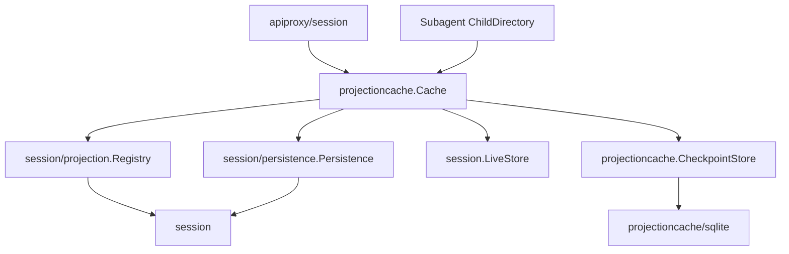

# Session Projection Cache 最终设计方案

状态：Accepted / Implemented

最后核对：2026-08-26

## 1. 文档职责

本文定义 Goren `Session Projection Cache` 的最终职责、模块边界、对外契约、关键数据、写入与冷恢复算法、并发与关闭语义，回答“最终代码应该是什么”。

- 模块实施顺序和 Gate 见[Session Projection Cache 实施方案](./SessionProjectionCache实施方案.md)。
- 当前完成状态和可复核证据见[Session Projection Cache 实施进度矩阵](./SessionProjectionCache实施进度矩阵.md)。
- 通用 Projection Registry 与 Session Title 的既有设计见[18 Session Projection 与 Session Title](./18-session-projection-and-title.md)。
- Session 事实持久化与 SQLite Backend 见[19 Session Persistence 与 SQLite](./19-session-persistence-and-sqlite.md)。

本文不记录实施完成比例，实际实现与验证证据由专项进度矩阵拥有；checkpoint 始终不是 Session 事实。

## 2. 固定源与 Goren 取舍

固定 DeepSeek Harness 基线为 `47f943859bef60e4160492346772ded9b24f765a`，源 owner 为：

- `packages/session/session-projection-cache/src/index.ts`；
- `packages/session/session-projection-cache/src/spec.ts`；
- `packages/session/session-projection-cache/tests/cache.spec.ts`；
- `packages/session/session-projection/src/index.ts`；
- `packages/session/session-persistence/src/index.ts`；
- `packages/host/apiproxy/src/api-proxy.ts`；
- `packages/subagent/subagent/src/list-children.ts`。

源实现的核心语义保留如下：

1. `SessionProjectionCache` 是独立 Service，不属于 Projection Registry 或 Session Persistence。
2. checkpoint 只是可从 Session Event Log 重建的加速数据，不是事实。
3. 缓存可以落后于 durable log，不允许领先 durable log。
4. `turn/end` 与 Session detach 是强制 checkpoint 点；事件数量和时间是辅助触发条件。
5. Unit `StateVersion` 不匹配时丢弃该 row，不迁移内部 state。
6. 同一 Session ID 的不同生命周期不得共用 checkpoint。
7. cold read 使用 checkpoint + `ReadFrom` suffix + Registry `Restore`，失配时从 `seq=0` 全量重放。
8. 缓存写失败 fail-soft；事实日志或 Projection fold 本身失败不被缓存层吞掉。

Goren 不复制 TypeScript 的 `storage-domain`/JSON medium，而是使用独立 SQLite/sqlc adapter。这是实现语言和当前存储基建的差异，不改变 Service 职责。

固定源的 `coldSnapshot` 已实现并有完整测试，但未接入固定基线 API Proxy 的 detached history 生产路径。Goren 已实现从日志尾部反向分页，因此明确把 `ColdSnapshot` 接入 `session.history` 首页，避免为 Projection 再次全量 `Inspect`。这个差异不改变 wire shape，只改变冷读的 I/O 与 fold 规模。

## 3. 目标与非目标

### 3.1 目标

1. 为每个 Session 持久化一份完整 Projection checkpoint。
2. `session.list` 不再为每个 cold Session 读取完整事件日志。
3. `session.history` 首页在只读最近消息的同时，用 checkpoint + suffix 得到日志末尾 Projection。
4. Subagent ChildDirectory 在缓存足以证明 child identity 时避免全量 `Inspect`。
5. 保持 Session Event Log 是唯一事实源，缓存丢失或损坏只影响性能。
6. 在并发 append、timer、`turn/end`、detach 和 Plugin shutdown 下保持单 Session 写入串行与可排空。

### 3.2 非目标

- 不保存 checkpoint 历史版本。
- 不把 checkpoint 变成 Event Log、Snapshot Store 或 CQRS 事实库。
- 不让 Session Persistence 保存 Projection 业务数据。
- 不让 Projection Registry 依赖 SQLite、Plugin Factory 或 API Proxy。
- 不改变 Agent、AgentLoop、Session Event 名称、Host wire 字段或客户端 higher-seq-wins 规则。
- 不在首期实现跨进程同 Session 并发写、checkpoint GC 或缓存容量驱逐。

## 4. 统一术语

### 4.1 Projection Unit

Projection Unit 是业务 owner 定义的确定性 fold。Unit 拥有 key、state version、initial state、event transition 和 view。Unit 不拥有数据库、timer 或 Session 生命周期。

### 4.2 Projection Checkpoint

Projection Checkpoint 是一个 Session 的可重建 Projection state cut。它包含所有已注册 Unit 在某一 Session Event 位置的内部 state，不是对客户端的 view。

### 4.3 Checkpoint Record

Checkpoint Record 是缓存中“一个 Session 的当前 checkpoint”。每个 Session ID 最多一个 record，每次成功写入完整替换，不对单个 Unit row 做局部 patch。

### 4.4 Checkpoint Row

Checkpoint Row 是 record 中一个 Unit 的 state：

```go
type CheckpointRow struct {
    Version int64
    Seq     int64
    Value   json.RawMessage
}
```

`Seq` 表示该 Unit 已经处理到的最后一个 Session Event，不是该 Unit 最后一次产生变化的事件。

### 4.5 Log Identity

Log Identity 用 Session Header 中的 `{createdAt, cwd}` 绑定 checkpoint 所属的 Session 生命周期。Session ID 只是可重用的槽位，不单独证明生命周期相同。

## 5. 模块职责与依赖方向

### 5.1 `session/projection`

拥有：

- Unit 注册与引用计数；
- live cell 和 `observedSeq`；
- `Snapshot`、`Checkpoint`、`RestoreFloor`、`ViewCheckpoint`、`Restore`；
- `session/projection` whole-value change 通知。

不拥有：

- checkpoint 持久化；
- 写入节流、timer 和 SQLite；
- `session.list` 或 `session.history` 用例。

### 5.2 `session/projectioncache`

拥有普通 Go 业务/application 对象 `CheckpointCache`：

- 内存 checkpoint record index；
- checkpoint 身份校验和完整替换；
- live Session 的 dirty/write state；
- threshold、interval、`turn/end`、detach 写入策略；
- 单 Session 写入串行化；
- cached snapshot 和 cold snapshot 算法；
- 关闭准入、timer 停止和 in-flight 排空。

`CheckpointCache` 不实现 Plugin lifecycle，不依赖 Plugin Runtime 的 Scope、Fiber 或 Registry。

### 5.3 `session/projectioncache/plugin`

Plugin adapter 只：

- 在 Manifest 声明 `session.LiveStore`、`session/persistence.Persistence` 和 `session/projection.Registry`；
- 发布 `projectioncache.Cache`；
- Apply 时打开 CheckpointStore 并激活 `CheckpointCache`；
- 把 `session/event` 和 `session/disposed` 翻译为缓存对象的业务输入；
- Dispose 时关闭 `CheckpointCache`。

Plugin adapter 不实现 checkpoint restore、SQLite 或 API 业务规则。

### 5.4 `session/projectioncache/sqlite`

SQLite adapter 只实现 consumer-owned `CheckpointStore`：

- schema 与 application identity；
- sqlc query 与 transaction；
- record 完整读取和替换；
- owner-defined record 与 SQL row 映射；
- 数据库关闭。

adapter 不判断什么时候写、哪个 row 版本有效、是否全量重放或如何处理 Session 生命周期。

### 5.5 跨模块方向



Agent 和 AgentLoop 不在该依赖图中，其职责不变。

## 6. 对外契约与关键对象

### 6.1 Cache Service

```go
type Cache interface {
    plugin.Service

    CachedSnapshot(
        session.Header,
    ) (*projection.Snapshot, error)

    ColdSnapshot(
        context.Context,
        session.SessionID,
    ) (projection.Snapshot, error)
}
```

`CachedSnapshot` 只读内存 index，不接受 Context，不执行 SQLite 或 Session log I/O。非空结果表示命中，`nil, nil` 表示正常未命中，`nil, err` 表示读取或 Projection view 失败。

`ColdSnapshot` 是可取消的权威读组合：缓存可以加速，最终结果必须由当前 Persistence log 证明。

`Write`、`Advance`、`Retire` 不进入 Cache Service 消费者契约，只由 Plugin adapter 驱动 concrete `CheckpointCache`。

### 6.2 CheckpointStore

```go
type CheckpointStore interface {
    LoadAll(
        context.Context,
    ) (map[session.SessionID]CheckpointRecord, error)

    Replace(
        context.Context,
        session.SessionID,
        CheckpointRecord,
    ) error

    Close(context.Context) error
}
```

Store 没有 `AppendRow`、`UpdateUnit` 或历史查询；这些方法会破坏整个 checkpoint cut 的替换语义。

### 6.3 Checkpoint Record

```go
type LogIdentity struct {
    CreatedAt int64
    CWD       *string
}

type CheckpointRecord struct {
    Identity LogIdentity
    Rows     projection.Checkpoint
}
```

最终设计不增加顶层 `AsOfSeq`。理由是：

- `Rows[key].Seq` 已经是 Restore 契约的 watermark；
- 新生成的完整 checkpoint 中，所有已注册 Unit row 必须位于同一 event cut；
- 再保存一个顶层 seq 会形成两个需要保持一致的事实字段；
- `CachedSnapshot` 仍按实际选中的版本兼容 rows 取最小 `Seq`，得到对客户端安全的 under-claim cut。

## 7. 每 Session 一个 Record 的不变量

1. 每个 Session ID 最多一个 `CheckpointRecord`。
2. 每个已注册 Unit 最多一个 row，row key 等于 Unit key。
3. Store 每次完整替换 record，不保存旧版本或历史 record。
4. `row.Seq` 是 Unit 已消费的最后事件 seq。`Transition.Changed=false` 仍必须推进 `observedSeq`。
5. 对同一次 `Registry.Checkpoint(session)`，所有 row 必须具有相同 `Seq`；空日志为 `-1`。
6. cold `Restore` 刷新的所有 row 必须使用本次 suffix 证明的 `endSeq`。
7. 旧 record 可能缺失新 Unit row，或包含已卸载 Unit row；Registry 只选择当前已注册且版本匹配的 row。同一生命周期写入新 checkpoint 时，当前未注册 Unit 的旧 row 原样保留，避免 Unit 注销与异步 detach write 竞态抹掉仍可复用的 state；这些 row 不属于本次 checkpoint cut。
8. record identity 不匹配当前 Header 时，整个 record 失效，不逐 row 复用。

示例：

```text
session-123
└── CheckpointRecord
    ├── identity: {createdAt, cwd}
    └── rows
        ├── title               -> {ver: 1, seq: 100, val: ...}
        ├── subagent            -> {ver: 2, seq: 100, val: ...}
        └── sessionListMetadata -> {ver: 1, seq: 100, val: ...}
```

`title` 可能在 `seq=20` 后从未变化，但它已经处理了 `21...100`，因此其 checkpoint row 仍为 `seq=100`。

## 8. SQLite 持久化

默认文件：

```text
<session-database-directory>/session-projection-cache.sqlite
```

该文件只保存可丢弃 checkpoint，不与 Session facts 或 Session Query FTS 共用数据库。

表模型：

```sql
CREATE TABLE session_projection_checkpoints (
    session_id TEXT PRIMARY KEY,
    created_at INTEGER NOT NULL,
    cwd TEXT,
    rows_json BLOB NOT NULL CHECK (json_valid(rows_json))
);
```

`rows_json` 保存完整 `projection.Checkpoint`。选择单行 JSON 而不是每 Unit 一行，是因为业务写入单位是一个 Session 的完整 checkpoint cut。

SQLite adapter 必须：

- 使用独立 `application_id`；
- 使用 cache schema `user_version`；
- 仅对已证明属于本 cache 的旧 schema 执行可丢弃重建；
- 对外来 application identity 或无法确认归属的数据库拒绝启动，不自动删除；
- 使用 sqlc 生成私有 query package；
- 在 Apply 时一次加载所有 record 到内存 index；
- 在 durable `Replace` 成功后才更新内存 index。

## 9. 写入状态与并发

### 9.1 状态

每个 live Session object 使用一个 write state，不只用 Session ID，以免同 ID 新旧生命周期共用运行期状态。

```go
type writeState struct {
    latestSeq    int64
    persistedSeq int64
    pending      int
    timer        *time.Timer
    writing      bool
    force        bool
    retiring     bool
}
```

`pending` 统计本次 live 期间自上次成功写入后的新事件，不把 resume 前的整段历史误计为新事件。

### 9.2 事件触发

`session/event` 到达后：

1. 更新 `latestSeq`和 `pending`；
2. 首个 dirty event 启动 interval timer；
3. `pending >= writeEveryEvents` 时请求写入；
4. event type 为 `turn/end` 时设置 `force=true` 并立即请求写入；
5. Observer 只登记工作并返回，不在 best-effort Event publication 内同步执行 SQLite I/O。

`session/event` 是并行 best-effort 投递，但 Cache 不依赖 Registry Observer 先于 Cache Observer 执行。`Registry.Checkpoint(session)` 会从 Session 当前 detached events 补算落后 cell，因此 checkpoint 不会因 Listener 顺序漏掉已 committed event。

### 9.3 单 Session 写入串行

- 同一 Session 同时最多一个 writer；
- threshold、timer、`turn/end` 和 detach 只合并为写入请求，不并发写 SQLite；
- writer 执行期间的新 event 继续更新 `latestSeq`；
- 写入成功后按 checkpoint row cut 重算 dirty 状态，不盲目清零写入期间的新 event；
- 写入失败保留 dirty/force 证据，运行中 Session 在后续触发点自愈。

### 9.4 耐久性顺序

每次写入必须保持：

```text
Registry.Checkpoint(session)
  -> if still live: LiveStore.Flush(session)
  -> CheckpointStore.Replace(record)
  -> update in-memory record index
```

checkpoint 先取 cut，再 Flush。Flush 可以把比 checkpoint cut 更新的 event 一并持久化，这只会让 cache 落后，不会让 cache 超前。

## 10. Detach 与 Plugin 关闭

### 10.1 Session detach

Session Handle Release 在从 LiveStore 移除前已经发布并等待最终 `session/flush`。`session/disposed` 到达 Cache 时：

1. 设置 `retiring=true` 和 `force=true`；
2. 如果有 writer 在运行，它完成后根据 final seq 决定是否再写一次；
3. Session 已不在 LiveStore 时不再调用 `LiveStore.Flush`；
4. final write 成功或失败后删除 live write state；
5. detach write 失败不无限保留 timer，由下次 cold read 全量或 suffix 自愈。

Projection Registry 的 `session/disposed` Observer 可能并行删除 live cell。Cache 不依赖该 cell 存活；`Checkpoint` 可从 detached Session events 重建。

### 10.2 Cache Plugin Dispose

Plugin Dispose 顺序固定为：

1. 关闭新 event/timer/cold write-back 准入；
2. 停止全部 timer；
3. 取消尚未进入存储的辅助写入；
4. 等待已进入 Flush/Store 边界的 in-flight 操作退出；
5. 关闭 CheckpointStore；
6. 清空内存 index 和 write states。

缓存是可丢弃数据，Plugin shutdown 不为未达到阈值的普通 dirty state 强制创建新写入。

## 11. `CachedSnapshot`

`CachedSnapshot(header)` 是零 Session-log I/O、零 SQLite I/O 的内存读：

1. 按 `header.ID` 查找 record；
2. 比较 record identity 与 `{header.CreatedAt, header.CWD}`；
3. identity 不同时返回 absent；
4. 调用 `Registry.ViewCheckpoint(rows)`；
5. Registry 只返回当前已注册且 `Version == StateVersion` 的 values；
6. 没有可用 value 时返回 absent；
7. `Snapshot.AsOfSeq` 取已返回 rows 的最小 `Seq`。

取最小 seq 是客户端 higher-seq-wins 的安全 under-claim：它可以让值看起来比实际更旧，不能让旧值冒充更新 cut。

## 12. `ColdSnapshot`

### 12.1 正常 suffix 路径

```text
load memory record
  -> Registry.RestoreFloor(rows)
  -> Persistence.ReadFrom(sessionID, floor)
  -> validate LogIdentity
  -> Registry.Restore(rows, suffix, floor)
  -> fail-soft durable write-back
  -> return Snapshot
```

`RestoreFloor` 按所有当前 Unit 计算最低需求：

- row 存在且版本匹配：需求从 `row.Seq+1` 继续；
- row 缺失或版本失配：需求从 `0` 重放；
- 实际 read floor 再向前保留一个 anchor，用于证明日志没有缩短到 checkpoint watermark 之前。

### 12.2 全量回退

以下情况丢弃整个已读 record，重新 `ReadFrom(id, 0)` 并以空 checkpoint Restore：

- Log Identity 不同；
- checkpoint row 版本不匹配且 suffix 不是从 `0` 开始；
- row seq 超过当前日志末尾；
- 日志缩短、anchor 无法证明 watermark；
- record/row state 不是合法 plain JSON；
- Registry 判断该 suffix 不足以从当前 checkpoint 恢复全部 Unit。

全量 Restore 仍失败时，失败来自 Session log 或 Unit fold，必须返回调用者，不伪装为 cache miss。

### 12.3 零 Unit

Registry 没有任何 Unit 时，`RestoreFloor` 返回 nil。Goren 不使用 `ReadFrom(id, 0)` 读完整日志，而是调用：

```text
ReadEventsBefore(id, nil, 1)
```

它同时保持 Session-not-found 契约。返回的 `Snapshot.Values` 为空，但 `Snapshot.AsOfSeq` 仍表示这次快照覆盖到的 durable log 位置：有事件时取最新事件 seq，空日志取 `-1`。cut 属于整个 Snapshot，不是给空 `Values` 添加标记。

### 12.4 Cold write-back

Restore 成功后用返回的完整 refreshed checkpoint 替换 record。write-back 失败只报告诊断，已计算的 Snapshot 仍返回调用者。

首期不对并发 `ColdSnapshot(id)` 做 singleflight。Session Persistence 已在 per-ID operation gate 上序列化存储操作，同一日志 cut 的后写 record 仍是可重建等价状态。如果未来证明存在读放大，再以独立性能证据引入 deduplication。

## 13. `session.list` 接入

API Proxy 拥有 `sessionListMetadata` Projection Unit，不把 list 字段塞进 Session 核心。

```text
key: sessionListMetadata
stateVersion: 1
state:
  blank
  lastPromptAt
```

transition：

- `turn/start` 使 `blank=false`；
- direct `user/message` 更新 `lastPromptAt`；
- 其他事件只推进 row seq，不改变 state。

cold list 流程：

1. `Persistence.List` 读 Header；
2. `Cache.CachedSnapshot(header)` 读内存 checkpoint；
3. 解码 `sessionListMetadata`；
4. cache 缺失、损坏或只能证明 `blank=true` 时，按保守语义返回 `blank=false`，不用滞后缓存隐藏可能已开始的会话；
5. `blank=false` 是单调事实，可直接采用；
6. `updatedAt` 用 `max(header.CreatedAt, lastPromptAt)`；
7. 不再为每个 cold row 调用 `Persistence.Inspect`。

live row 仍使用 `Registry.Snapshot(session)`。list 的 Projection 列失败对单 row fail-soft，不使整个 list 失败。

## 14. `session.history` 接入

### 14.1 首页一致 cut

`session.history` 首页的 events 与 projections 必须属于同一 `asOfSeq`。不允许先读最新页，再无约束地读一个可能更新的 Projection Snapshot。

cold 流程：

```text
Cache.ColdSnapshot(id) -> E
  -> ReadEventsBefore(id, E+1, batch)
  -> 向前扫描到完整 message group 边界
  -> 校验页面末尾 seq == E
  -> 返回 events + projections(asOfSeq=E)
```

增长日志不会越过 exclusive `E+1` cursor。如果日志修复或缩短使页面末尾小于 `E`，重新执行 cold snapshot/page 收敛，不返回错位 cut。

live 流程同样先取 `Registry.Snapshot(session)` 的 `E`，再从 Session events 中选择 `seq <= E` 的尾页。

### 14.2 Older page

`beforeSeq` 非空的 older page 不携带 Projection block，不调用 Cache，只按现有完整 message group 规则反向分页。

### 14.3 可选 Service

Cache 对扩展组合是可选加速能力，默认 Goren Server 必须装配。扩展组合没有 Cache 时，首页使用全量 `Inspect + Restore` 作为永久 correctness fallback，不是临时兼容分支。

## 15. Subagent ChildDirectory 接入

ChildDirectory 在消费端定义只需 `CachedSnapshot` 的窄接口，Subagent Plugin 解析全局 `projectioncache.Cache` 后传入，业务包不依赖 Cache Plugin 类型。

cold child 流程：

1. 读取 identity-matching cached snapshot；
2. 解码 `subagent` Projection value；
3. 只有 `identity.Seq >= header.SeedLength` 时才采用，以证明它是 child 自己的 descriptor，不是 fork seed 中的 ancestor descriptor；
4. 命中后直接返回 inactive child row；
5. cache miss、decode failure、null 或 seq gate 不满足时，回退当前 `Inspect + Restore`；
6. 缓存损坏只降级当前 child，不使整个 children/descendants 列表失败。

## 16. 错误、取消与诊断

### 16.1 启动失败

以下错误使 Cache Plugin Apply 失败：

- SQLite 路径或权限错误；
- 外来 application identity；
- 无法打开或加载 checkpoint store；
- 必需 Service 缺失；
- Factory config 非法。

“cache 可丢失”不等于“配置或数据库异常静默忽略”。

### 16.2 Fail-soft 操作

以下错误通过 Cache 自己的 `FailureReporter` 报告，不使 Session Event publication 或已成功 cold read 失败：

- threshold/interval/`turn/end`/detach checkpoint 写失败；
- cold read 成功后的 checkpoint write-back 失败；
- 已识别为可丢弃 checkpoint row 的验证失败。

### 16.3 必须向调用者返回的错误

- request Context 取消；
- Session 不存在；
- Session Persistence 权威读失败；
- 从 `seq=0` 完整重放仍无法验证 Session log；
- Projection Unit 在完整事实上仍无法 fold/view。

## 17. 不变量与验收契约

| ID | 不变量 |
| --- | --- |
| PC-I01 | Session Event Log 是唯一事实源，cache miss 不影响结果正确性 |
| PC-I02 | 每 Session ID 最多一个当前 CheckpointRecord |
| PC-I03 | 一次 checkpoint 新生成的当前已注册 Unit row 位于同一 event cut；原样保留的未注册 Unit row 维持旧 seq |
| PC-I04 | row seq 表示已处理事件位置，不是最后变化位置 |
| PC-I05 | cache 可以落后 durable log，不能领先 durable log |
| PC-I06 | Log Identity 不同时整个 record 失效 |
| PC-I07 | StateVersion 不同时丢弃 row，不迁移 Unit state |
| PC-I08 | 同 Session 同时最多一个 checkpoint writer |
| PC-I09 | `session.list` 的 cold rows 不为 Projection 执行全量 `Inspect` |
| PC-I10 | history 首页的 `projections.asOfSeq` 与页面末尾 event seq 相同 |
| PC-I11 | older history page 不调用 Cache，不携带 Projection block |
| PC-I12 | Cache Plugin Dispose 先关闭准入并排空，再关闭 CheckpointStore |
| PC-I13 | Cache Plugin/SQLite adapter/CheckpointCache 业务对象是三个独立职责 |
| PC-I14 | Agent、AgentLoop 和 Session core 不依赖 Projection Cache |

## 18. 文档同步边界

本方案的实现完成后，一次性同步：

- `zh-CN/18-session-projection-and-title.md`：链接本文，删除“未来 adapter”的过期表述；
- `zh-CN/16-session-api-gateway-and-live-frames.md`：记录 list/history 的 cache 消费边界；
- `zh-CN/19-session-persistence-and-sqlite.md`：只强化“Session fact DB 不是 Projection Cache DB”的链接；
- `zh-CN/08-implementation-progress.md`：只记录总体完成状态和公共验证证据；
- `zh-CN/README.md`：在设计索引加入本文和专项进度矩阵；
- 真实新增 package 的 `README.zh-CN.md`。

专项进度矩阵记录本次实现和验证的实际完成情况；全局文档只保留稳定职责和汇总证据。
