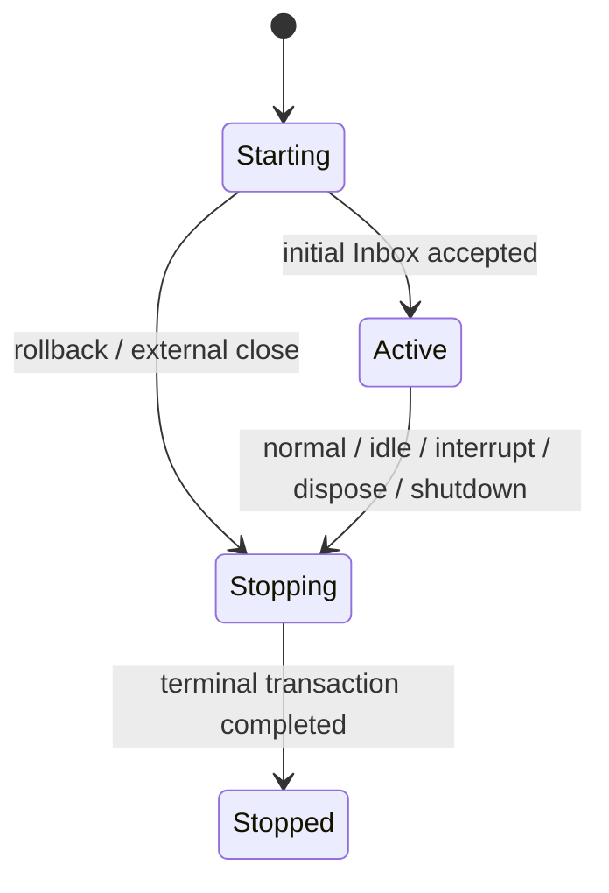
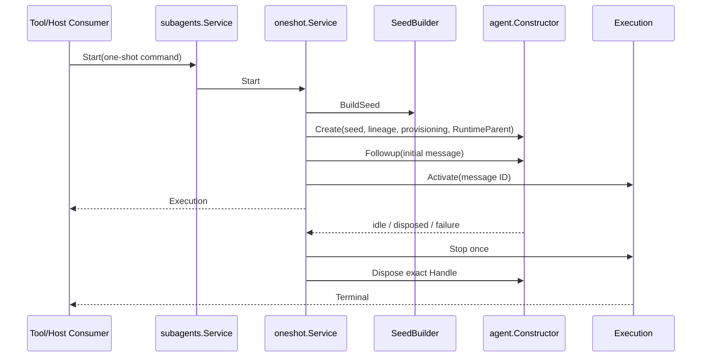

# Subagent 架构与生命周期重构技术方案

状态：当前目标设计

最后核对：2026-08-26

## 1. 文档职责

本文定义 Subagent 当前重构的架构边界、统一生命周期、模块职责、调用关系、状态所有权和上下文契约。它回答“最终代码应该是什么”，不记录实施进度，也不重复固定源兼容分析。

- 按模块实施顺序和 Gate 见[Subagent 重构实施方案](./Subagent重构实施方案.md)。
- 当前完成状态和验证证据见[Subagent 重构进度矩阵](./Subagent重构进度矩阵.md)。
- 固定源 owner、兼容符号与纳入范围见[Subagent 源能力分析](./subagent/01-source-capability-analysis.md)。
- 包级运行说明见[`subagent/README.zh-CN.md`](../subagent/README.zh-CN.md)。

本文不更新全局设计索引或全局进度文档；待本方案和实现最终确认后再同步。

## 2. 核心结论

1. OneShot 与 Continuable 是两种 Subagent 实现，不是两套互不相干的生命周期模型。
2. 两种实现都返回同一个 `Execution` 契约，并使用同一个 `Starting -> Active -> Stopping -> Stopped` 状态词汇。
3. 每个 `Execution` 与一个 exact Agent epoch 一一对应。Subagent 不再额外定义 `Activation` 或复制 Agent 的运行状态。
4. OneShot 与 Continuable 只在创建策略、消息策略和停止触发时机上不同。
5. `SeedBuilder` 只构造 fresh child Session 的事件前缀；它不创建 Agent，也不拥有生命周期。
6. `agent.Constructor` 是创建和恢复 Agent 的唯一入口；`agent` 拥有 exact Agent、运行父子关系、descendant admission 和 child-first 关闭。
7. `agentloop` 只执行单个 Agent 的 Inbox、turn、step、Tool 和模型循环，不感知 OneShot、Continuable、SeedBuilder 或 ChildDirectory。
8. Session log 是 durable child identity、消息和结果重建的事实来源；Projection 只是可重建读模型。
9. Plugin 与业务对象分离：Plugin 只解析依赖、装配、发布能力、注册事件和管理结构启停。
10. 重构采用破坏性替换，不保留旧 Provider execution、Run、Activation、Catalog、Continuation Manager 或兼容 wrapper。

## 3. 统一术语

### 3.1 SeedBuilder

`SeedBuilder` 是 fresh child Session 的创建输入策略。它只接收 detached parent events，返回拥有不可变 event prefix 的 `SessionSeed`；调用者只能通过 `EventPrefix()` 取得新的副本。child ID、Session Header 和 lineage 不进入 Builder，仍由启动用例拥有。

`spawn` 返回空 seed；`fork` 返回 parent 最后一个完整 turn 之前的事件前缀。两者都不调用 Agent Constructor。

兼容事件名 `subagent/provider-added`、`subagent/provider-removed`，以及 descriptor 的 `provider` 字段继续保留。字段值表示创建该 child 所使用的 SeedBuilder 名称；Go 业务对象不再称为 Provider。

### 3.2 Execution

`Execution` 表示一次 Subagent 业务执行，也是一个 exact Agent epoch 在 Subagent 领域中的一对一生命周期视图。它保存：

- `RunID`：配对 `subagent/start` 与 `subagent/end`；
- child Session ID；
- 统一执行状态；
- memoized terminal outcome；
- 唯一停止事务。

`Execution` 不拥有 Agent Scope、AgentLoop、Inbox 或 Agent 运行时父子关系。它通过 mode-specific `Terminator` 请求并等待相应业务终止工作。

### 3.3 Durable child

durable child 是由 Session Header、`subagent/descriptor` 和 append-only event log 定义的持久身份。它可以暂时没有 live Agent。

OneShot 通常只产生一次 Execution。Continuable 可以在同一个 durable child identity 上先后产生多个 Execution，但任一时刻至多有一个 current Execution。

### 3.4 Settlement

Settlement 是 Continuable Execution 在 Agent idle、Inbox 无 pending message、且没有 runtime descendants 时触发的正常停止事务。它形成 terminal outcome、最终 flush、父通知、`subagent/end` 和 exact Handle 释放。

Settlement 不是第二套 Agent 关闭算法。Agent 仍拥有结构关闭；Subagent 只完成自己的业务终态。

### 3.5 ChildDirectory

`ChildDirectory` 是 durable child 的只读目录。它组合 live Session、持久化 Session 和 Subagent Projection，返回 children/descendants 快照及单候选 diagnostic。

目录查询不会创建、恢复、中断或关闭 Agent，也不能充当控制操作的授权证明。

## 4. 架构分层

```text
模型 Tool / Host Consumer
        ↓
公开 Subagent capability
        ↓
统一 Subagent application service
        ↓
OneShot / Continuable 实现
        ↓
Agent / Session / Approval / Tools 等消费接口
        ↓
Runtime Plugin 与 composition root 装配具体能力
```

### 4.1 公开领域与能力契约：`subagent`

根包只声明跨包需要的稳定对象：

- `StartCommand`、`Starter`、`Execution`、`Terminal`；
- `ChildControl`、`ParentReporter`、`ChildDirectory`；
- `SeedBuilder`、`SeedBuilderRegistry`；
- `ContinuableExtension`、`ExtensionRegistry`；
- descriptor、生命周期事件、MessageSource 和错误码。

根包不保存可变运行状态，不实现 Plugin，不导入 runtime adapter。

### 4.2 应用层：`internal/subagents`

`subagents.Service` 是唯一统一应用入口。它通过 `Starter`、`ChildControl` 和 `ParentReporter` 三个窄 capability view 发布，而不是公开一个包含所有方法的大接口。

它负责：

- 模块准入状态和已准入调用 join；
- 按 `StartCommand.Mode()` 选择 OneShot 或 Continuable；
- interrupt 的公共 live Execution 查找与 ancestor/direct-parent 授权；
- 把 Send 和 Report 委派给能处理 durable child 的 Continuable 实现；
- 在模块关闭时逆序收敛 mode implementations；
- 在 `agent/disposed` 到达时把 exact Agent closure 汇合到同一 Execution 停止事务。

它不包含 Tool schema、Plugin API、Session codec 或 Agent 构造细节。

### 4.3 两种实现

`internal/oneshot` 完整拥有一次性委派用例：

- snapshot 公共请求；
- 解析 SeedBuilder 并构造 fresh seed；
- 推导 lineage 和 child policy；
- 创建 Agent 并接受首条消息；
- 创建并发布 common Execution；
- 选择 terminal output 和 structured output；
- terminal 后自动释放 exact Agent Handle。

`internal/continuable` 完整拥有可续投 child 用例：

- fresh create 与 cold resume；
- per-child materialization 串行化；
- 后续消息、当前 turn interrupt、子向父 report；
- descriptor/seed boundary 恢复；
- idle settlement 和父通知；
- final flush failure 的隔离报告。

两者不互相调用，也不通过 capability bool 分支。统一只发生在公开 command、Execution 状态机和应用 Service 路由层。

### 4.4 共享业务模块

| 模块 | 对象是什么 | 责任 |
| --- | --- | --- |
| `internal/execution` | Subagent Execution 及当前执行索引 | 统一状态、结束结果、停止过程、当前执行查询和最终 assistant 输出选择 |
| `internal/seedbuilder` | SeedBuilder Registry | 名称唯一性、精确 registration 和兼容事件 |
| `internal/childpolicy` | child-local policy set | 组装 approval、persona 和 Tool restriction Plugin |
| `internal/lineage` | child lineage | 推导 parent、depth、cwd、origin、preset、Agent options 和 seed length |
| `internal/extension` | Continuable Extension Registry | 注册、安装、publication commit 复核和精确撤销 |
| `internal/childdirectory` | ChildDirectory service | 合并 live/cold child，构造目录和 diagnostic |
| `internal/projection` | Subagent Session Projection units | 折叠 `subagent` identity 和 `subagentTiming` read model |

这些模块按业务概念划分，不建立 `utils`、`common`、一类型一目录或按 DTO/mapper/storage 分层的包树。

### 4.5 Plugin 与适配器

`subagent/plugin.Plugin` 只负责：

- 解析 Agent、Session、Persistence、Approval 和 Projection capability；
- 构造并连接业务对象；
- 发布六个窄 capability；
- 注册 Subagent Projection units；
- 把 SeedBuilder registration facts 发布到 Plugin event bus；
- 把 Execution lifecycle facts 发布到 parent Agent runtime event scope；
- 把 `agent/disposed` 转交统一 Service；
- 按依赖逆序关闭和释放 registration。

`spawn`、`fork` 的 Builder 是纯业务对象；各自 Plugin 只拥有 exact SeedBuilder registration。

`tools/delegation`、`tools/control`、`tools/report` 是模型 Tool 适配器。它们拥有 schema、参数映射、结果渲染、Tool/Prompt registration，不实现 Subagent 状态机。

## 5. 公开接口

### 5.1 启动

```go
type Starter interface {
	Start(context.Context, StartCommand) (Execution, error)
}
```

`StartCommand` 是 closed union。调用方只能通过 `NewOneShotStart` 或 `NewContinuableStart` 构造合法 variant，不能制造 mode 与字段不匹配的命令。两个构造函数同时校验并复制 `ChildRequest` 中的 slice、pointer 和 JSON；`Request()` 每次返回新的副本，因此调用方不能在命令构造后修改其内部输入。

### 5.2 统一生命周期

```go
type Execution interface {
    RunID() RunID
    ChildID() session.SessionID
    State() ExecutionState
    Wait(context.Context) error
    Result() (Terminal, bool)
    Dispose(context.Context) error
}
```

`Wait` 只等待 terminal transaction，`Result` 只读取已保存结果，`Dispose` 请求并等待同一个 terminal transaction。OneShot 正常结束和 Continuable settlement 都自动释放 exact Handle；调用方无需在正常完成后补做一次资源清理。

### 5.3 控制与报告

`ChildControl.Send` 表达 parent 向 durable Continuable child 投递后续消息。cold child 可在该用例中恢复。

`ChildControl.Interrupt` 只针对当前 live Execution，授权是 closed union：人类入口提供 direct parent Session ID；Agent 入口提供 exact live ancestor Agent。

`ParentReporter.Report` 只允许 exact live child 向 exact live direct parent 投递。`quiet` 追加消息，`next-step` 请求父 Agent 下一步调度。

### 5.4 创建输入策略

`SeedBuilder.BuildSeed` 只在首次创建 child Session 时调用。cold resume 必须从原 Session 和 descriptor 恢复，不能重新运行 Builder，也不能在损坏时静默创建替代 child。

### 5.5 目录与扩展

`ChildDirectory` 只有 `ListChildren` 与 `ListDescendants`。查询失败按候选隔离；全局依赖不可用或 Context 取消才使整个调用失败。

`ContinuableExtension` 在未发布 continuable Agent Scope 中安装 child-scoped effect，返回 exact `ExtensionInstallation`。Extension 不参与 Plugin 生命周期，拥有它的 Plugin 只负责注册和注销 Extension。

## 6. 状态所有权

### 6.1 Execution 状态



- `Starting`：Agent 可能已构造，但初始 Inbox 消息尚未完成业务 publication。
- `Active`：Execution 已发布，允许 mode-specific 操作。
- `Stopping`：唯一停止事务已被某个 trigger claim；其他触发只 join。
- `Stopped`：terminal value/error 已 memoize，等待者读取同一结果。

状态由 `internal/execution.Execution` 单字段持有，不用布尔集合表达阶段。

### 6.2 Service 准入状态

统一 Service 使用：

```text
inactive -> accepting -> closing -> closed
```

进入 `closing` 后，新的 Start、Send、Interrupt 和 Report 都返回稳定 `DRAINING` 错误。已经取得准入的调用先完成，随后 Service 才逆序关闭 OneShot 和 Continuable。

### 6.3 Continuable per-child 状态

`childSlot` 只提供同一 durable child 的互斥 materialization：

- fresh create 与 cold resume 不能并发发布两个 Agent；
- Send 与 settlement 在同一 slot 内重新检查 current Execution；
- slot 不是 Agent Registry，不保存 durable truth；
- current Execution 结束并 detach 后，后续 Send 可以创建下一次 Execution。

### 6.4 数据状态

| 状态 | Owner | 是否持久化 |
| --- | --- | --- |
| Session Header、descriptor、消息、turn/step events | Session | 是 |
| Projection checkpoint | Session Projection Registry | 可重建缓存 |
| exact Agent epoch、Scope、Inbox 与 runtime descendants | Agent | 否；可由 Session 恢复所需事实 |
| Execution phase、terminal future、live index | Subagent | 否 |
| SeedBuilder/Extension registration | 对应 Registry 与 Plugin registration | 否 |

## 7. 关键调用流程

### 7.1 OneShot



初始消息接受前的任一步失败都回滚 exact Handle，且不发布成功 Execution。正常 terminal 后由 OneShot 自动释放 Handle。

### 7.2 Continuable fresh create 与 cold resume

fresh create 与 OneShot 共用 request snapshot、SeedBuilder、lineage、child policy、Agent Constructor 和 common Execution，但 descriptor 与 Continuable Extensions 在 Agent publication 前安装。

cold Send 流程：

1. 校验请求 Context 和 exact live direct parent；
2. 取得 per-child slot；
3. 检查 live current Execution；
4. 若不存在，Inspect 原 Session，并按 `SeedLength` 跳过继承 seed；
5. 解析当前 child 自己的 Continuable descriptor；
6. 调用 `agent.Constructor.Resume`；
7. 安装 child policy 与当前 Continuable Extensions；
8. 接受消息、发布新的 Execution；
9. 返回 stable Message ID。

恢复不调用 SeedBuilder，也不替换 child identity。

### 7.3 Continuable settlement

watcher 只观察当前 exact Execution：Agent idle、Inbox 无 pending、且 `RuntimeDescendants` 为空时请求 `StopIdle`。唯一 Terminator 随后：

1. 等待 Agent idle；
2. best-effort flush Session；
3. 从本 Execution 的 event suffix 推导 StopReason 和 final assistant output；
4. 向 live direct parent 发送 settlement notice；
5. 发布 `subagent/end`；
6. 从 live Execution Registry 移除；
7. 释放 exact Agent Handle；
8. detach slot 并唤醒可能受影响的 parent settlement watcher。

final flush 失败只进入 Diagnostics，不能把已经完成的业务终态伪装成结构 teardown 失败。

### 7.4 外部 Agent closure

Agent 结构关闭发布 `agent/disposed` 时，Runtime 把 exact Agent 交给统一 Service。Service 只在 live Execution Registry 中找到同一个 Agent identity 时调用 `StopExternal` 并等待 terminal transaction。

该路径不再次 Dispose 已经由 Agent 关闭的 Handle，避免嵌套 Scope teardown。

### 7.5 模块关闭

```text
plugin.Plugin.Dispose
  -> subagents.Service.Close
      -> close admission
      -> join admitted calls
      -> Continuable.Close
      -> OneShot.Close
  -> ChildDirectory.Disable
  -> Extension Registry.Clear
  -> SeedBuilder Registry.Clear
  -> release Projection registrations
```

mode implementation 只请求 current Executions 停止并等待 exact Agents 进入 `Closing`。Agent 模块继续完成 child-first closure 与 Scope release；Subagent 不遍历或 dispose Plugin Scope。

### 7.6 Projection

`internal/projection` 定义 `subagent` identity 和 `subagentTiming` 两个纯 Session Projection unit。它通过 `Units()` 向 Runtime 提供不可拆分的完整 registration 集合；具体 Unit、key 和 raw codec 都留在包内。Session Projection Registry 负责每个 Session 的 state、checkpoint、Snapshot、Restore 和 change event。

`ChildDirectory` 只通过 `ReadIdentity()` 消费 identity projection，不知道 key 或 JSON 表示。完整 projection values 同时通过 Session list/history 和 live `session/projection` frame 对外暴露，因此 timing projection 不是内部死代码。

Identity 必须采用 descriptor last-wins，以覆盖 fork seed 中继承的 ancestor descriptor。Continuable resume 则先按 `SeedLength` 切掉 seed，再在 suffix 中读取当前 child descriptor；两种读取不能无条件合并。

## 8. 上下文契约

### 8.1 Session

Session 主动提供 append-only log、LiveStore、Persistence 和 Projection Registry。Subagent 决定 descriptor、MessageSource、seed boundary、final flush 的业务时机，但不直接实现存储。

模型可见输入必须已经进入 Session log。调用 Context 在 Inbox 接受后取消，不能撤回已接受消息。

### 8.2 Agent

Subagent 主动调用 `agent.Constructor.Create/Resume`。Agent 返回 exact `Handle`，并拥有：

- Agent epoch 和 Registry publication；
- RuntimeParent 父子关系；
- descendant admission 与 child-first close；
- Scope、Provisioner/Provisioning；
- Inbox、Agent 状态、Cancel、WhenIdle 和 AgentLoop。

Subagent 只持有完成本次业务 Execution 所需的 exact Handle，不另建 Agent 运行时父子关系索引。

### 8.3 AgentLoop

AgentLoop 的职责不因 Subagent 重构而扩张。它继续消费 Inbox，执行 turn/step、模型请求和 Tool，并把事件写入 Session。它不选择 Subagent mode，不构造 child，不决定 settlement，也不管理 parent/child 生命周期。

### 8.4 Plugin Runtime

Plugin Runtime 拥有 capability binding、event dispatch、Plugin Apply/Dispose、effect rollback 和 Scope topology。Subagent Runtime Plugin 是该机制的 Consumer/Provider adapter，不把 Plugin 类型泄漏进 `internal/subagents`、OneShot 或 Continuable 的业务接口。

### 8.5 Tools、Approval 与 Prompt

Tool 包只把模型调用映射到公开 capability。`childpolicy` 把 approval、persona、Tool restriction 转为 child-local Plugin；`subagent/plugin` 在 OneShot/Continuable 各自拥有的 Environment Builder 端口后组合 policy、mode-specific Plugin 和 Extension。两种业务实现只接收 `agent.Provisioner`，不导入 Plugin Runtime 或 child Plugin adapter。

## 9. `context.Context` 契约

- Start/Send/Report 在业务提交前响应取消；输入在异步边界前 snapshot。
- `Wait` 的 Context 只取消本次等待，不停止 Execution；`Result` 不接收 Context、不等待。
- `Execution.Dispose` 请求停止并等待同一个 terminal transaction。
- Interrupt 验证并发出取消后返回，不承诺等待 Agent idle。
- Close 进入 `closing` 后不重新开放准入；内部结构清理使用不可被调用方提前取消的 completion context，外层 Context 只限制等待。
- cold inspection、Persistence 和 Session flush 继续接收合适的请求或 completion Context，不在业务对象中使用隐式全局 Context 代替可取消 I/O。

## 10. 失败与一致性

- SeedBuilder registration added event 可 veto；失败回滚 registration。removed event 是 best-effort observer edge。
- Start 只有在 Agent 构造、initial Inbox 接受、Execution 激活和 live registry publication 全部完成后才成功。
- 同一 child 的并发 create/resume 由 slot 串行化，任一时刻最多一个 current Execution。
- 多个 stop trigger 只能 claim 或 join 一个 terminal transaction。
- 单个目录候选的损坏/不可用转为 diagnostic，不污染 siblings。
- Extension 安装失败逆序回滚已安装 effects；registration 撤销使未发布 Provisioning 在 Commit 时失败，并撤销 resident installations。
- runtime event observer failure 不回滚已经提交的业务终态；需要诊断的失败进入 process-owned reporter。

## 11. 明确不保留的抽象

- Provider-owned Agent creation/execution；
- OneShot `Run` 与 Continuable 自定义返回类型；
- `Activation`、`ResidentChild` 或 Agent epoch 镜像状态；
- `Continuation Manager` 和 mode-specific lifecycle state machine；
- `Catalog`、`childscope`、`inprocess`、`identity` 等旧包；
- capability bool、多个 lifecycle bool 或 mode-specific public Service；
- selected-child/descendant drain、Quiesce 或嵌套 Scope Dispose 特例；
- Plugin 与业务接口之间的 function adapter 兼容层；
- Tool、Plugin 和业务实现混放在同一对象。

## 12. 验收条件

1. 两种实现都只返回 common `Execution`，并通过同一状态机和停止事务形成 terminal。
2. OneShot/Continuable 的差异仅位于各自 implementation，不泄漏为公开 Service 枚举。
3. spawn/fork 不导入 Agent Constructor、Approval、AgentLoop 或 Execution。
4. Runtime Plugin 只装配和适配，不实现 Subagent 用例。
5. Agent 仍唯一拥有 exact epoch、运行父子关系和结构关闭；AgentLoop 职责不变化。
6. Session log 能重建模型可见消息、descriptor 和 Continuable resume 输入。
7. ChildDirectory 查询不恢复 Agent；Projection state 可从事件重建。
8. Plugin unload 先关闭业务准入并 join 已接纳调用，不泄漏 active Execution 或 registration。
9. 不存在旧 Provider execution、Run、Activation、Catalog、Continuation 或 childscope 兼容路径。
10. 实现、包 README、技术方案、实施方案和进度矩阵使用同一术语与真实路径。
11. focused、race、contract、全仓测试和静态检查的实际结果只记录在进度矩阵，不在本文预先宣称。
