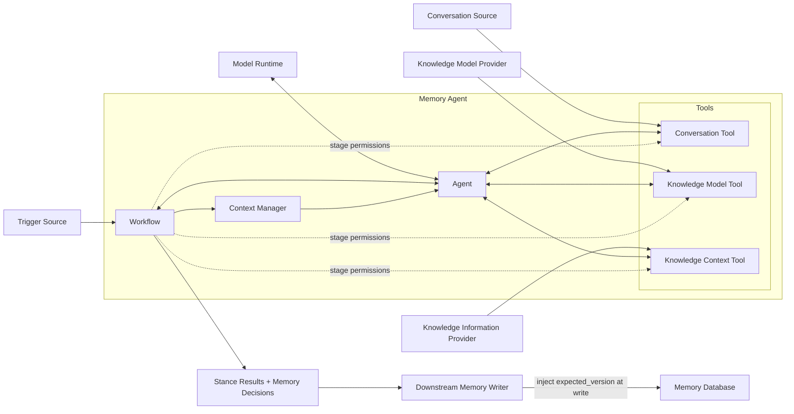

# 01 架构与边界

状态：Draft

本文负责 Memory Agent 的目标、术语、两阶段语义处理、系统边界与组件职责。详细工作流、接口契约和运行保障由后续文档维护；项目背景见根目录 [README.zh-CN.md](../../README.zh-CN.md)。

## 1. 背景

Agent Memory 的静态记忆产品通常重点解决长期事实、偏好、指令或摘要如何存储、组织和召回。它们需要一个独立、可复用的 Memory Agent，结合 Agent、Tools 和 Workflow，先理解用户对对话中知识的当前立场，再结合已有 Knowledge 判断应产生什么知识变化。

Memory Agent 负责：

- 第一阶段仅基于 Conversation Context 抽取配置允许的知识对象；
- 判断用户对每个对象的 `stance`，并区分直接表态和上下文推断；
- 使用第一阶段结果通过只读 Tool 查询相关已有 Knowledge 及其立场；
- 第二阶段让 LLM 合并重复对象、解决新旧冲突；
- 输出 `add`、`update`、`keep` 或 `delete` 决策；
- 校验每个阶段的结构化结果和 Evidence。

Memory Agent 不固定知识对象的种类。`Entity`、`Relation`、`Claim` 可以由 Provider 配置，也可以配置为偏好、用户事实、长期指令或其他静态记忆类型。

## 2. 核心结论

1. Memory Agent 是 Agent、Tools 和 Workflow 的组合，三者共同构成系统本体。
2. Workflow 固定两阶段顺序、状态转换和每个阶段允许使用的 Tools，但不替代 Agent 做语义判断。
3. Agent 在当前 Workflow 阶段内调用允许的 Tools、管理推理过程并输出结构化语义结果。
4. 第一阶段不开放 Knowledge 查询 Tool；LLM 直接抽取知识对象并判断 `stance + basis`。
5. 第一阶段完成后，Workflow 才开放只读 Knowledge 查询 Tool，Agent 根据抽取结果查询相关已有 Knowledge 和已有 stance。
6. 第二阶段把第一阶段结果与相关 Knowledge 一起交给 LLM，完成合并和冲突解决。
7. 第二阶段输出 `add / update / keep / delete`，不增加其他知识决策类型。
8. 决策是 Agent 的语义输出，不是已执行的数据库命令；Tools 不提供 Knowledge 写能力。
9. 一次 Run 固定一个 Knowledge Model 版本；该版本提供知识类型、两个阶段的 Prompt、输出 Schema 和解析规则。
10. Agent 核心不依赖任何具体知识类型，也不针对具体 `kind` 编写判断分支。
11. 第一阶段的 `stance` 只有 `support`、`oppose`、`uncertain`。
12. `support` 和 `oppose` 必须标明 `basis = explicit | inferred`；`uncertain` 不设置 basis。
13. stance 不机械映射为 decision；第二阶段必须结合已有 Knowledge、当前 Evidence 和类型规则判断。
14. Model Runtime 只提供推理、token 计数和 Context 硬上限；Memory Agent 管理每个阶段实际使用的 Context。
15. Agent 只处理对象语义，不读取、生成或管理记忆对象版本；`expected_version` 只由下游写入组件在写记忆数据库时注入。

## 3. 目标与非目标

### 3.1 目标

- 把知识抽取和用户立场判断与 Knowledge 合并、冲突解决明确分为两个阶段；
- 以 Workflow 约束顺序和 Tool 权限，同时保留 Agent 在阶段内的语义判断能力；
- 通过受控 Tools 获取 Conversation、Knowledge Model 和相关 Knowledge；
- 允许部署方通过接口、Prompt、Schema 和 Parser 自定义知识类型；
- 由 Memory Agent 管理两个阶段各自的 Context 和 token 预算；
- 通过只读 Tool 获取已有 Knowledge，同时隐藏其内部管理方式；
- 输出可被下游执行的 `add / update / keep / delete` 语义决策；
- 每个决策都能追溯到第一阶段结果、当前对话 Evidence 和实际使用的 Knowledge 引用；
- 支持重试、回放以及模型、Prompt 和 Knowledge Model 版本比较。

### 3.2 非目标

Memory Agent 不负责：

- 保存原始 Conversation 或 Message；
- 决定主 Agent 如何回答用户；
- 直接创建、更新、删除或发布 Knowledge；
- 读取、生成、比较或推进记忆对象版本或 `expected_version`；
- 验证下游是否已经执行决策；
- 定义 Knowledge 的存储、版本、事务、索引或一致性模型；
- 管理数据库、缓存、召回视图或审计历史；
- 在核心中定义固定的知识对象类型；
- 在 Context 不充分时无限等待或自主轮询。

## 4. 术语

### 4.1 Memory Agent

Memory Agent 是以下三部分的组合：

- `Agent`：使用 LLM 理解当前 Context，决定如何使用当前阶段开放的 Tools，并输出 stance 结果或 Knowledge 决策；
- `Tools`：向 Agent 提供读取 Conversation、加载 Knowledge Model 和查询相关 Knowledge 的受控能力；
- `Workflow`：控制两阶段顺序、状态转换、Tool 可用性、解析校验、重试和终态。

Workflow 不把所有步骤退化为与 LLM 无关的脚本；Agent 也不能绕过 Workflow 任意调用 Tool。Agent 的判断能力和 Workflow 的确定性约束同时存在。

### 4.2 Context Window

Context Window 是一次 LLM 调用实际可见的完整上下文。

第一阶段 Context 包含：

- System 和 Agent 指令；
- 第一阶段知识类型 Prompt 和输出 Schema；
- 当前对话及必要历史消息；
- 输出预留和策略约束。

第二阶段 Context 包含：

- System 和 Agent 指令；
- 第二阶段合并与冲突解决 Prompt 和输出 Schema；
- 第一阶段结构化结果；
- Knowledge Context Tool 返回的相关 Knowledge；
- 当前对话 Evidence；
- 输出预留和策略约束。

第一阶段不得包含已有 Knowledge。Memory Agent 分别为两个阶段计算 token 预算，不得把第一阶段 Context 简单追加为第二阶段 Context。

### 4.3 Knowledge Model

Knowledge Model 是一次 Run 使用的版本化配置，包含一个或多个知识类型定义。它决定允许抽取什么、两个阶段分别注入什么 Prompt、模型应按什么 Schema 输出，以及如何解析和校验响应。

Knowledge Model 不决定知识如何存储或管理。

### 4.4 知识类型定义

每个知识类型至少提供：

- 稳定的 `kind` 和 Schema 版本；
- 应抽取内容和非目标；
- 第一阶段立场判断 Prompt 和输出 Schema；
- 第二阶段合并与冲突解决 Prompt 和输出 Schema；
- 两个阶段的 Parser；
- payload、stance、basis、decision、引用和 Evidence Validator。

Provider 可以配置任意静态记忆类型。Agent 核心只按通用信封处理结果。

### 4.5 第一阶段结果

第一阶段 LLM 对每项知识直接输出：

- 临时 `result_ref`；
- `kind` 和 Schema 版本；
- 符合类型 Schema 的 `payload`；
- `stance`；
- `basis`，仅适用于 `support` 和 `oppose`；
- 当前对话中的 `evidence`。

同一语义在当前输入中重复出现时只返回一项，并合并 Evidence。

### 4.6 Stance

`stance` 只有三种：

- `support`：用户在当前 Conversation Context 中最终支持、确认或陈述该知识；
- `oppose`：用户在当前 Conversation Context 中最终反对、否认或撤回该知识；
- `uncertain`：当前 Conversation Context 无法确定用户的最终立场。

纯询问、临时推理和无长期记忆价值的内容不进入第一阶段结果。

### 4.7 Basis

`basis` 说明确定性立场如何得出：

- `explicit`：用户在当前输入中直接陈述、确认、否认或撤回该知识；
- `inferred`：Agent 需要结合指代、前文问答或多条 Conversation Message 才能得出 `support` 或 `oppose`。

`basis` 只描述 Conversation 内的判断依据。第一阶段不读取 Knowledge，因此不得以已有 Knowledge 作为 inferred stance 的依据。`uncertain` 不设置 basis。

### 4.8 Knowledge Context

Knowledge Context 是第一阶段完成后，通过只读 Tool 查询到的相关已有知识。每项至少提供不透明 `knowledge_ref`、`kind`、payload、已有 stance、可选 basis 和 Evidence 引用。

Agent 只使用这些信息进行第二阶段合并和冲突解决，不解释其存储、版本、索引或生命周期实现。

### 4.9 Decision

第二阶段输出四种 decision：

- `add`：没有可复用的已有对象，应把合并后的新对象交给下游新增；
- `update`：已有对象应保留身份，但 payload、stance 或相关内容应替换为合并后的结果；
- `keep`：已有对象已经正确表达合并后的结果，无需改变；
- `delete`：已有对象不应继续保留，且没有同一身份下的替代结果。

stance 与 decision 是两个不同维度。`support` 不必然等于 add，`oppose` 也不必然等于 delete。第二阶段 LLM 必须结合已有 Knowledge 和类型规则判断。

### 4.10 Schema 版本与对象版本

`knowledge_model_version` 和 `schema_version` 只描述本次 Agent 如何解释、解析和校验知识类型，不是某条记忆对象的持久化版本。

Memory Agent 的第一阶段结果、Knowledge Context 和第二阶段 decision 都不包含或管理记忆对象版本或 `expected_version`。`target_ref` 只是现有对象的不透明语义引用，不能从中推断对象版本。

下游写入组件在真正写记忆数据库时，才根据数据库写入协议取得当前对象版本并向写命令注入 `expected_version`。版本冲突、条件写入和写入重试均属于该组件与记忆数据库的职责，不回流为 Agent 的对象抽取职责。

## 5. 系统边界

Agent、Tools、Workflow 和 Context Manager 共同位于 Memory Agent 内部。Trigger Source、Conversation Source、Knowledge Model Provider、Knowledge Information Provider、Model Runtime、Downstream Memory Writer 和 Memory Database 都是外部边界。Tool 是 Memory Agent 面向 Agent 的受控能力，不等于外部 Provider；Provider 只负责实现 Tool 背后的读取能力。下游 Writer 只在实际写数据库时处理对象版本。

### 5.1 Trigger Source

提供 Scope、新增 Message 引用、触发原因以及可选成本或延迟策略。它不组装 Context，也不决定 Knowledge 如何变化。

### 5.2 Conversation Source

保存原始消息并按引用返回消息顺序、角色、时间和 Evidence 范围。它不管理 Context token，也不判断什么应成为长期知识。

### 5.3 Knowledge Model Provider

按版本返回启用的知识类型定义，并保证两个阶段的 Prompt、Schema、Parser 和 Validator 兼容。它不读取用户 Knowledge，也不判断具体对话。

### 5.4 Knowledge Information Provider

根据 Scope、第一阶段结果和 token 预算返回相关已有 Knowledge。它自行决定 Knowledge 的组织、检索和管理方式；Agent 只依赖 Knowledge Context Tool 的响应。

### 5.5 Memory Agent

#### Agent

- 使用 Model Runtime 进行语义推理；
- 在 Workflow 当前阶段内使用允许的 Tools；
- 第一阶段抽取知识并判断 stance 与 basis；
- 第二阶段合并第一阶段结果和已有 Knowledge、解决冲突并输出 decisions；
- 不绕过 Workflow 调用当前阶段未开放的 Tool。

#### Tools

- `Conversation Tool`：按 Scope 和 Message 引用读取原始消息与 Evidence；
- `Knowledge Model Tool`：按版本加载知识类型、两阶段 Prompt、Schema、Parser、Validator 和类型规则；
- `Knowledge Context Tool`：接受第一阶段结果，返回相关已有 Knowledge 及其 stance；
- 每个 Tool 都执行适用于自身的输入校验、Scope 约束和返回预算；
- Tools 不提供 Knowledge 写入、发布或生命周期操作。

Tools 不向 Agent 暴露记忆对象版本。Knowledge Model Tool 返回的版本字段只用于类型配置兼容性。

确定性步骤可以由 Workflow 直接触发 Tool；需要语义参数的调用可以由 Agent 请求。无论调用由谁发起，都必须经过 Workflow 的阶段权限和 Tool 自身的输入校验。

#### Workflow

- 固定输入版本并控制两阶段运行顺序；
- 第一阶段完成前不开放 Knowledge Context Tool；
- 管理 Tool 权限、阶段转换、解析、校验和有限重试；
- 接收 Agent 的阶段结果并决定进入下一状态或结束 Run；
- 返回第一阶段 stance 结果和最终 decisions。

#### Context Manager

- 分别组装第一阶段 Conversation Context 和第二阶段 Reconciliation Context；
- 注入对应阶段的 Prompt 与 Schema；
- 分配 token、预留输出并执行裁剪、压缩和分段；
- 保存实际使用的来源引用和 token 统计。

### 5.6 Model Runtime

提供模型推理、Context 硬上限、输出限制、token 计数以及结构化模型响应和用量。它不选择消息，也不查询 Knowledge。

### 5.7 Downstream Memory Writer

消费 Memory Agent 返回的 decisions，并把语义决策转换为记忆数据库写命令。它在实际写入时取得当前对象版本并注入 `expected_version`，负责条件写入、版本冲突和写入重试。

Downstream Memory Writer 不属于 Memory Agent，也不是 Agent Tool。Agent 不接收其对象版本或写入结果。
