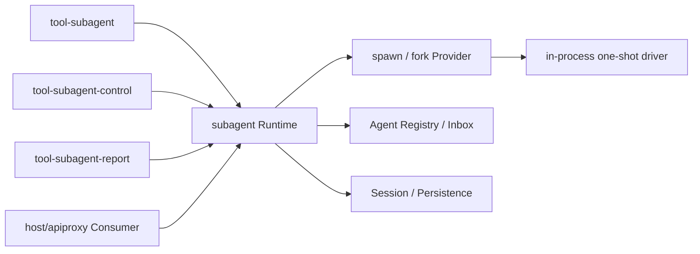

# DSH Subagent 源证据

状态：Source Evidence

本文只保留 Goren Subagent 设计仍需追溯的源 owner、调用方向和兼容差异。当前 Go 职责与契约见 [`subagent` 领域设计](../../subagent/docs/design.zh-CN.md)，完成状态见[实现进度](../08-implementation-progress.md)。

分析源：`../deepseek-harness` @ `b150a551b8d465e31e418e1b2eaf5e79bbb7d28e`。这是一条 feature-local 证据基线，不改变仓库全局固定基线。

## 1. 调用方向

Consumer 主动调用 Subagent core；core 再选择 Provider 并使用 Agent、Session 等现有能力。Agent Loop 不发现 Subagent，也不拥有父子授权、continuation residency 或 Provider registry。

## 2. 源 owner 与符号

| 源包 | 关键符号或文件 | Owner 结论 |
| --- | --- | --- |
| `packages/subagent/subagent` | `SubagentRuntime`、`SubagentContinuationManager`、`registerProvider` | Provider registry、one-shot admission、continuation、descriptor、catalog 与 lifecycle |
| `packages/subagent/subagent` | `start`、`startContinuable`、`followup`、`interrupt`、`reportFrom` | one-shot 与 continuable 是不同用例；父子授权和冷恢复属于 core |
| `packages/subagent/subagent` | `activation-setup-registry.ts` | continuable child-scoped contribution 的有序安装与精确撤销 |
| `packages/subagent/subagent-in-process-driver` | `startInProcessRun`、`drivePublishedRun` | 本地 one-shot child 创建、一个 turn、结果读取、取消与 Dispose |
| `packages/subagent/subagent-spawn-in-process` | `SpawnInProcessProvider` | fresh seed；支持 one-shot 与 continuable preparation |
| `packages/subagent/subagent-fork-in-process` | `ForkInProcessProvider`、`completedTurnPrefix` | 只继承截至最后 `turn/end` 的平衡前缀 |
| `packages/subagent/tool-subagent` | `apply`、delegation Tool executor | Provider-bound foreground/background 路由，不拥有 child lifecycle |
| `packages/subagent/tool-subagent-control` | `send_message`、`interrupt_agent`、`list_agents` | continuable Service/Catalog 的模型 Tool Consumer |
| `packages/subagent/tool-subagent-report` | child-scoped `report` contribution | 只安装到 continuable child，把消息交给 exact direct parent |

## 3. Provider 边界

源 `Provider` 基础能力是 one-shot `start`；`prepareContinuable` 存在时才表示可建立 continuable child。Provider 只贡献运行算法或 detached creation seed：

- core 分配 durable child ID、写 parent Header 与 descriptor；
- core 拥有 Activation、cold resume、Inbox delivery、settlement 和 drain；
- Provider 移除只阻止新 Start，不撤销已经发布的 Run 或 Activation；
- spawn 返回空 seed；fork 返回 balanced completed-turn prefix。

## 4. Consumer 边界

- `tool-subagent` 显式 `run_in_background=false` 走 one-shot；continuable background 返回 durable child ID。
- source 的 background one-shot 依赖 Jobs。Goren 不实现 Jobs，因此该分支返回明确错误，不改走 continuable。
- control Tool 不读取 Persistence 或自行推导 authority；`list_agents` 过滤 one-shot。
- report 是 child-local Tool/Prompt，不是 child 中再次挂载的 host Plugin；report 不结束 child turn。

## 5. 已记录差异

- Goren 使用 Go `agent.Provisioner` / optional `agent.Provisioning` 表达源 Agent setup transaction，不复制 TypeScript callback/object-literal 形态。
- Goren 的 child Scope 解释位于 `subagent/internal/childscope`，one-shot 与 continuable 使用不同 Builder。
- fork Factory 静态注册，但默认 deployment 只启用 spawn continuable Tool。固定源中 fork 的 Provider 注释与部分 composition 对 continuable 使用存在漂移，Goren 不据此默认开放 fork continuable Tool。
- Jobs、background one-shot collection、Code Mode structured capture、Host Subagent API、ACP/Codex/Claude Code/DSH SDK Provider 未纳入当前实现。

本文不复制 Go 接口、错误表、状态表或测试矩阵；这些信息分别由代码、[领域设计](../../subagent/docs/design.zh-CN.md)和[实现进度](../08-implementation-progress.md)所有。
