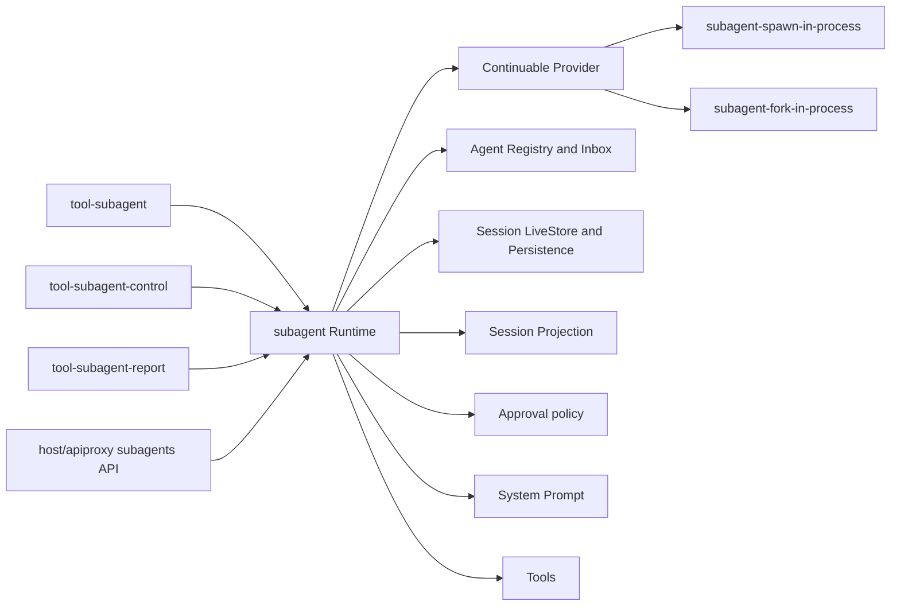

# Subagent 源功能与模块关系

状态：Draft

分析源：`../deepseek-harness` @ `b150a551b8d465e31e418e1b2eaf5e79bbb7d28e`。草案地位与排除范围见[00 范围与阅读顺序](./00-draft-scope-and-reading-order.md)。

## 1. 源模块不是同一层

调用方向是 Consumer 主动调用 `SubagentRuntime`，Runtime 再调用选中的 Provider 和已有核心能力：

- `tool-subagent` 根据模型工具输入调用 one-shot `start` 或 continuable `startContinuable`；
- `send_message` 调用 `followup`，`interrupt_agent` 调用 `interrupt`，`list_agents` 调用 `listDescendants`；
- 子 Agent 中的 `report` 调用 `reportFrom`；
- Host API Proxy 调用 `listChildren`、`followup`、`interrupt`，history 则在先验证 catalog 身份后读取 Session；
- Runtime 调用 Provider 的 `prepareContinuable`，Provider 不反向拥有 Runtime；
- Runtime 通过 Agent Registry 创建或恢复 Agent，并把消息交给 Agent Inbox。Agent Loop 不主动发现或调度 Subagent。

## 2. Core 拥有的能力

源 owner 位于 `packages/subagent/subagent/src/`。其中 `SubagentRuntime` 和 `SubagentContinuationManager` 是有状态核心，不是纯 contract：

| 源文件 | 主要证据 |
| --- | --- |
| `index.ts`、`types.ts` | Service Definition、Provider Registry、公开 request/result、四个 lifecycle event |
| `continuation.ts` | start/followup/interrupt/report、Activation、ownership、cold resume、settlement、drain |
| `activation-setup-registry.ts` | setup transaction、即时撤销、安装索引和释放失败 |
| `child-agent.ts`、`depth.ts` | child options/metadata、depth、delegated policies 和 child composition |
| `descriptor.ts`、`descriptor-seed.ts` | descriptor v2 strict codec 与 fork own-suffix 边界 |
| `projection.ts`、`projection-types.ts` | `subagent` / `subagentTiming` projection |
| `list-children.ts` | live-preferred corpus、projection ladder、diagnostic 与稳定 traversal |
| `lifecycle.ts`、`assistant-output.ts` | run ID、start/end 配对、epoch stop reason 与最终 assistant output |
| `run-settlement.ts`、`out-of-process.ts` | one-shot settlement 与外部运行诊断；本项目只分析不实施 |

| 能力 | 源入口 | 所有权语义 |
| --- | --- | --- |
| Provider 注册 | `registerProvider`、`getProvider`、`list` | 唯一名称、稳定顺序、精确撤销、Provider 生命周期事件 |
| one-shot 启动 | `start` | 解析 Provider 与能力、启动一次运行并返回 `SubagentRun`；本项目推迟实现 |
| continuable 启动 | `startContinuable` | 分配 durable child、安装 Activation、把首条消息提交 Inbox |
| 后续消息 | `followup` | 对 resident child 排队，或从 Persistence 冷恢复后排队 |
| 中断 | `interrupt` | 校验直接父或 live ancestor 权限，对当前 turn 发出 keep-inbox cancel |
| 子向父报告 | `reportFrom` | 以精确 live child 为凭证，只投递给其直接父 Agent |
| 子级安装 | `registerContinuableSetup` | 对每个新 Activation 事务性安装 child-scoped 能力，并支持立即撤销 |
| 清理 | `drainContinuableChildren`、`drainContinuableDescendants` | 子优先关闭，尝试所有分支并聚合失败 |
| 目录 | `listChildren`、`listDescendants` | live-preferred、无 Agent 激活的 durable 身份查询 |

Core 还拥有：descriptor v2、projection、委派深度、父子授权、运行期 start/end 配对、最终 assistant output 提取、settlement notice 和 activation epoch。

## 3. Provider 的真实边界

Provider 不是完整子 Agent runtime。源 Provider 合同包含：

- 唯一 `name`；
- `inheritsParentContext`，用于 Consumer 描述其上下文语义；
- one-shot 静态 capabilities：`outputSchema`、`depthLimit`、`toolFilter`、`persona`；
- one-shot `start`；
- 可选 `prepareContinuable`，方法存在即表示支持 continuable。

continuable Provider 只准备 detached creation data，当前关键结果是可选 seed：

- spawn 返回空 seed，表示新会话；
- fork 返回截至最近完整 turn 的平衡前缀；
- Provider 不创建 Session ID，不写父子 Header，不注册 Agent，不保存 Activation，也不拥有 cold resume；
- cold resume 只读取 durable descriptor 并恢复 Agent，不再次调用 Provider，因此 Provider 下线不会让已经持久化的 continuable child 失去可恢复性。

Provider 移除只阻止新启动。已被接受的 one-shot run 或 continuable Activation 不被追溯撤销。

## 4. Spawn、Fork 与 in-process driver

### 4.1 Spawn

`subagent-spawn-in-process` 同时支持源 one-shot 和 continuable：

- one-shot 路径委托 `subagent-in-process-driver` 创建并驱动一个临时 child；
- continuable 路径的 `prepareContinuable` 不继承历史，创建新的 durable child；
- 首期 Go 迁移建议把 spawn 作为唯一默认 continuable Provider。

### 4.2 Fork

`subagent-fork-in-process` 使用父 Session 中最后一个完整 turn 之前的平衡前缀作为 seed。它仍必须让 Runtime 在 seed 后追加新 descriptor 与委派策略，这样新策略覆盖历史中的旧值。

最新源存在配置漂移：Provider 注释与 `packages/bundle/base/cordis.patch.yml` 把 fork 约束为 one-shot，以免 report Tool/System Prompt 插入在继承历史前破坏 prefix reuse；但 CLI 的 standard/code/cordis preset 仍配置 `backgroundMode: continuable`。在源意图澄清前，Goren 不应默认挂载 fork continuable。

### 4.3 `subagent-in-process-driver`

该模块只建立和驱动“一次性、内进程”的 child：创建临时 Agent、写首轮 descriptor、安装 persona/tool filter/structured-output capture、执行一个 turn、接管取消、收集最终输出并销毁。

它不属于 continuable core，因此首期不需要创建 `subagent/inprocess`。将来恢复 one-shot 时，再根据 Go 的公开扩展需求决定 driver 是公开包还是 `internal` 实现；不能仅因 TypeScript 包是公开 npm package 就预先暴露 Go API。

## 5. one-shot 的完整语义与推迟边界

推迟的是执行，不是分析。源 one-shot contract 为：

- `SubagentRun`：可 dispose 的单次运行，只产生一次结果，不可 resume、followup 或 steer；
- `SubagentResult.output`：`ContentBlock[]`；优先取最后一条非空 assistant message，没有时退回累计 assistant text stream，再没有则为空数组；
- `structured`：Provider 支持 output schema 时的结构化结果；
- `diagnostic`：安全、可选、最多 4096 UTF-8 bytes 的诊断尾部；
- `stopReason`：`completed`、`aborted`、`error`、`max-tokens`、`refusal`，并允许扩展；
- child 级失败通过 `result` 正常 settle 为非 completed stop reason；只有 seam 无法表达的基础设施故障才 reject result；
- start signal 在发布前要求 Provider 清理 partial resources 后拒绝，发布后继续作为取消剩余 turn work 的 canonical channel；Consumer 无论结果如何都必须 dispose run 并等待静止；
- background one-shot 通过 Jobs 收集结果，Jobs 不服务 continuable；
- spawn/fork one-shot 共享 in-process driver，外部进程 Provider 自己实现 `SubagentRun`。

首期不实现：`SubagentRun`、`SubagentResult`、one-shot `start`、in-process driver、structured capture、Jobs 集成和所有外部 one-shot Provider。core descriptor decoder仍建议识别 one-shot durable descriptor，使目录能够把历史记录正确展示为 one-shot，而不是把已知事实误报为 corrupt；识别不等于能重新运行。

## 6. Tool Consumers

### 6.1 `tool-subagent`

它拥有模型可见的委派入口，而不拥有子 Agent 生命周期。源配置包括 Provider、Tool name、是否允许 background、background mode、Agent options、persona、tool filter 和 max depth。

源路由有一个首期必须显式处理的分支：即使默认 `backgroundMode` 是 continuable，模型显式传 `run_in_background=false` 仍会走 one-shot。由于 one-shot 推迟，Go 首期必须让默认组合显式选择 continuable，并对 `run_in_background=false` 返回稳定的“不支持”错误；不能静默改成 continuable，也不能调用空实现。

Provider added/removed 会使 Tool 相应注册/撤销。Tool schema 文案会根据 `inheritsParentContext` 说明 child 是否继承上下文。

### 6.2 `tool-subagent-control`

- `send_message` 是 `followup` 的薄适配；
- `interrupt_agent` 是 `interrupt` 的薄适配；
- `list_agents` 是 `listDescendants` 的展示适配，会过滤 one-shot，并把 live Agent 状态映射为工具结果状态。

它们不应自己读取 Persistence、推导父子关系或恢复 Agent。

### 6.3 `tool-subagent-report`

它通过 continuable setup registry 安装到每个 child Scope，提供 `report` Tool 与配套 System Prompt。报告是可选且可多次调用的中间通信，不会结束 child turn，也不会自动发生。

## 7. Host API Consumer

`packages/host/apiproxy/src/api/subagents.ts` 定义浏览器安全的四个方法：

| 方法 | 核心依赖 | 额外 API Proxy 职责 |
| --- | --- | --- |
| `subagents.list` | `listChildren` | 把 core 的 Session-live activity 映射为 Agent sampling activity，并返回 parent availability hint |
| `subagents.history` | catalog 身份验证 | live snapshot/cold inspect、普通 history 分页与 projection 映射，不激活 Agent |
| `subagents.prompt` | `followup` | 要求 direct parent live、校验时区和 wire error、返回 accepted message ID |
| `subagents.interrupt` | `interrupt` | durable parent address 授权；不查 catalog、不恢复 Agent；返回统一 accepted receipt |

这说明 Host API 是 Core 的 Consumer，不应把 transport DTO 放进 `subagent`。是否把这四个方法和对应 Web UI 纳入首期，是待确认的产品范围；若纳入，wire contract 由 API Proxy 所有并需要 TypeScript-to-Go golden fixtures。

## 8. 与其他核心模块的边界

| Owner | Subagent 可以调用 | Subagent 不能接管 |
| --- | --- | --- |
| Agent | Create/Resume、Inbox、Cancel、WhenIdle、live ownership | turn/step 驱动、模型请求、Agent 状态机 |
| Session | Header/Event、LiveStore、Flush | 事件序号、durability、repair、业务 Event codec |
| Projection | 注册/fold descriptor 与 timing | 全局 projection framework |
| Tools | child overlay、Tool 注册与限制 | schema 验证、Tool execution pipeline |
| System Prompt | child context/persona section | prompt 全局装配和顺序规则 |
| Approval | 为 child 写 delegation-owned `never` policy | approval Event 编码与 effective policy 算法 |
| LLM | ContentBlock、Message、MessageSource | Provider/Model transport 和生成循环 |
| Plugin Runtime | Service、Event、Scope、Mount/Dispose | 第二套 locator 或动态模块系统 |

Subagent 的核心价值正是编排这些现有能力之间的委派生命周期；把它拆散到 Tool、Agent Loop 或 API Proxy 会产生多套授权、恢复和清理语义。
