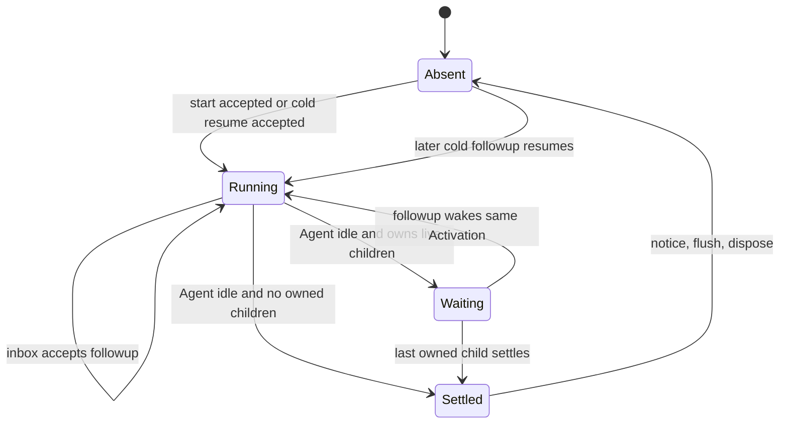
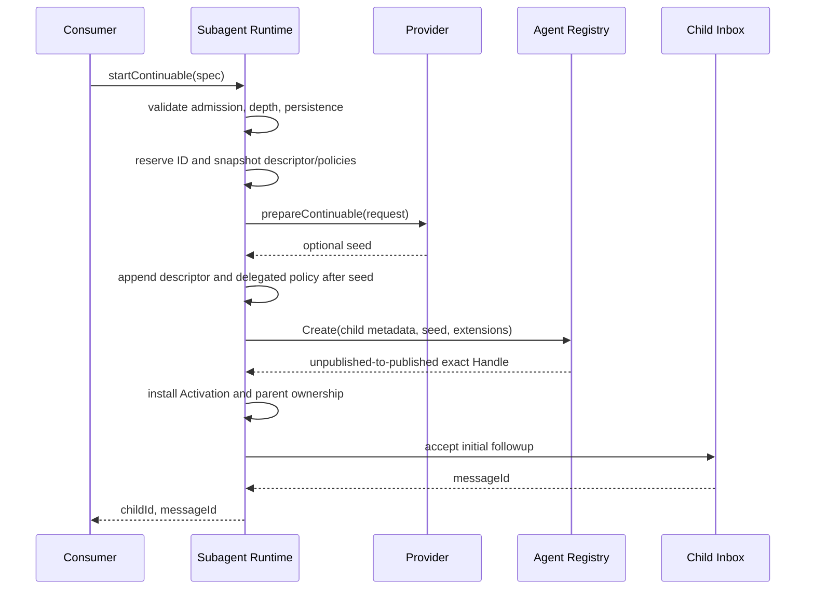

# Continuable 生命周期与持久化语义

状态：Draft

本文展开 DSH continuable Subagent 的行为契约。模块关系和 one-shot 边界见[01 源功能与模块关系](./01-source-capability-analysis.md)，Go 对象与接口候选见[03 Go 架构、接口与契约](./03-go-architecture-and-contracts.md)。

## 1. 两种生命周期事实

一个 continuable child 同时具有两层身份：

- durable child Session：Header、descriptor、消息和策略 Event 是事实来源，可跨进程驻留周期恢复；
- process-local Activation：某一时刻至多一个，持有 live Agent Handle、父子 ownership、监听器和已安装 Extension。

Activation 是一个 residency epoch，不是第二份 Session。它可以处理多个 FIFO turn；冷恢复会产生新的 Activation 和新的 lifecycle run ID，但 child Session ID、descriptor 和历史保持不变。

`running`、`waiting`、`settled` 是从 Agent 和 owned children 推导的状态，不需要另建可分叉的执行状态机：

- running：Agent 正在运行，或已有被接受、正在唤醒的工作；
- waiting：Agent idle，但仍拥有 live child Activation；
- settled：Agent idle 且不再拥有 live child，可以完成本 epoch。

## 2. Durable identity

### 2.1 Session Header

源 child Header 使用：

- `origin: "subagent"`；
- `parentSession`：durable 直接父 Session；
- `cwd`；
- `delegationDepth`；
- `seedLength`：fork seed 的边界；
- `agentPreset`：父级 composition 身份。

Goren 的 `session.Header`/`session.Metadata` 已有 `OriginSubagent`、`ParentSession`、`SeedLength`、`DelegationDepth`、`AgentPreset`，不应为 Subagent 再建一份父子关系表。

### 2.2 `subagent/descriptor`

descriptor version 固定为 2，是 child 自己日志中的 Session Event。它拥有可恢复的 Subagent 身份，不存放 transient 输入：

| variant | durable 字段 |
| --- | --- |
| one-shot | `mode`、`provider`、可选 `label` |
| continuable | `mode`、`provider`、必填 `label`、可选 `agentProvider`、`agentModel`、`persona`、`toolFilter` |

descriptor 不保存 prompt、parent、cwd、depth 或 output schema：parent/cwd/depth 属于 Header，prompt/后续 turn 属于 Session log，output schema 属于 one-shot activation request。

新 child 的 descriptor 必须写在 Provider seed 之后。fork seed 可能包含祖先的旧 descriptor，fold 时只看本 Session 自有 suffix 中最后生效的 descriptor；不能把 seed 中的祖先身份当成当前 child。

### 2.3 Projection

源注册两个 canonical projection key：

- `subagent`：fold descriptor，产出当前 child identity；
- `subagentTiming`：在本 child descriptor 处重置，只累计其后的 turn timing。

首期 Go 可以用 live projection snapshot 或对 Persistence `Inspect` 的 Event 进行 detached fold，不需要先实现 projection cache。少一次缓存只影响性能，不改变结果、授权或是否激活 Agent。

## 3. Start transaction

`startContinuable` 的成功边界是初始消息被 child Inbox 接受，并返回 `childId + messageId`；不是 Agent 开始采样、Session 已 flush 或 turn 已结束。

关键顺序与失败语义：

1. 在任何 await 前验证调用方、Persistence、depth，并同步捕获 descriptor、Agent options、sandbox/approval policy 等父级快照；
2. 预留 child ID，并同时检查 live Registry 与 Session corpus 冲突；
3. 调用 Provider 准备 seed；
4. descriptor 和新委派策略追加在 seed 后，保证新值覆盖 seed 中的旧值；
5. 在 per-child lock 内再次检查重复 ID 和调用方指定 ID 对应的持久化快照；
6. 以 `agent.WithInitiator` 让 Agent Registry 记录精确父 Agent ownership；
7. child Provisioning、Extension 和监听器全部成功后才发布 Activation；
8. 初始消息被 Inbox 接受后才向 Consumer 暴露 ID。

接受前任何失败都必须逆序撤销 Provisioning、监听器、ownership、Agent Handle 和 Session membership，并且不返回可被误用的 child/message ID。

`subagent/start` 的边界早于 Inbox acceptance：Agent 已 publication、Activation 已 resident 后立即发布 start，确保任何 turn 运行前 observer 已看见 epoch。若随后初始 Inbox admission 失败，Runtime 仍 Dispose 该 resident Activation 并发布配对的 end，但启动调用不返回 child/message ID，也不发送 settlement notice。

## 4. Followup 与 cold resume

`followup(parent, childId, content, options)` 按 child ID 的同一把锁串行化投递、销毁和恢复：

1. resident + running：把消息追加到相同 Inbox；
2. resident + waiting：追加 Inbox 并唤醒相同 Activation；
3. absent：通过 Persistence `Inspect` 读取 Header/Event；
4. 验证 `origin=subagent`、durable direct parent 和 continuable descriptor；
5. 通过 Agent Registry `Resume` 重建 child extensions 和 Activation；
6. 把消息提交 Inbox。

冷恢复不调用原 Provider。descriptor 内的 Provider 名称是 durable identity 和诊断信息，不是 resume 时的实时依赖。

调用方的取消权只持续到 Inbox acceptance。接受后，该消息的运行、重试、settlement 和 flush 由 ContinuationManager 拥有；HTTP 断开或 Tool call context 取消不能撤销已经接受的工作。

Message source 只记录 provenance，不参与授权。源 canonical Subagent source 有：

- `coordinator` / `relay` / `senderSessionId`；
- `subagent-report` / `relay` / `senderSessionId`；
- `subagent-settled` / `notice` / `summary` / `senderSessionId`。

Goren 的 `llm.MessageSource` 支持未知 kind 的 lossless opaque decode。首期应增加 Subagent 自己的 typed source 用于新写入，同时允许旧日志以 opaque source 重放；任何路径都不得从 source 字段推导权限。

## 5. Interrupt authority

`interrupt(childId, authority)` 是 fire-and-return：

- human authority 必须携带 durable direct parent Session ID；
- Agent authority 必须是该 live child 的精确 live ancestor；
- self、sibling、过期 Agent 实例和非祖先都不授权；
- resident child 接收 Agent `Cancel(..., KeepInbox=true)`，方法不等待 idle；
- 当前已 claim 的工作不重新排队，尚未 claim 的消息、Activation 和 descendants 保留；
- child 不存在、已 idle 或已经 settlement 是 accepted no-op；
- interrupt 绝不为了取消而 cold resume child。

“不存在是 no-op”不能绕过授权：对仍 resident 的 child 先验证 authority；Host 的 durable direct-parent address 由 core primitive 自己验证，API Proxy 不应先做一个会竞态的 catalog 查询。

## 6. Child-to-parent report

`reportFrom(senderAgent, content, delivery)` 不允许调用者指定 recipient：

1. Runtime 验证 sender 是当前 Registry 中的精确 live child；
2. 从 child durable Header 取得 direct parent ID；
3. 查找 live parent Agent；
4. `next-step` 使用 parent `Steer`，让消息进入下一 step 并在 parent idle 时唤醒；
5. `quiet` 使用 parent `Inject`，只写上下文，不唤醒 parent。

报告可以为零次或多次，不自动生成，不结束 child turn。父 Agent 不 live 时返回 `PARENT_UNAVAILABLE`，不能把报告暂存到一个没有明确 delivery 语义的旁路队列。

## 7. Activation Extension registry

DSH 把这条 seam 称为 continuable setup；Go contract 用 `ActivationExtension` 表示 child-scoped contribution，用 `Provisioning` 表示 publication transaction：

- 创建 Activation 时按注册顺序安装；
- 任一安装失败，逆序回滚此前安装并阻止 Activation 发布；
- 新注册的 Extension 只影响后续 Activation，不追装已有 child；
- 撤销 Extension 先关闭注册，再立即卸载所有 resident installation；
- 若撤销与 child 构建并发，构建事务必须检测 generation 已失效并回滚，不能发布带已撤销能力的 Activation；
- disposer 是精确、幂等对象，不能按名称误删后来注册的实例。

`tool-subagent-report` 使用这条 seam 给每个 child 安装 report Tool 和 prompt guidance。persona、tool restriction 和 delegation context 也应作为 child extension 组合，而不是写进 Agent Loop 分支。

## 8. Settlement、notice 与 drain

Activation 只有在 Agent idle 且所有 owned child Activation 已 disposed 后才能 settle。顺序为：

1. 建立 closing boundary，不再接受新的 resident work，并取消本 Agent；
2. child-first 等待所有 owned child disposal，再等待本 Agent idle；
3. best-effort Flush child Session；失败记录但不能让 Activation 永久泄漏；
4. 在 child 仍 live 时 capture terminal facts，然后逆序卸载并 Dispose exact Agent Handle；
5. 删除 Activation entry；
6. 在释放父 ownership 前，向 direct parent 投递 runtime-owned `subagent-settled` notice；notice 包含 stop reason summary 和最终 assistant message（如果存在）；
7. 即使 teardown 失败也释放父 ownership；
8. disposal outcome 已确定后发布本 epoch 的 `subagent/end`，失败则把 stop reason 归为 `error`。

Settlement notice 的投递也区分父状态：父正在 closing 时只 `Inject`、不唤醒；父 idle 时以 ordinary followup 唤醒；父 busy 时 `Steer` 到下一 step。父已不 live 或 notice 投递失败只是 contained warning，不得为了重试 notice 保留 child ownership。

start/end 以每个 Activation epoch 的新 run ID 配对。冷恢复同一 child 会产生另一对 start/end，不能拿 child ID 充当 run ID。

Drain 是结构清理，不是普通调用取消：

- children-first；
- 遍历所有分支，即使某个 child 失败；
- 聚合所有 teardown failure；
- 一旦 admission cutoff 建立，后续结构清理使用不受原请求取消影响的 close context；
- scoped drain 关闭指定 parent 的 children，全局 drain 关闭所有 continuable descendants。

## 9. Durable catalog

`listChildren` 和 `listDescendants` 读取 live-preferred corpus，但绝不 Create/Resume Agent：

1. 合并 Session LiveStore 与 Persistence listing；
2. 只把 `origin=subagent` 的 Header 当作候选；
3. identity 优先读取 live projection；否则 Persistence `Inspect` 后 detached fold descriptor；
4. direct children 按 `createdAt`、再按 ID 稳定排序；
5. descendants 以迭代式稳定 preorder 展开，普通或 one-shot 中间节点仍参与遍历；
6. descriptor 正常时返回 child row；异常时返回 diagnostic row。

diagnostic reason 固定为：

- `corrupt`：settled candidate 缺 descriptor、descriptor 非法或 version 未被当前 projection 识别；
- `unsupported`：保留在 source union 供 Consumer 路由，最新源当前不会生成该值；
- `unavailable`：单 child inspection 暂时失败。

Persistence 可选；缺失时目录退化为 live-only，而不是报错。若已挂载 Persistence，则整体 list 失败会使整个调用失败。创建窗口中 live Session 尚未写 descriptor 时暂时省略，避免把未发布事务暴露成 corrupt。Core `activity=running` 只表示该 Session 在 LiveStore 中，`inactive` 表示只存在于 Persistence；Host API 会再把 wire activity 映射为 Agent sampling 状态。两者都不表示任务最终结果。

## 10. 深度和委派策略

父 depth 取 durable Header `delegationDepth` 与 live `agent.Options.SubagentDepth` 的较大值；缺失视为 0。child depth = parent + 1，并同时验证 safe integer 和绝对 `maxDepth`。

Goren 目前 Header 已有 depth，`agent.Options` 尚无 `SubagentDepth`。实现前应补该字段，使 Runtime 能在 child 尚未完全持久化或从 live Agent 继续委派时保持一致判断。

源还在首次 Activation 同步捕获并委派：

- parent 明确 sandbox override；
- approval capability 存在时，child 强制 durable `policy=never, source=delegation`；
- parent Provider/Model/MaxTokens，除非 start spec 覆盖；descriptor 只持久化解析后的 Provider/Model，MaxTokens 是单次 Activation budget，cold resume 使用恢复路径默认值；
- parent Agent Preset composition；
- cwd、persona、tool filter 与 delegation prompt。

当前 Goren 没有完整 sandbox capability，也没有可复用的 Agent Preset composition；这两项是明确兼容缺口，不能以空字段或 silent fallback 宣称完成。
