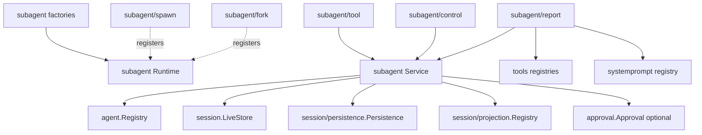

# Subagent Go 架构、接口与契约

状态：Draft

本文把[源功能分析](./01-source-capability-analysis.md)和[continuable 生命周期](./02-continuable-runtime-and-durability.md)翻译为 Go 候选设计。代码片段用于固定边界和名称，不是已实现 API；评审通过前不得据此声明兼容。

## 1. 候选包边界

只在对应切片真实实现时创建目录：

```text
subagent/                 核心 Service Definition、Runtime、descriptor、projection、continuation
subagent/factory/         核心 Runtime 的 typed Factory
subagent/spawn/           fresh continuable Provider Plugin
subagent/fork/            fork seed Provider Plugin；首期不进入默认组合
subagent/tool/            模型委派 Tool Consumer
subagent/control/         send_message / interrupt_agent / list_agents Consumer
subagent/report/          child-scoped report setup Consumer
```

边界理由：

- 根 `subagent` 是真实公共扩展合同：Provider、Service、事件、descriptor 和错误；
- `Runtime`、`ContinuationManager`、`ActivationSetupRegistry` 是根包内的命名对象，先保持少量 cohesive 文件，不拆成 ownerless helpers；
- spawn/fork 是可替换 Provider，不进入 core 条件分支；
- Tool packages 是 Consumer，不拥有 continuation；
- Factory 只负责严格 config decode、validation 和 construction；
- one-shot 推迟期间不创建 `subagent/inprocess`；恢复 one-shot 后，只有第三方确实需要复用 driver 时才公开，否则 driver 放 `subagent/internal/inprocess`。`internal` 表示仓库私有装配，不表示 Subagent core 本身是内部能力。

## 2. 依赖方向



禁止的依赖：

- `agent`、`session`、`tools`、`approval` 不能反向依赖 `subagent`；
- Provider 不能依赖 `ContinuationManager` 或 process-local Activation；
- API Proxy DTO、Echo context、WebSocket frame 不能进入 `subagent`；
- core 不依赖 spawn/fork/tool/report 的具体类型；
- 不建立 `subagent -> llm/docs` 或旧 pi runtime 依赖。

### 2.1 当前 Goren 可复用锚点

| 现有位置 | 可复用能力 | Subagent 仍需补足 |
| --- | --- | --- |
| `agent/registry.go`、`agent/factory.go` | exact Create/Resume Handle、live Get/List、owner membership、Extensions | ContinuationManager 和 per-child admission lock |
| `agent/initiator.go` | `WithInitiator` 把 exact parent 传给 Registry ownership | start/resume 必须统一使用该 context |
| `agent/agent.go`、`agent/inbox.go` | Followup/Steer/Inject、Cancel、WhenIdle、唯一 FIFO queue | `Options.SubagentDepth` |
| `session/types.go`、`session/store.go` | Parent/Origin/SeedLength/DelegationDepth/AgentPreset、LiveStore/Flush | descriptor Event 与 Subagent projection |
| `session/persistence/contracts.go` | Inspect/ListSnapshots 和 backend-neutral durable log | Subagent cold-resume/read-model policy |
| `session/projection/` | live/detached projection Registry | 可选 projection cache 不是首期前置 |
| `tools/`、`systemprompt/` | Tool/Policy/Restriction、prompt overlay 与精确 handle | Subagent Consumer packages 与 setup composition |
| `approval/` | durable policy、`PolicyNever`、`PolicySourceDelegation` | owner-owned delegation seed 方法 |
| `llm/message_source.go` | merge-extensible typed/opaque MessageSource | 三种 typed Subagent source |
| `plugin/` | typed Service/Event、Scope、MountChild/UnloadChild、rollback | setup host 对即时撤销的组合验证 |

Agent Loop 已在 Agent publication 前挂载 `CreateOptions.Extensions`，失败会回滚未发布 child。这是 setup transaction 的基础；Subagent 不应另建 Agent constructor 或绕过 Registry。

## 3. 核心命名对象

| 对象 | 拥有的可变状态 | 不拥有 |
| --- | --- | --- |
| `Runtime` | Provider Registry、Service facade、全局 draining、依赖与 lifecycle publication | 单 Agent turn、Provider 具体算法 |
| `ContinuationManager` | per-child lock、resident Activation、parent ownership、admission/settlement/drain | durable Session facts、模型循环 |
| `Activation` | exact Agent Handle、epoch run ID、parent/ancestry snapshot、owned children、closing 状态 | 可独立持久化的业务状态机 |
| `ActivationSetupRegistry` | 有序 registrations、generation、resident installations | Tool/System Prompt 的业务规则 |
| `setupHost` | 一个 child Activation 内可即时卸载的 setup child handles | 全局 setup 顺序 |
| `ProviderRegistration` | 一个精确 Provider 注册的幂等撤销权 | 按名称删除后来实例 |
| `SetupRegistration` | 一个精确 setup 注册和 resident installations 的幂等撤销权 | Activation 本身的 Dispose |

所有跨 await 的 Start 数据先形成 immutable snapshot。Manager 不持有调用方的可变 request、Parent Agent options 指针或 Provider config 指针。

## 4. Service Definition

候选根能力保留源 canonical 操作，但首期不暴露空的 one-shot `Start`：

```go
type Service interface {
	plugin.Service
	RegisterProvider(Provider) (ProviderRegistration, error)
	Provider(string) (Provider, bool)
	ProviderNames() []string
	StartContinuable(context.Context, ContinuableStartRequest) (ContinuableStartReceipt, error)
	Followup(context.Context, agent.Agent, session.SessionID, []llm.ContentBlock, FollowupOptions) (llm.MessageID, error)
	Interrupt(session.SessionID, InterruptAuthority) error
	ReportFrom(context.Context, agent.Agent, []llm.ContentBlock, ReportOptions) (llm.MessageID, error)
	RegisterContinuableSetup(ContinuableSetup) (SetupRegistration, error)
	DrainContinuableChildren(context.Context, agent.Agent, []session.SessionID) error
	DrainContinuableDescendants(context.Context, []agent.Agent) error
	ListChildren(context.Context, session.SessionID) ([]ListEntry, error)
	ListDescendants(context.Context, session.SessionID) ([]DescendantListEntry, error)
}
```

说明：

- `Runtime` 是实现此接口并嵌入 `plugin.Base` 的有状态 Plugin；
- Tool/Host/report 各自在自己的包内声明更窄的 consumer interface，构造函数只接收所需方法；Runtime Service 是统一 Provider contract，不强迫 Consumer 依赖全部方法；
- `context.Context` 替代 AbortSignal，并作为 operation 参数传入，不能存入 durable request；
- `Interrupt` 是同步 admission + fire-and-return，不为形式一致强加无意义的等待；Consumer 在调用前检查自己的 context；
- one-shot 恢复时再通过一次完整 API 变更加入 `Start`、`Run` 和 `Result`，不预留永远报 unsupported 的方法。

## 5. Provider contract

Go 用接口能力而不是 TypeScript 的 optional method：

```go
type Provider interface {
	Name() string
	InheritsParentContext() bool
}

type ContinuableProvider interface {
	Provider
	PrepareContinuable(context.Context, ContinuablePrepareRequest) (ContinuablePrepareSpec, error)
}

type ContinuablePrepareRequest struct {
	ChildID session.SessionID
	Parent  agent.Agent
}

type ContinuablePrepareSpec struct {
	Seed []session.Event
}
```

约束：

- 注册时 Provider 必须实现当前至少一种受支持 capability；首期即 `ContinuableProvider`；
- `Parent` 保留源 `ContinuableCreateRequest.parent: Agent` 的 trusted same-process Provider contract；Provider 只读取建立 seed 所需的 completed history，不能创建 child、投递 prompt 或持有 parent 的生命周期；
- Runtime 在调用 Provider 前已独立 snapshot descriptor 和委派策略；Provider 返回的 `Seed` 必须 detached，不能把父 Session 的可变 slice 借给 Runtime；
- spawn 返回空 `Seed`；fork 只计算平衡的完整-turn prefix；
- Provider Plugin 在 Apply 时注册 contract、Dispose 时释放 exact `ProviderRegistration`；
- Provider name 唯一且经过 trim/非空验证，列表保持成功注册顺序；
- `ProviderAdded` observer 可以 veto，因此发布失败必须回滚注册；移除事件失败被 containment，不恢复已移除 Provider。

源 `SubagentProvider` 同时强制 one-shot `start`，并以可选 `prepareContinuable` 表示附加能力。上面的分接口是 one-shot 被明确排除期间的阶段性 Go API 子集：它保留 continuable 的可观察语义，但不承诺源 Provider 的源码级兼容，也不允许加载只支持 one-shot 的 Provider。恢复 one-shot 时应独立扩展：

```go
type OneShotProvider interface {
	Provider
	Capabilities() Capabilities
	Start(context.Context, OneShotStartRequest) (Run, error)
}
```

`Run`、`Result`、`Capabilities` 在 one-shot 切片前不存在于生产 API，避免首期形成伪兼容面。

## 6. Start、Followup 与 authority 请求

候选输入应先表达业务对象，再表达附属选项：

```go
type ContinuableStartRequest struct {
	Parent       agent.Agent
	ProviderName string
	Prompt       []llm.ContentBlock
	Label        string
	ChildID      *session.SessionID
	AgentOptions AgentOptionsOverride
	Persona      *string
	ToolFilter   *ToolFilter
	MaxDepth     *int64
}

type ContinuableStartReceipt struct {
	ChildID  session.SessionID
	MessageID llm.MessageID
}

type FollowupOptions struct {
	Source llm.MessageSource
}

type InterruptAuthority interface {
	interruptAuthority()
}

type UserAuthority struct {
	ParentSessionID session.SessionID
}

type AgentAuthority struct {
	Ancestor agent.Agent
}
```

设计规则：

- `Parent` 是启动时权限和继承的 live subject；durable direct parent 最终写 Header；
- `ChildID` 只支持显式保留 ID 的受控调用，Manager 必须同时检查 live 和 persisted collision；
- `AgentOptionsOverride` 用字段 presence 表达覆盖，不以零值猜测；
- `Prompt`、`Source` 和返回 receipt 都做 detached copy；
- authority 是封闭 sum type；不接受 `{kind:string, ...optional fields}` 这种可能同时表示多个身份的结构；
- `Followup` 中传入的 parent 必须是 Registry 中 exact live direct parent，MessageSource 不作为授权凭证。

## 7. Descriptor、list row 与 JSON

不要用一个带大量 optional 字段的公开 struct 同时表示 one-shot、continuable、child 和 diagnostic。候选结构：

```go
type Descriptor interface {
	descriptorVariant()
	Version() int
	ProviderName() string
}

type ContinuableDescriptor struct {
	Provider     string
	Label        string
	AgentProvider *string
	AgentModel    *string
	Persona       *string
	ToolFilter    *ToolFilter
}

type OneShotDescriptor struct {
	Provider string
	Label    *string
}

type ListEntry interface {
	listEntryVariant()
	SessionID() session.SessionID
}

type ChildEntry struct {
	ID          session.SessionID
	Descriptor  Descriptor
	Activity    Activity
	HasChildren bool
}

type DiagnosticEntry struct {
	ID     session.SessionID
	Reason DiagnosticReason
}
```

由 `subagent` 自己实现严格 descriptor Event codec 和 variant decoder：

- event name 固定 `subagent/descriptor`，version 固定 2；
- 必填、缺失、null、未知 mode 和未知 version 按源 fold 语义处理；未知 version 不抛 schema error，但当前 listing 会归为 `corrupt`；
- 支持读取 one-shot identity，但首期不把它判为 resumable；
- `DescendantListEntry` 组合 `ListEntry`、durable parent ID 和相对 depth；
- core `Activity` 是瞬时 read-model 字段：Session 在 LiveStore 为 `running`，只在 Persistence 为 `inactive`，不写入 durable descriptor；Host wire 可再映射为 Agent sampling activity，Tool status 也由 Consumer 映射；
- API Proxy 若纳入，自行映射为 wire union，不能直接 JSON marshal Go domain interface。

## 8. Setup contract 与 child composition

Setup 是自然的 composition-root seam，可以用小接口而非状态型 closure chain：

```go
type ContinuableSetup interface {
	Name() string
	Build(ActivationContext) (plugin.Plugin, error)
}

type ActivationContext struct {
	ChildID  session.SessionID
	ParentID session.SessionID
	Agent    agent.Agent
	Descriptor ContinuableDescriptor
}
```

候选实现流程：

1. `ActivationSetupRegistry` 在创建前取得 registration ID + generation 的有序快照；
2. Runtime 把一个 `setupHost` 放进 `agent.CreateOptions.Extensions`；
3. Agent Loop 在 membership commit 前挂载 extension，`setupHost.Apply` 再用 `plugin.MountChild` 安装各 setup Plugin；
4. Registry 记录 registration -> activation -> exact child handle；
5. 撤销 registration 时先标 closed，再以 `plugin.UnloadChild` 卸载所有 resident handles；
6. 构建完成前复核 generation；已撤销则返回 `ACTIVATION_SETUP_REVOKED`，由 Agent Create transaction 统一回滚。

这样同时满足“新注册不追装”和“撤销立即作用于 resident child”。若实际 Agent Extension 激活/卸载机制无法提供精确 child handle，应先修复这条基础 seam，不能退化为只在下一次 resume 生效。

首期 child composition 包括：delegation prompt、persona overlay、tool restriction、report setup 和 approval delegation policy。每一项由原 owner 提供 Plugin 或方法，Subagent 只排序和装配。

## 9. Approval、sandbox 与 Agent options

Approval Event 只能由 `approval` owner 编码。建议给现有 `approval.Approval` 增加窄方法：

```go
SeedDelegationPolicy(*session.Session) error
```

它固定追加 `approval/policy {policy:"never", source:"delegation"}`。Subagent 调用 owner 方法，不直接构造 `approval.PolicyChanged`，也不通过普通用户 `SetPolicy` 注入“用户改变策略”的 notice。

`agent.Options` 建议增加：

```go
SubagentDepth *int64
```

该字段是 live depth 的保守上界，和 Header depth 取较大值。字段由 Agent 做非负 safe-integer validation，由 Subagent 设置和读取；其他模块不得赋予新语义。

Sandbox capability 目前不存在，Agent Preset composition 也没有可复用 contract。首期必须把二者标为 compatibility gap：

- 不把“无 sandbox”解释为成功继承；
- 不仅复制 `AgentPreset` 字符串就宣称 composition 已继承；
- 若产品要求二者，先由各 owner 建立接口，再由 Subagent 消费。

## 10. Events

canonical event name 和建议 delivery：

| Go event | canonical name | Scope | delivery |
| --- | --- | --- | --- |
| `ProviderAdded` | `subagent/provider-added` | Runtime/root | ordered，可 veto |
| `ProviderRemoved` | `subagent/provider-removed` | Runtime/root | best effort |
| `Started` | `subagent/start` | delegating parent Scope | best effort |
| `Ended` | `subagent/end` | delegating parent Scope | best effort |

`Started`/`Ended` 精确保留源 `SubagentRunInfo`：新生成的 run ID、child ID、provider 和 `local`；不添加 `mode` 字段。`Ended` 再包含 stop reason 与可选 final assistant message。Continuable Activation 的 `local=true`。Runtime 可用 exact parent Agent 作为 `plugin.Publish` 的 source，使 observer 只在正确 Scope 链上接收 lifecycle；Provider 事件由 Runtime 自身发布。

生命周期 observer failure 不改变已接受工作。只有 ProviderAdded 明确处于 registration transaction 内，可以 veto 并触发回滚。

## 11. Stable errors

core 使用 typed error，不让 Tool/API 解析文本：

```go
type ErrorCode string

type Error struct {
	Code    ErrorCode
	Message string
	Cause   error
}
```

`Error` 实现 `error` 和 `Unwrap`。候选常量保留源码：

```text
ACTIVATION_SETUP_RELEASE_FAILED  ACTIVATION_SETUP_REVOKED
ACTIVATION_CLOSING               ACTIVATION_TEARDOWN_FAILED
DRAINING                         DUPLICATE_CHILD
NOT_RESUMABLE                    PARENT_UNAVAILABLE
PERSISTENCE_UNAVAILABLE          UNAUTHORIZED
CONTINUATION_UNAVAILABLE         DUPLICATE_PROVIDER
NO_PROVIDER                      UNSUPPORTED_CAPABILITY
CANCELLED                        SUBAGENT_CONTROL_PROJECTIONS_UNAVAILABLE
SUBAGENT_CONTROL_SESSION_STORE_UNAVAILABLE
```

Core code 是稳定领域分类；Tool error、Host RPC error 和日志文本分别由 Consumer 映射。Context cancellation 在 catalog 类调用映射 `CANCELLED`，而 acceptance 后的执行不再继承请求取消。

## 12. Typed config

每个 Factory 拥有 config、strict `UnmarshalJSON`、默认值和 validation。首期 `subagent/tool` 配置必须把能力缺口写进验证：

- `provider` 必填；
- `toolName` 默认 canonical `subagent`；
- 默认组合显式设置 `enableRunInBackground=true`；
- `backgroundMode` 首期只接受 `continuable`，不能沿用源的 one-shot 默认；
- tool call 的 `run_in_background=false` 返回 `UNSUPPORTED_CAPABILITY`；
- `agentOptions`、`persona`、`toolFilter`、`maxDepth` 使用 owner-defined typed value；
- `maxDepth` 必须是非负 safe integer；
- `spawn` Provider name 默认 `spawn`；
- `fork` name 默认 `fork`，但 unresolved source drift 解决前不进入默认 composition；
- report delivery 默认 `next-step`，只接受 `next-step` 或 `quiet`。

Raw JSON 只停留在 Factory catalog 边界，Plugin 和 Provider 构造完成后只持有 validated immutable config。
