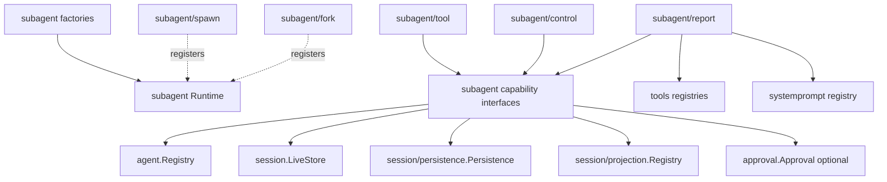

# Subagent Go 架构、接口与契约

状态：Draft

本文把[源功能分析](./01-source-capability-analysis.md)和[continuable 生命周期](./02-continuable-runtime-and-durability.md)翻译为 Go 候选设计。本文只在设计影响实现时更新；准确完成状态见[领域实现进度](../../subagent/docs/implementation-progress.zh-CN.md)，接口存在不得被解释为行为兼容。

## 1. 候选包边界

只在对应切片真实实现时创建目录：

```text
subagent/                 领域公开契约与共享值对象
subagent/runtime/         唯一 Runtime Plugin 与私有能力装配
subagent/internal/provider/      Provider 注册、顺序与精确撤销
subagent/internal/oneshot/       one-shot admission 与 lifecycle
subagent/internal/continuation/  Activation、恢复、投递、settlement、drain
subagent/internal/extension/     Activation Extension 注册、安装与撤销
subagent/internal/catalog/       durable child 查询
subagent/factory/         核心 Runtime 的 typed Factory
subagent/spawn/           fresh continuable Provider Plugin
subagent/fork/            fork seed Provider Plugin；首期不进入默认组合
subagent/tool/            模型委派 Tool Consumer
subagent/control/         send_message / interrupt_agent / list_agents Consumer
subagent/report/          child-scoped report Extension Consumer
```

边界理由：

- 根 `subagent` 只按概念声明接口和值对象，不设置聚合所有声明的 `types.go`；
- `subagent/runtime.Runtime` 是唯一 Plugin 和 Service Provider；私有子模块只实现内聚用例，不嵌入 `plugin.Base`，不直接发布 Service；
- Provider、one-shot、continuation、extension 和 catalog 按业务能力拆分，不再以 DTO/service/mapper 技术层拆分；
- spawn/fork 是可替换 Provider，不进入 core 条件分支；
- Tool packages 是 Consumer，不拥有 continuation；
- Factory 只负责严格 config decode、validation 和 construction；
- 当前不创建 `subagent/inprocess`；实现 one-shot driver 时，只有第三方确实需要复用才公开，否则作为 `internal/oneshot` 的内部机制。`subagent/internal` 只承载同一领域的私有能力，不承载另一套 Runtime。

## 2. 依赖方向



禁止的依赖：

- `agent`、`session`、`tools`、`approval` 不能反向依赖 `subagent`；
- Provider 不能依赖 `ContinuationManager` 或 process-local Activation；
- API Proxy DTO、Echo context、WebSocket frame 不能进入 `subagent`；
- core 不依赖 spawn/fork/tool/report 的具体类型；
- 不建立 `subagent -> llm/docs` 或旧 pi runtime 依赖。

### 2.1 当前 Goren 可复用锚点

| 现有位置 | 可复用能力 | Subagent 仍需补足 |
| --- | --- | --- |
| `agent/registry.go`、`agent/factory.go`、`agent/provisioning.go` | exact Create/Resume Handle、live Get/List、owner membership、unpublished `Provisioner`/`Provisioning`/`Scope` | ContinuationManager、Extension registry 和 per-child admission lock |
| `agent/initiator.go` | `WithInitiator` 把 exact parent 传给 Registry ownership | start/resume 必须统一使用该 context |
| `agent/agent.go`、`agent/inbox.go` | Followup/Steer/Inject、Cancel、WhenIdle、唯一 FIFO queue；结构骨架已补 `Options.SubagentDepth` 的 copy/validation | depth 计算与 child 创建行为 |
| `session/types.go`、`session/store.go` | Parent/Origin/SeedLength/DelegationDepth/AgentPreset、LiveStore/Flush | descriptor Event 与 Subagent projection |
| `session/persistence/contracts.go` | Inspect/ListSnapshots 和 backend-neutral durable log | Subagent cold-resume/read-model policy |
| `session/projection/` | live/detached projection Registry | 可选 projection cache 不是首期前置 |
| `tools/`、`systemprompt/` | Tool/Policy/Restriction、prompt overlay 与精确 handle | Subagent Consumer packages 与 child provisioning composition |
| `approval/` | durable policy、`PolicyNever`、`PolicySourceDelegation` | owner-owned delegation seed 方法 |
| `llm/message_source.go` | merge-extensible typed/opaque MessageSource | 三种 typed Subagent source |
| `plugin/` | typed Service/Event、Scope、MountChild/UnloadChild、rollback | Subagent Extension registration 与 resident installation 索引 |

Agent Loop 已在 Agent publication 前调用 `CreateOptions.Provisioner`，并把 `agentTree` 作为 `agent.Scope` 交给 Provisioner；Provision/Commit/publication 失败都会回滚未发布 child。完整调用链见[05 Agent 创建事务与 Provisioning 边界](./05-agent-creation-transaction.md)。Subagent 不应另建 Agent constructor 或绕过 Registry。

## 3. 核心命名对象

| 对象 | 拥有的可变状态 | 不拥有 |
| --- | --- | --- |
| `Runtime` | Plugin 生命周期、私有模块装配、Service publication、跨模块 lifecycle publication | 单 Agent turn、具体用例状态 |
| `provider.Registry` | Provider registrations 与稳定顺序 | Plugin lifecycle、one-shot admission |
| `oneshot.Service` | one-shot validation、Run publication 与 terminal observation | Provider registry mutation、continuable child |
| `continuation.Manager` | per-child lock、resident Activation、parent ownership、admission/settlement/drain | durable Session facts、模型循环 |
| `activation` | exact Agent Handle、epoch run ID、parent/ancestry snapshot、owned children、closing 状态 | 可独立持久化的业务状态机 |
| `extension.Registry` | 有序 registrations 和 resident installations；为每次创建提供 fresh `agent.Provisioner` | Tool/System Prompt 的业务规则、Agent publication |
| `ProviderRegistration` | 一个精确 Provider 注册的幂等撤销权 | 按名称删除后来实例 |
| `ExtensionRegistration` | 一个精确 Extension 注册和 resident installations 的幂等撤销权 | Activation 本身的 Dispose |

所有跨 await 的 Start 数据先形成 immutable snapshot。Manager 不持有调用方的可变 request、Parent Agent options 指针或 Provider config 指针。

## 4. Service Definition

one-shot 与 continuable 属于同一个 Subagent 领域，但不是同一个 consumer capability。Go 不照抄 TypeScript `ctx.subagents` 的单对象表面；唯一 `subagent/runtime.Runtime` 装配私有模块，并只在对应用例完成后提供窄 Service：

```go
type ProviderRegistry interface {
	plugin.Service
	RegisterProvider(context.Context, Provider) (ProviderRegistration, error)
	GetProvider(string) (Provider, bool)
	ListProviders() []string
}

type OneShotService interface {
	plugin.Service
	Start(context.Context, string, StartRequest) (Run, error)
}

type ContinuableService interface {
	plugin.Service
	StartContinuable(context.Context, ContinuableStartSpec) (ContinuableStart, error)
	Followup(context.Context, agent.Agent, session.SessionID, []llm.ContentBlock, FollowupOptions) (llm.MessageID, error)
	Interrupt(session.SessionID, InterruptAuthority) error
	ReportFrom(context.Context, agent.Agent, []llm.ContentBlock, ReportOptions) (llm.MessageID, error)
	DrainContinuableChildren(context.Context, agent.Agent, []session.SessionID) error
	DrainContinuableDescendants(context.Context, []agent.Agent) error
}

type ExtensionRegistry interface {
	plugin.Service
	RegisterExtension(ActivationExtension) (ExtensionRegistration, error)
}

type Catalog interface {
	plugin.Service
	ListChildren(context.Context, session.SessionID) ([]ListEntry, error)
	ListDescendants(context.Context, session.SessionID) ([]DescendantListEntry, error)
}
```

说明：

- `Runtime` 是实现上述接口并嵌入 `plugin.Base` 的唯一有状态 Plugin；`internal/*` 模块是同一领域内的职责对象，不是第二套 Runtime 或 Service Provider；
- one-shot Tool 只依赖 `OneShotService`，continuable Tool/control 只依赖 `ContinuableService`，Provider Plugin 只依赖 `ProviderRegistry`，report installer 只依赖 `ExtensionRegistry`，Host/控制列表只依赖 `Catalog`；
- `Catalog` 同时读取两种 descriptor，因为“列举 durable child identity”是独立只读用例，不是某一种执行策略；
- `context.Context` 替代 AbortSignal，并作为 operation 参数传入，不能存入 durable request；
- `Interrupt` 是同步 admission + fire-and-return，不为形式一致强加无意义的等待；Consumer 在调用前检查自己的 context；
- 未完成用例必须 fail loud 且不得进入默认组合；完成对应切片时必须删除 pending 路径，不能留下 fallback。逐项实现状态不在本文维护。

## 5. Provider contract

基础 Provider 必须支持 one-shot；Go 用窄接口表达 TypeScript optional method 提供的附加 continuable 能力：

```go
type Provider interface {
	Name() string
	Capabilities() Capabilities
	InheritsParentContext() bool
	Start(context.Context, ResolvedStartRequest) (Run, error)
}

type ContinuableProvider interface {
	Provider
	PrepareContinuable(context.Context, ContinuableCreateRequest) (ContinuableCreateSpec, error)
}

type ContinuableCreateRequest struct {
	SessionID session.SessionID
	Parent    agent.Agent
}

type ContinuableCreateSpec struct {
	Seed []session.Event
}
```

约束：

- 每个 Provider 都实现 one-shot `Start`；只有实现 `ContinuableProvider` 的 Provider 才能被 `StartContinuable` 选择。这不是两类互斥 Provider，而是 base capability + additional capability；
- `Parent` 保留源 `ContinuableCreateRequest.parent: Agent` 的 trusted same-process Provider contract；Provider 只读取建立 seed 所需的 completed history，不能创建 child、投递 prompt 或持有 parent 的生命周期；
- Runtime 在调用 Provider 前已独立 snapshot descriptor 和委派策略；Provider 返回的 `Seed` 必须 detached，不能把父 Session 的可变 slice 借给 Runtime；
- spawn 返回空 `Seed`；fork 只计算平衡的完整-turn prefix；
- Provider Plugin 在 Apply 时注册 contract、Dispose 时释放 exact `ProviderRegistration`；
- Provider name 唯一且经过 trim/非空验证，列表保持成功注册顺序；
- `ProviderAdded` observer 可以 veto，因此发布失败必须回滚注册；移除事件失败被 containment，不恢复已移除 Provider。

这直接对应源 `SubagentProvider.start` + `prepareContinuable?`。`Capabilities` 只描述 one-shot start-time 输入；它不包含 `continuable bool`，因为 `ContinuableProvider` 的接口实现本身就是能力证明。

## 6. Start、Followup 与 authority 请求

候选输入应先表达业务对象，再表达附属选项：

```go
type ContinuableStartSpec struct {
	Provider string
	Label    string
	ChildID  *session.SessionID
	Request  ContinuableRequest
}

type ContinuableStart struct {
	ChildID   session.SessionID
	MessageID llm.MessageID
}

type FollowupOptions struct {
	Source llm.MessageSource
}

type InterruptAuthority interface {
	interruptAuthority()
}

type UserInterruptAuthority struct {
	ParentSessionID session.SessionID
}

type AncestorInterruptAuthority struct {
	Agent agent.Agent
}
```

设计规则：

- `Parent` 是启动时权限和继承的 live subject；durable direct parent 最终写 Header；
- `ChildID` 只支持显式保留 ID 的受控调用，Manager 必须同时检查 live 和 persisted collision；
- `ContinuableRequest.AgentOptions` 使用可选 `*agent.Options` 表达是否声明覆盖；Runtime 在跨异步边界前复制每个 pointer 字段；
- `Prompt`、`Source` 和返回 receipt 都做 detached copy；
- authority 是封闭 sum type；不接受 `{kind:string, ...optional fields}` 这种可能同时表示多个身份的结构；
- `Followup` 中传入的 parent 必须是 Registry 中 exact live direct parent，MessageSource 不作为授权凭证。

## 7. Descriptor、list row 与 JSON

不要用一个带大量 optional 字段的公开 struct 同时表示 one-shot、continuable、child 和 diagnostic。候选结构：

```go
type Descriptor interface {
	descriptorVariant()
	DescriptorVersion() int
	DescriptorMode() Mode
	ProviderName() string
}

type ContinuableDescriptor struct {
	Provider     string
	Label        string
	AgentProvider *string
	AgentModel    *string
	Persona       *string
	ToolFilter    *ToolFilter
}

type OneShotDescriptor struct {
	Provider string
	Label    *string
}

type ListEntry interface {
	listEntryVariant()
	SessionID() session.SessionID
}

type OneShotChildEntry struct {
	ID          session.SessionID
	Label       *string
	Activity    Activity
	HasChildren bool
}

type ContinuableChildEntry struct {
	ID          session.SessionID
	Label       string
	Activity    Activity
	HasChildren bool
}

type DiagnosticEntry struct {
	ID     session.SessionID
	Reason DiagnosticReason
}
```

由 `subagent` 自己实现严格 descriptor Event codec 和 variant decoder：

- event name 固定 `subagent/descriptor`，version 固定 2；
- 必填、缺失、null、未知 mode 和未知 version 按源 fold 语义处理；未知 version 不抛 schema error，但当前 listing 会归为 `corrupt`；
- 支持读取 one-shot identity，但首期不把它判为 resumable；
- child row 只暴露 projection-owned mode/label，不返回完整 descriptor 中的 Provider-private 创建数据；
- `DescendantListEntry` 组合 `ListEntry`、durable parent ID 和相对 depth；
- core `Activity` 是瞬时 read-model 字段：Session 在 LiveStore 为 `running`，只在 Persistence 为 `inactive`，不写入 durable descriptor；Host wire 可再映射为 Agent sampling activity，Tool status 也由 Consumer 映射；
- API Proxy 若纳入，自行映射为 wire union，不能直接 JSON marshal Go domain interface。

## 8. Provisioning contract 与 child composition

Agent 创建侧的通用 contract 已固定为 `agent.Provisioner`、可选 `agent.Provisioning`、`agent.Scope` 和 exact `agent.Effect`；详细职责、顺序和回滚见[05 Agent 创建事务与 Provisioning 边界](./05-agent-creation-transaction.md)。Subagent 的 `extension.Registry` 负责把有序 `ActivationExtension` registrations 变成每次 Create/Resume 的 fresh Provisioner，并保留 registration 到 resident installation 的 exact 索引。

撤销 registration 时必须先阻止新安装，再释放它在所有 resident Activation 中产生的 exact installation。若撤销发生在 Provision 与 Commit 之间，该 Provisioning 的 `Commit` 返回兼容码 `ACTIVATION_SETUP_REVOKED`，由 Agent 创建事务统一回滚。新注册不追装到已 resident child。

首期 child composition 包括：delegation prompt、persona overlay、tool restriction、report Extension 和 approval delegation policy。每一项由原 owner 提供 Plugin、Extension 或方法，Subagent 只排序和装配。

## 9. Approval、sandbox 与 Agent options

Approval Event 只能由 `approval` owner 编码。建议给现有 `approval.Approval` 增加窄方法：

```go
SeedDelegationPolicy(*session.Session) error
```

它固定追加 `approval/policy {policy:"never", source:"delegation"}`。Subagent 调用 owner 方法，不直接构造 `approval.PolicyChanged`，也不通过普通用户 `SetPolicy` 注入“用户改变策略”的 notice。

`agent.Options` 建议增加：

```go
SubagentDepth *int64
```

该字段是 live depth 的保守上界，和 Header depth 取较大值。字段由 Agent 做非负 safe-integer validation，由 Subagent 设置和读取；其他模块不得赋予新语义。

Sandbox capability 目前不存在，Agent Preset composition 也没有可复用 contract。首期必须把二者标为 compatibility gap：

- 不把“无 sandbox”解释为成功继承；
- 不仅复制 `AgentPreset` 字符串就宣称 composition 已继承；
- 若产品要求二者，先由各 owner 建立接口，再由 Subagent 消费。

## 10. Events

canonical event name 和建议 delivery：

| Go event | canonical name | Scope | delivery |
| --- | --- | --- | --- |
| `ProviderAdded` | `subagent/provider-added` | Runtime/root | ordered，可 veto |
| `ProviderRemoved` | `subagent/provider-removed` | Runtime/root | best effort |
| `Started` | `subagent/start` | delegating parent Scope | best effort |
| `Ended` | `subagent/end` | delegating parent Scope | best effort |

`Started`/`Ended` 精确保留源 `SubagentRunInfo`：新生成的 run ID、child ID、provider 和 `local`；不添加 `mode` 字段。`Ended` 再包含 stop reason 与可选 final assistant message。Continuable Activation 的 `local=true`。Runtime 可用 exact parent Agent 作为 `plugin.Publish` 的 source，使 observer 只在正确 Scope 链上接收 lifecycle；Provider 事件由 Runtime 自身发布。

生命周期 observer failure 不改变已接受工作。只有 ProviderAdded 明确处于 registration transaction 内，可以 veto 并触发回滚。

## 11. Stable errors

core 使用 typed error，不让 Tool/API 解析文本：

```go
type ErrorCode string

type Error struct {
	Code    ErrorCode
	Message string
	Cause   error
}
```

`Error` 实现 `error` 和 `Unwrap`。候选常量保留源码：

```text
ACTIVATION_SETUP_RELEASE_FAILED  ACTIVATION_SETUP_REVOKED
ACTIVATION_CLOSING               ACTIVATION_TEARDOWN_FAILED
DRAINING                         DUPLICATE_CHILD
NOT_RESUMABLE                    PARENT_UNAVAILABLE
PERSISTENCE_UNAVAILABLE          UNAUTHORIZED
CONTINUATION_UNAVAILABLE         DUPLICATE_PROVIDER
NO_PROVIDER                      UNSUPPORTED_CAPABILITY
CANCELLED                        SUBAGENT_CONTROL_PROJECTIONS_UNAVAILABLE
SUBAGENT_CONTROL_SESSION_STORE_UNAVAILABLE
```

Core code 是稳定领域分类；Tool error、Host RPC error 和日志文本分别由 Consumer 映射。Context cancellation 在 catalog 类调用映射 `CANCELLED`，而 acceptance 后的执行不再继承请求取消。

## 12. Typed config

每个 Factory 拥有 config、strict `UnmarshalJSON`、默认值和 validation。`subagent/tool` 行为实施时必须把能力选择写进验证：

- `provider` 必填；
- `toolName` 默认 canonical `subagent`；
- 默认组合显式设置 `enableRunInBackground=true`；
- `backgroundMode` 接受 `one-shot` 或 `continuable`，并选择对应 Service 用例；
- `run_in_background=false` 始终路由 one-shot `Start`，不能 silent reroute；在 one-shot 行为完成前整个 Tool Plugin 不进入默认组合；
- `agentOptions`、`persona`、`toolFilter`、`maxDepth` 使用 owner-defined typed value；
- `maxDepth` 必须是非负 safe integer；
- `spawn` Provider name 默认 `spawn`；
- `fork` name 默认 `fork`，但 unresolved source drift 解决前不进入默认 composition；
- report delivery 默认 `next-step`，只接受 `next-step` 或 `quiet`。

Raw JSON 只停留在 Factory catalog 边界，Plugin 和 Provider 构造完成后只持有 validated immutable config。
